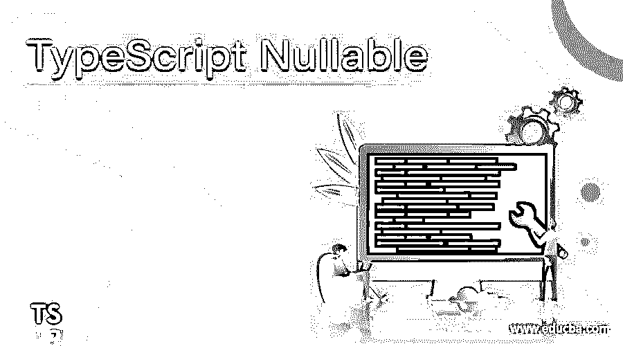
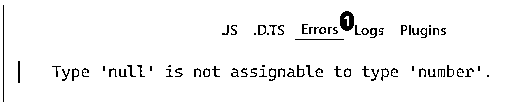
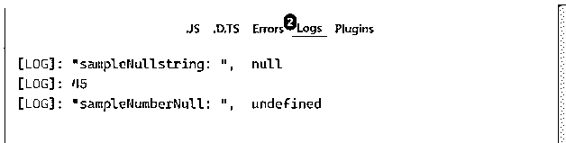
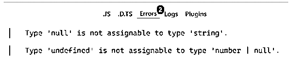
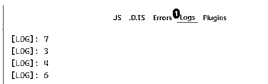
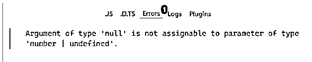
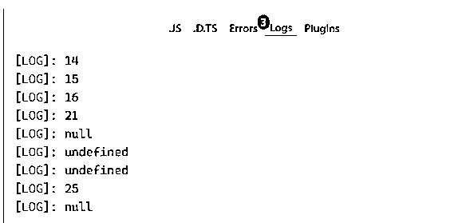
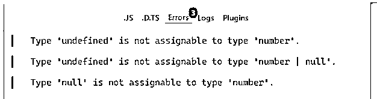

# TypeScript 可空

> 原文：<https://www.educba.com/typescript-nullable/>

## TypeScript Nullable 简介

TypeScript Nullable 是一种特殊的 null 类型，其值为 null。TypeScript Null 很像 void，也就是说，它本身没有用。默认情况下，null 是所有其他子类型的子类型，这意味着用户可以将 null 分配给任何数据类型，如字符串、数字等。这也意味着用户不能阻止空类型被赋值给任何其他类型，即使用户试图阻止赋值。Null 的发明者东尼·霍尔说，这个限制是“百万美元的错误”。

但是，在使用–strict null checks 标志时，上述限制是固定的。当用户试图声明一个变量时，它不会自动具有 null 值。Null 类型只能赋给 unknown，它们的任何类型。只有在使用联合类型时，才能显式包含这些类型。

<small>网页开发、编程语言、软件测试&其他</small>

**语法:**

对于 TypeScript nullable，我们没有遵循任何特定的语法，但是我们使用了一个标志，即

`–strictNullChecks`

基于标志被打开或关闭，我们可以实现 Nullable。

### 可空的规则和规定

以前，在 TypeScript 中，没有办法将类型显式定义为 null。但是，它仍然可以在没有任何检查模式的情况下使用。

我们的 JavaScript 应用程序中触发了许多错误，这些错误大多是对空类型和值的不正确使用，从而导致 TypeError 或 ReferenceError。这种错误会使应用程序崩溃，对于开发人员来说，找出错误并修复它是一个巨大的问题，这实际上比有效地花费时间要花费更多的时间。

TypeScript 为用户屏蔽了这类错误。由于 TypeScript 是一种静态类型语言，它允许用户通过使用未知类型和任何类型来禁用类型控制。在 strictNullChecks 配置中， **tsconfig.json 中配置的一个参数，**如果设置为 false，那么空类型总是每个其他定义类型的一个子类型。将 strictNullChecks 设置为 true 会将 null 类型与其他类型分开。

### 可空的类型脚本示例

TypeScript nullable 在代码中的外观示例，

`interface Employee {
empName: string;
empID: number;
empLob: string;
}
let emp: Employee = {
empName: ‘Karthik’,
empID: null,
empLob: ‘RCL’,
}`

所以在这里，我们考虑一个接口雇员，它有 3 个变量；员工姓名、Id 和 Lob。我们将 empID 指定为空。我们将-strictNullChecks 标志保持为 ON。让我们实现这个例子，看看错误是什么或者输出是什么。

#### 示例# 1:TypeScript Nullable:-strictNullChecks 标志打开

**代码:**

`interface Employee {
empName: string;
empID: number;
empLob: string;
}
let emp: Employee = {
empName: "Karthik",
empID: null,
empLob: "RCL"
}`

**输出:**

所以，是的，我们这里有一个错误。类型“null”不可赋给类型“number”。

如果-strictNullChecks 为 OFF，则不会出现上述错误，因此 TypeScript 编译器将允许编译代码。

Flag -strictNullChecks 为 OFF 时，保护代码不引用代码中的空值。标志可以作为命令行编译器上的一个选项添加，也可以作为 tsconfig.json 文件中的一个依赖项添加。

#### 示例 2: TypeScript 可空标志的用法。

**代码:**

`let sampleNullstring = "Educba";
sampleNullstring = null;
console.log('sampleNullstring: ', sampleNullstring)
let sampleNumberNull: number | null = 45;
console.log(sampleNumberNull)
sampleNumberNull = null;
sampleNumberNull = undefined;
console.log('sampleNumberNull: ', sampleNumberNull)`

**输出:**

当我们将一个字符串类型赋给 null，将数字赋给一个未定义的。

我们将“sampleNumberNull”的类型声明为 Null 或数字，但赋值 undefined 将引发错误。

在 TypeScript 版中，对可空类型使用可选链接要容易得多。让我们再看一个可选链接的例子。

#### 示例 3:可选链接的可空类型脚本

**代码:**

`function fAdd(x: number, y?: number) {
return x + (y ?? 0);
}
console.log(fAdd(5, 2));
console.log(fAdd(3, undefined));
console.log(fAdd(4, ));
console.log(fAdd(6, null));`

**输出:**

所以，这里我们使用了可选的链接**？:**检查 y 值是数字还是未定义的参数。

但是在赋值 null 值时，它会抛出如下错误:

#### 示例 4: TypeScript 可空检查

**代码:**

`// Compiled –strictNullChecks
let x: number | null;
let y: number | undefined | null;
let z: number;
console.log(x = 14);
console.log(y = 15);
console.log(z = 16);
console.log(x = 21);
console.log(y = null);
console.log(z = undefined);
console.log(x = undefined);
console.log(y = 25);
console.log(z = null);`

**输出:**

分配的值将显示为输出，但我们需要先了解错误日志，以便更好地了解这个概念。

类型“undefined”不能赋值给类型“number”:这是针对被赋值为 undefined 的类型 z 的。

类型“undefined”不可赋值给类型“number | null”:这是针对被赋值为 undefined 的类型 x 的。

类型“null”不可赋给类型“number”:这适用于被赋为 null 的类型 z。

至此，我们结束了我们的主题“TypeScript Nullable”。我们已经看到了什么是可空性以及它们是如何定义的。将 of -strictNullChecks 标志设置为 ON 或 OFF，这取决于绕过哪些空变量或未定义的变量。我们已经解决了上面的几个例子，这些例子清楚地显示了用户在分配值类型时在 TypeScript Nullable 中面临什么错误。为了理解这个概念，我们还列出了一些规则。此外，可选链接是 TypeScript 3.7 版本中非常流行的概念之一，对 TypeScript 可空概念更有用。谢谢！快乐学习！!

### 推荐文章

这是一个关于可空类型脚本的指南。这里我们讨论可空性的规则和规定，以及代码实现的例子。您也可以浏览我们推荐的其他文章，了解更多信息——

1.  [打字稿数组](https://www.educba.com/typescript-array/)
2.  [打字稿通用](https://www.educba.com/typescript-generic/)
3.  [打字稿操作符](https://www.educba.com/typescript-operators/)
4.  [打字稿版本](https://www.educba.com/typescript-versions/)

