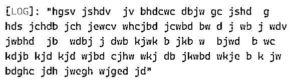
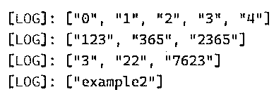

# TypeScript 键 of

> 原文：<https://www.educba.com/typescript-keyof/>

## TypeScript keyof 简介

在 TypeScript 中，keyof 是可用于获取用户值的运算符之一；此外，它遵循 union 运算符格式及其属性；它检索用户指定的每个值的索引，因此我们可以将其称为索引类型查询。keyof 运算符将与其他预定义的关键字组合，如“extends keyof and in keyof”。同时，我们可以在 collections 类等对象中使用 keyof 运算符，这是一种映射技术，我们可以通过使用键和值对来存储和检索数据，因此可以使用 map 实例对象。keys()方法将获取存储在内存中的键。

**语法:**

<small>网页开发、编程语言、软件测试&其他</small>

TypeScript 的 keyof 运算符用于获取和检索键范围中的索引，它还用于需要正确且准确的属性名称，keyof 运算符用作索引类型查询，该查询将通过特定对象集的属性范围生成，该对象集映射并隔离到 TypeScript 中的 keyof 运算符。

`class classname
{
---- some typescript codes depends upon the requirement----
}
var or let variable name: keyof  classname;
varaiable  name=””;`

以上代码是在 TypeScript 中使用 keyof 运算符的基本语法。在这里，我们创建了名为的类，并使用变量名称的 var 或 let 数据类型，并使用 keyof 运算符调用类名，无论变量名被赋予什么值，它都将显示输出屏幕。

### 打字稿怎么打字？

*   通常，TypeScript 提供了一组实用程序类型运算符、关键字和函数，用于开发用户预期中的应用程序。keyof 操作符也称为索引类型查询操作符，它产生包含属性名及其操作数值的键的并集，并且很可能 keyof 操作符将在对象文字类型之前，并且它最广泛地用于原始数据类型。索引基本类型查询将从属性及其属性中获取值，这些属性与默认关键字及其数据类型等元素相关。
*   其他的关键字是用类似“T”的字符来使用和派生的，它覆盖和使用所有可能的值，并且它需要更多的特性，如数组、类型脚本中的集合技术。通过使用对象。Key()方法我们可以在哈希内存中存储和检索关键字，哈希内存中的数据存储在哈希引用中，通过使用一些循环，如 for，forEach，迭代值并在输出控制台上显示。
*   有时 keyof 方法会将数字和非数字字符的输入值连接起来；数组值作为父对象存储，状态将是通用的，类型化函数调用键和值作为参数构造函数，因此借助于 keyof 运算符和检索与用户输入相关的所有值的键索引的方法。键索引是惟一的，所以它不接受脚本中的重复键。

### TypeScript keyof 的示例

下面给出了 TypeScript keyof 的示例:

#### 示例#1

**代码:**

`class demo {
p: number = 6253;
r:string="hgsv jshdv  jv bhdcwc dbjw gc jshd  g hds jchdb jch jewcv whcjbd jcwbd bw d j wb j wdv jwbhd  jb  wdbj j dwb kjwk b jkb w  bjwd  b wc kdjb kjd kjd wjbd cjhw wkj db jkwbd wkje b k jw bdghc jdh jwegh wjged jd"
}
class demo1 {
s: keyof demo;
example(t: demo): any {
return t[this.s];
}
}
let d: demo1 = new demo1();
d.s = "p";
d.s="r";
var res = d.example(new demo());
console.log(res);`

**输出:**

在上面的例子中，我们使用了带有 keyof 关键字的父类和子类关系。这里我们使用了一个名为 demo 的类。我们已经用字符串和数字这两种数据类型初始化了这两个变量；number 变量使用数字类型声明值，使用字符串数据类型声明字符串值。我们还使用了一个类似 example()的方法，使用这个关键字返回值。将从一个具有 var 全局数据类型的变量中调用该方法，并且在输出控制台上存储和打印这些值。用 let 这样的变量，用 let 数据类型创建 demo1 类对象，通过它的引用，通过子类(demo1)引用调用父类变量。

#### 实施例 2

**代码:**

`function getDemo<T, K extends keyof T>(vars: T, keysobj: K) {
return vars[keysobj];
}
function setDemo<T, K extends keyof T>(vars: T, keysobj: K, valuesobj:T[K]) {
vars[keysobj] = valuesobj;
}
let vars1 = { ac: 10, bd: "hfds hscfd hcdf hwcf h  we h  hv jg d hq hsd asg asgh asgc hasgdc hs hfwds hwfgcs hwfg qhwv qhws" };
let p = getDemo(vars1, "ac");
let q = getDemo(vars1, "bd");
let re = getDemo(vars1, "uyew wteuy");
setDemo(vars1, "p", "string");
console.log(re);`

**输出:**

#### 实施例 3

**代码:**

`const vars = ['hdjhg wjgdhv wjhv', 'jhgsd jgdhv', 'cjshdg wjhgd', 'djgh', 'djgh'];
console.log(Object.keys(vars));
const vars1 = { 123: 'jdh', 2365: '73dnb', 365: 'jd3' };
console.log(Object.keys(vars1));
const vars2 = { 7623 : '73 d', 22: 'bjeh', 3: 'ehjw' };
console.log(Object.keys(vars2));
const re = Object.create({}, {
exammple: {
value: function () { return this.example2; }
}
});
re.example2 = 1;
console.log(Object.keys(re));`

**输出:**

在最后一个示例中，我们使用 Object.keys()方法来检索键索引及其值。在这个索引的帮助下，我们可以很容易地识别这些值，并将它们打印在输出控制台上。

### 钥匙的法规

*   用于借助键索引来标识元素的 keyof 运算符。
*   通过使用 Objects.keys()方法，我们能够检索键索引及其值。
*   对于以上两个步骤，当用户在双企业应用程序上工作时，他们可以很容易地检索数据。

### 结论

在结论部分，keyof 算子在应用中有多种用途。基于 TypeScript 的大型企业应用程序大多是借助一些默认方法从后端到前端访问数据。通过使用这些方法，我们可以访问应用程序；元素的索引将被访问并与服务器交互到 UI 端。

### 推荐文章

这是一个关于键入的指南。这里我们分别讨论 keyof 的介绍、工作、示例、规则和规定。您也可以看看以下文章，了解更多信息–

1.  [打字稿字母](https://www.educba.com/typescript-let/)
2.  [打字稿类型](https://www.educba.com/typescript-typeof/)
3.  [打字稿版本](https://www.educba.com/typescript-versions/)
4.  [什么是 TypeScript？](https://www.educba.com/what-is-typescript/)

