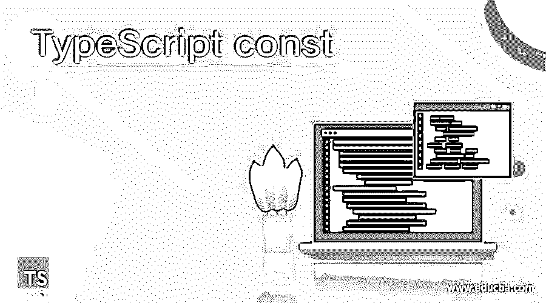
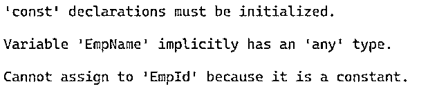
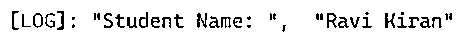
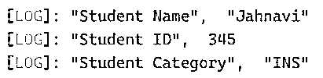
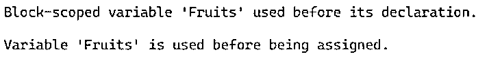

# TypeScript 常量

> 原文：<https://www.educba.com/typescript-const/>

## TypeScript const 简介

TypeScript const 是声明变量的方法之一。关键字“const”使变量成为常数，这意味着变量的值不能改变。还有很多其他的方法可以使用' let '，' var '等来声明变量。因为“var”允许像 JavaScript 一样声明变量，所以它有与 JavaScript 相同的作用域规则。虽然“let”关键字是在 ES6 中与“const”关键字一起引入的[，但是“let”声明了块范围的局部变量，可选地初始化为一个值。但是在某些情况下，我们不希望阻塞作用域，但是也希望有不可变的变量。因此，由于“let”关键字的这种限制，我们对不可变变量使用“const”关键字。](https://www.educba.com/what-is-es6/)

**语法:**

<small>网页开发、编程语言、软件测试&其他</small>

下面给出了 TypeScript const 的语法:

`const <constant_name> = <value>`

这是一个普通的变量声明，但带有关键字“const”。

### const 关键字的规则和规定

我们将研究一些使用 const 关键字声明变量的规则。

*   Const 变量使变量成为常量，不能改变。
*   在声明常量变量之前，用户应该确保该变量不会被重置。
*   不可变变量是一种产生较少错误的方法。
*   Const 关键字用任何常数值声明块范围的变量。
*   Const 的作用域规则与“let”关键字的作用域规则相同。
*   如果用户事先知道声明的变量不会被重新赋值，那么最好使用 const 关键字而不是 let 和 var 关键字来声明。
*   Const 声明提供了对该值的只读引用，这并不意味着 const 关键字持有的值是不可变的，但不能被重新分配。
*   在初始化之前不能访问 Const 关键字，这会导致引用错误。
*   Const 不能重新声明，这将引发一个无法捕获的语法错误。

**常量变量的示例声明:**

`const sample_emp = “Karthik”;`

### TypeScript 常量的示例

下面给出了 TypeScript 常量的示例:

#### 示例#1

TypeScript 常量声明。

**代码:**

`const sample_emp="Karthik";
console.log('here is the employee name', sample_emp);`

**输出:**

所以在这里，我们只声明一个常量变量，并将其初始化为一个字符串值。

现在，我们将看到这些常量声明的各种错误。

#### 实施例 2

TypeScript const，不能重新分配 const 变量。

**代码:**

`const Employee = {
empName: "Karthik",
empID: 10,
empLob: "RCL"
};
Employee = {
empName: "Daniel",
empID: 11,
empLob: "INS"
};
Employee.empName = "Saideep";
console.log('Employee Name: ', Employee.empName)
Employee.empID = 14;
console.log('Employee ID: ', Employee.empID)
Employee.empLob = "IVS";
console.log('Employee Lob: ', Employee.empLob)`

**输出:**

将不会有输出，因为此代码将给出一个错误，即“无法分配给‘Employee’，因为它是一个常量。”

#### 实施例 3

必须初始化 TypeScript 常量。

**代码:**

`const EmpName;
const EmpId = 45;
EmpId = 89;`

**输出:**

不会有特定的输出，因为上面的代码会抛出一个错误，即“const 声明必须初始化”。& '变量 EmpId 隐式具有' any '类型。此外，我们将 EmpId 重新分配给另一个值，因此这也会抛出一个错误。

#### 实施例 4

TypeScript const 是块范围的变量。

**代码:**

`const stuName = "Ravi Kumar";
if (true) {
const stuName = "Ravi Kiran";
console.log('Student Name: ', stuName);
}`

**输出:**

我们用一个新值来声明和初始化同一个常量变量，这不会给我们任何错误，因为它被当作一个新变量，并且只限于 if 块。

#### 实施例 5

深度不变性的 TypeScript const。

**代码:**

`const student = { stuName: "Jaanu", stuId: 567, stuCtgry: "RCL" };
student.stuName = "Jahnavi"
student.stuId = 345
student.stuCtgry = "INS"
console.log('Student Name', student.stuName);
console.log('Student ID', student.stuId);
console.log('Student Category', student.stuCtgry);`

**输出:**

这里我们看到 student const 有对象文字，我们重新分配的是对象文字，而不是 const 值。因此，const 关键字支持要变异的对象的子属性。

#### 实施例 6

TypeScript const 对值的只读引用。

**代码:**

`const student = { stuid:101, stuname:"Tushar"}
student = {stuid:102, stuname:"Ramkiran"}
console.log('here are the student details', student.stuid, student.stuname);`

**输出:**

这里我们不会得到输出，因为上面的代码给了我们一个错误‘不能赋值给‘student’，因为它是一个常量。’

这里的 const 创建了一个对该值的只读引用。用户不能更改引用，因为它是不可变的。但是用户可以更改 const 保存的属性值。用户不能分配新对象，但可以更改对象的属性。

#### 实施例 7

TypeScript const“在声明前访问”。

**代码:**

`console.log(Fruits);
const Fruits  = { fruitName1: "Orange", fruitName2: "Apple", fruitName3: "Grapes" };
console.log('Fruits', Fruits);`

**输出:**

不会有输出，因为上面的代码会给出一个错误，因为在赋值“&”之前使用了变量“Fruits”，在声明之前使用了块作用域变量“Fruits”。

我们试图在初始化之前访问常量，这会导致引用错误。

### 结论

至此，我们将结束我们的主题“类型脚本常量”。我们已经看到了什么是 TypeScript const 以及如何使用它。用几个例子研究了它的语法声明和初始化。我们面对的这个小关键字“const”的大多数错误也被显示出来。大多数开发人员建议使用 const 来声明变量。Const 主要用于块范围的变量和不可变变量。我们还在声明中列出了一些 TypeScript const 的规则、用法和限制。对于 const 对象，只有引用是不可变的。

### 推荐文章

这是一个类型脚本常量指南。这里我们分别讨论 const 关键字和示例的介绍、规则和规定。您也可以看看以下文章，了解更多信息–

1.  [打字稿类型](https://www.educba.com/typescript-typeof/)
2.  [TypeScript 可选参数](https://www.educba.com/typescript-optional-parameters/)
3.  [打字词典](https://www.educba.com/typescript-dictionary/)
4.  [打字稿操作符](https://www.educba.com/typescript-operators/)

