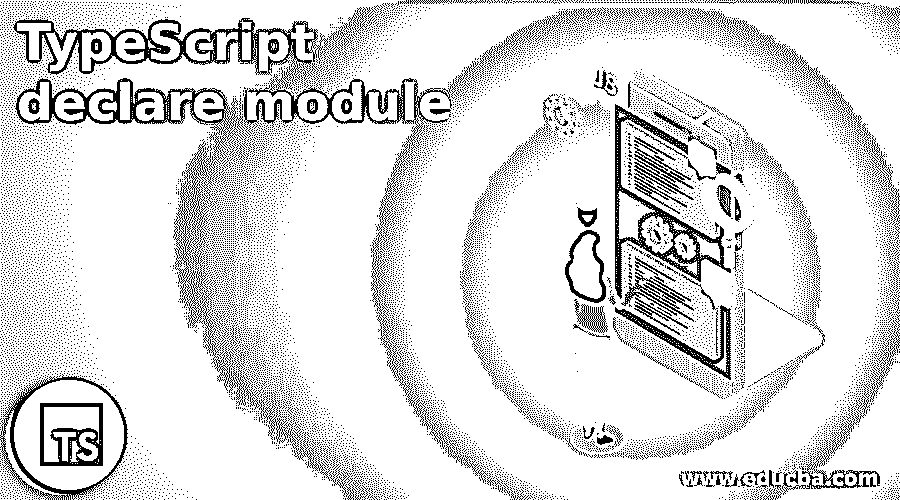
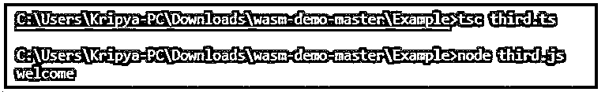
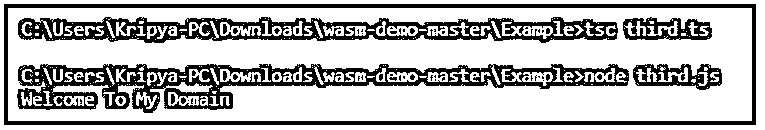
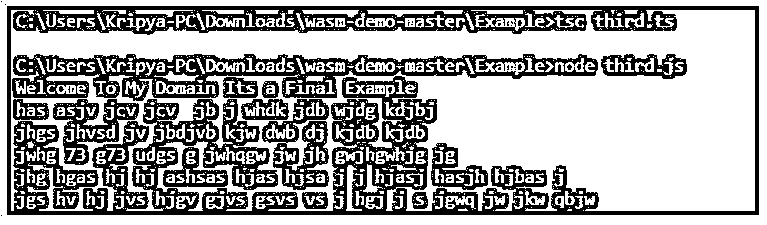

# TypeScript 声明模块

> 原文：<https://www.educba.com/typescript-declare-module/>

## TypeScript 声明模块简介

TypeScript 声明模块是模块和关键字之一，它用于包围和定义类、接口；变量也是声明的，它不会像模块一样源自类型脚本，它是一组包含值、类、函数/方法、关键字、枚举的文件，所有这些都包含数据类型和访问修饰符，如 public、private、protected 当我们在[类型脚本语言](https://www.educba.com/what-is-typescript/)中同时使用 declare 和 module 时，我们应该在脚本的第一行进行初始化，如果访问修饰符值是 public，还要确保声明和模块可由全局访问。

**语法:**

<small>网页开发、编程语言、软件测试&其他</small>

我们知道 TypeScript 有默认的关键字、变量和函数来实现更复杂的应用程序。在声明中，模块用它们自己的作用域定义和执行，而不是跨全局作用域，因为它可以在模块内部使用，而不是跨模块外部使用。所以访问修饰符对这些关键字起主要作用。

`declare module “module name” {
class or interface name {
--some typescript codes—
}
---some other default typescript codes depends upon the project requirement---`

上面的代码我们使用了模块并在 TypeScript 应用程序中声明。它可能因用户要求和项目而异；有些类、接口和方法是使用“import”关键字导入的，并使用“declare”关键字声明。返回类型将在函数声明中返回。最后，我们可以使用它将模块声明为 TypeScript 上的特定模块。

### 如何在 TypeScript 中声明模块工作？

*   基本上，declare module 是其中一个模块，它是一个用于声明环境模块集的块，也在编译和运行时被调用和使用。主要是这个模块将始终存在于运行时模式，并且模块和导出值类似于脚本代码中的名称空间声明；每一个声明都有一个单独的名字，它将使用一些父类和子类以及同一个模块。与此类似，我们使用一些在 declare 模块中额外使用的导入和导出模块。如果我们在 TypeScript 中使用 import 关键字，特定的包将被导入到应用程序中。
*   导入的包主要是应用程序中特定任务的类和接口；导入和导出语句都是通过全局类型调用和声明文件的；脚本程序也包含在编译中，但没有显式调用，因此 export 关键字用于导出接口和类，它还导出基于特定类的函数或方法。此外，还通过脚本的外部调用和导出函数或方法。

### TypeScript 声明模块的示例。

下面给出了 TypeScript 声明模块的示例:

#### 示例#1

**测试数据**

`declare module 'first' {
type exam =  {
demo: string;
demo1: string;
demo2: string;
demo3: string;
demo4: string;
demo5: string;
demo6: string;
demo7: string;
demo8: string;
demo9: string;
demo10: string;
};
export class second{
constructor()
denos5():string;
}
let Exams:exam;
}`

**First.ts**

`import { Exams } from 'first';
console.log("welcome");`

**输出:**

以上示例是在 test.d.ts 文件中初始化 declare 模块的基本示例。每当我们想要声明模块时，我们将使用. d.ts 扩展名保存代码。因此 TypeScript 编译器知道它是一个声明的模块，用于初始化应用程序中的脚本。在这里，我们使用带有导出语句的类，并使用构造函数，我们希望在脚本应用程序中需要特定模块的任何地方创建对象。

#### 实施例 2

**测试数据**

`declare module "examp" {
export interface examp {
demoid?: string;
demoid2?: string;
demoid3?: string;
demoid4?: string;
demoid5?: string;
demoid6?: string;
demoid7?: string;
demoid8?: string;
demoid9?: string;
demoid10?: string;
}
export function examp2(
demoid11: string,
): examp;
}
declare module "examps" {
export function first(xr: string): string;
export function second(...vars1: any[]): string;
export var yr: string;
}`

**Third.ts:**

`/// <reference path="test.d.ts"/>
import * as test from "examp";
let tests = "Welcome To My Domain";
console.log(tests);`

**输出:**

在第二个例子中，我们对接口使用了相同的声明模块语句；我们没有使用类，而是使用一个接口来初始化带有默认数据类型(比如 string)的变量。所以我们可以声明任何类型的值，这取决于用户的需求。我们还提到了第三个中的 declare 模块。是带有<reference path="">标签的文件，这里我们也导入了所有已经在 test.d.ts 声明模块文件中声明的函数和变量。</reference>

#### 实施例 3

**测试数据**

`declare module "first" {
class demo {
constructor()
}
export = demo
}`

**Third.ts**

`/// <reference path="test.d.ts"/>
import * as test1 from "./first";
let test1e= "Welcome To My Domain Its a Final Example";
console.log(test1e)
let test2e= "has asjv jcv jcv  jb j whdk jdb wjdg kdjbj";
console.log(test2e)
let test3e= "jhgs jhvsd jv jbdjvb kjw dwb dj kjdb kjdb";
console.log(test3e)
let test4e= "jwhg 73 g73 udgs g jwhqgw jw jh gwjhgwhjg jg";
console.log(test4e)
let test5e= "jhg hgas hj hj ashsas hjas hjsa j j hjasj hasjh hjbas j";
console.log(test5e)
let test6e= "jgs hv hj jvs hjgv gjvs gsvs vs j hgj j s jgwq jw jkw qbjw";
console.log(test6e)`

**输出:**

在最后一个例子中，声明模块初始化了创建对象的类和构造函数。同时，我们可以像 import *一样导入 third.ts 文件上的 declare 模块脚本，它表示模块上添加的所有函数和方法。我们可以用“，”来表示路径。/"这些操作符表示必须用当前脚本导入的文件路径。

### 申报模块的规章制度

*   基本上 declare 模块会用. d.ts 格式保存；其余的文件在。仅限 ts 格式。
*   我们不能在块内的声明模块上初始化变量值。
*   声明的模块也不接受该实现。

### 结论

在结论部分，TypeScript 声明模块是实现相同工作区应用程序的预定义代码之一。我们需要导入模块名，并利用函数和变量。declare 模块是索引，脚本的开头接受唯一的声明实现是用下一个文件创建的。ts，。js 等。

### 推荐文章

这是 TypeScript 声明模块的指南。这里我们讨论一下入门，如何在 TypeScript 中声明模块工作？例子，规则和条例。您也可以看看以下文章，了解更多信息–

1.  [打字稿类型](https://www.educba.com/typescript-typeof/)
2.  [打字稿字母](https://www.educba.com/typescript-let/)
3.  [什么是 TypeScript？](https://www.educba.com/what-is-typescript/)
4.  [打字稿版本](https://www.educba.com/typescript-versions/)

