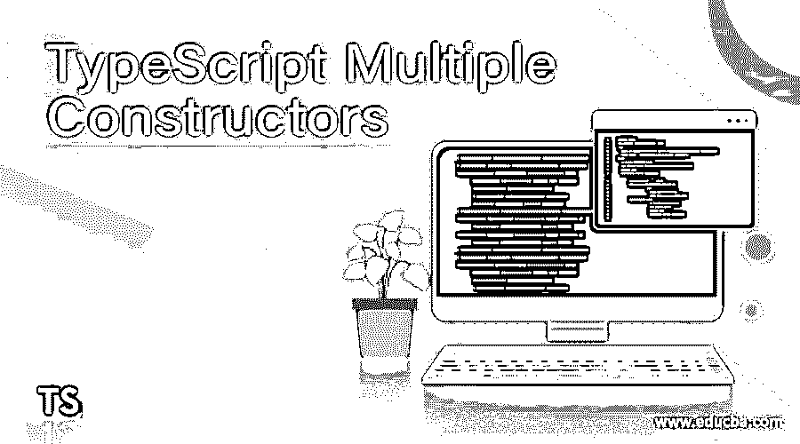
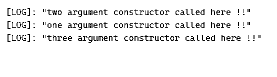

# TypeScript 多个构造函数

> 原文：<https://www.educba.com/typescript-multiple-constructors/>

## TypeScript 多个构造函数的定义

在 TypeScript 中，我们不能像其他编程语言那样定义多个构造函数，因为它不支持多个构造函数。但是在 TypeScript 中，我们有一些替代方法可以用来在 TypeScript 中定义多个构造函数，但是没有像在 Java、c++和其他面向对象的编程语言中那样直接指向多个构造函数的方法。为了实现这一点，我们必须为我们在 TypeScript 类中定义的所有构造函数提供一个公共实现。在下一节中，我们将更详细地讨论多重构造函数的实现，以便在应用程序开发时使用它。

**语法:**

<small>网页开发、编程语言、软件测试&其他</small>

如前所述，为了在 TypeScript 中支持多个构造函数，我们必须给出所有构造函数的公共实现。让我们看看它的语法，以便更好地理解它的用法，见下文；

`public constructor(...args: any[]) {
// your logic will go here ..
}`

在上面几行代码中，你可以看到我们只是使用了“constructor”关键字来定义一个构造函数实现。在这里面，我们采用参数数组。让我们来看看 TypeScript 中多构造函数支持的一个实践语法，以便更好地理解(见下文);

**例如:**

`public constructor(...args: any[]) {
if (args.length === your value) {
// logic for your called constructor goes here..
}
}`

正如你所看到的，我们在这里检查参数的数量，以检查哪个构造函数被调用。在下一节中，我们将更多地讨论它的内部工作方式，以及如何编写和使用这个构造函数的逻辑来提高代码的效率。

### 如何在 TypeScript 中使用多个构造函数？

正如我们已经知道，我们已经使用构造函数实现来支持 TypeScript 中的多个构造函数。但是没有直接的方法可以轻松地实现它们，我们必须在 TypeScript 中使用一些替代方法。我们可以在我们的类中定义许多构造函数，但是我们必须为这个构造函数中定义的所有构造函数提供一个通用的实现。我们可以在 TypeScript 中编写自己的逻辑。在这一节中，我们将用一段供初学者使用的示例代码来更多地讨论它的内部工作，让我们从下面开始看；

**1)构造函数实现:**用于给 TypeScript 类中定义的所有构造函数提供实现。我们可以单独检查参数，或者我们可以定义接受任何参数数组的构造函数，然后我们可以确定它的长度。为了更好地理解，让我们举一个简单的例子。

**例如:**

`class DemoClassTest {
public constructor(x : string, y:string);
public constructor(x : number);
public constructor(x : number, y:string, z:string);
public constructor(...myarray: any[]) {
if (myarray.length === 2) {
console.log('two argument constructor called here !!');
return;
}
if (myarray.length === 3) {
console.log('three argument constructor called here !!');
return;
}
if (myarray.length === 1) {
console.log('one argument constructor called here !!');
return;
}
}
}
let a = new DemoClassTest('hello', 'bye');
let b = new DemoClassTest(1);
let c = new DemoClassTest(100, 'str1', 'str2');`

正如你在上面的例子中看到的，我们在类中定义了如此多的构造函数，它们接受不同类型的不同参数。我们已经定义了一个接受参数数组的构造函数，在这个构造函数中，我们在创建类的实例时改变了传递的参数的数量，然后我们可以在 TypeScript 中应用我们想要执行的逻辑。最后，我们还创建了一个不同的对象来调用不同类型的构造函数。首先，我们创建了接受字符串和字符串的对象“a”。第二个称为“b ”,它只接受一个参数作为数字类型。第三个参数是“c ”,它接受三个参数数字、字符串和字符串，根据传递的参数，将执行实现的构造函数内部的逻辑。

### 例子

1)在这个示例中，我们试图在 Typescript 中实现多个构造函数支持，这是一个简单的示例，便于初学者详细理解 Typescript 中多个构造函数的概念。

**代码:**

`class DemoClassTest {
public constructor(x : string, y:string);
public constructor(x : number);
public constructor(x : number, y:string, z:string);
public constructor(...myarray: any[]) {
if (myarray.length === 2) {
console.log("arugument length is :: " + myarray.length)
console.log('two argument constructor called here !!');
return;
}
if (myarray.length === 3) {
console.log("arugument length is :: " + myarray.length)
console.log('three argument constructor called here !!');
return;
}
if (myarray.length === 1) {
console.log("arugument length is :: " + myarray.length)
console.log('one argument constructor called here !!');
return;
}
}
}
console.log("Example to show multiple constructor support in Typescript !!")
let result1 = new DemoClassTest('hello', 'bye');
let result2 = new DemoClassTest(1);
let result3 = new DemoClassTest(100, 'str1', 'str2');
console.log("Printing result here !!")
console.log( "result one is :::" + result1)
console.log("result two is :::" +result2)
console.log("result three is :::" +result3)`

**输出:**

### 多个构造者的规则和规定

在 TypeScript 中实现多个构造函数时，我们需要遵循一些规则，如下所示:

1)首先要记住，TypeScript 不直接支持多个构造函数的实现。我们必须使用替代方法来支持多个构造函数。

2)如果您在 TypeScript 类中定义了多个构造函数，那么我们必须定义我们已经讨论过的所有构造函数的公共实现。

3)如果我们有一个构造函数，它接受相同数量但不同类型的参数，那么我们还必须应用条件来检查传递的参数的类型。

4)如果我们不在多重构造器类型脚本类中提供构造器的实现，那么它将抛出运行时异常。

5)Typescript 中的多个构造函数如果没有正确实现可能会抛出异常，我们可以在我们的 Typescript 类中实现任意数量的构造函数。

### 结论

TypeScript 通过提供构造函数的实现来支持多个构造函数。没有简单直接的方法来实现这一点。在本文中，我们已经讨论了在 TypeScript 中支持多个构造函数的方法。这将使应用程序代码变得高效，并可通过一些逻辑进行重用。

### 推荐文章

这是一个指导如何编写多重构造函数的指南。这里我们讨论定义以及如何在 TypeScript？以及代码实现的例子。您也可以浏览我们的其他相关文章，了解更多信息——

1.  [打字稿字母](https://www.educba.com/typescript-let/)
2.  [打字稿类型](https://www.educba.com/typescript-typeof/)
3.  [类型脚本转换对象](https://www.educba.com/typescript-cast-object/)
4.  [打字词典](https://www.educba.com/typescript-dictionary/)

