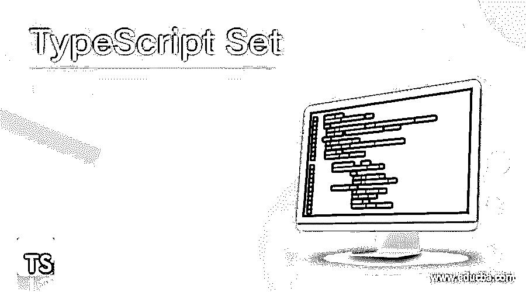
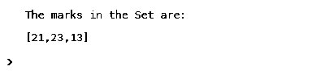
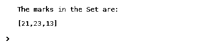
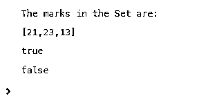
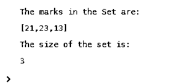
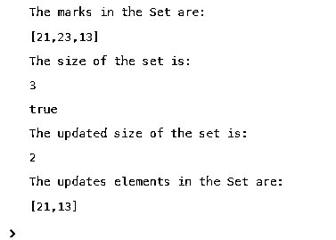
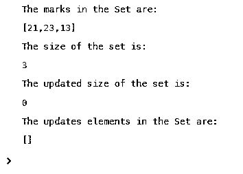

# 打字稿集

> 原文：<https://www.educba.com/typescript-set/>

## TypeScript Set 方法的定义

在 TypeScript 中，ES6 JavaScript 版本中添加了一种新的数据结构，称为 set。这有助于将只出现一次的不同值的数据存储到不同编程语言(如 C#、Java 等)中可用的列表中。尽管这种数据结构几乎类似于 map，但它不能存储键值对，而只能存储键。因为 set 的对象是一组值，所以可以按照特定的顺序遍历这些项。在本文中，我们将讨论 typescript 中 set 的不同方面。

**语法:**

<small>网页开发、编程语言、软件测试&其他</small>

下面是 typescript set 的语法。

`let setobj = new Set();`

这里，set type 必须与关键字 new 一起使用。

### 方法

下面是在 Typescript 中设置的不同方法。

*   **方法:** `add(val)`

**描述:**这个方法有助于向集合中添加值。

*   **方法:** `has(val)`

**描述:**该方法检查方法中传递的值在集合中是否存在。如果存在，将返回 true。否则，将返回 false。

*   **方法:** `delete()`

**描述:**这个方法有助于从集合中删除值。

*   **方法:** `size()`

**描述:**这个方法有助于返回集合的大小。

*   **方法:** `clear()`

**描述:**这个方法有助于从集合中删除所有值。

### 例子

让我们讨论打字稿集的例子。

#### 示例 1:创建集合并向其中添加值的 Typescript 程序。

**代码:**

`//create a set with marks as object
let marks = new Set();
//Add marks to the set
marks.add(21);
marks.add(23);
marks.add(13);
console.log("The marks in the Set are:");
console.log(marks);`

**样本输出:**

在这个程序中，以标记为对象创建一个集合。然后，将 21、23 和 13 等元素添加到其中。执行代码时，显示集合中的所有元素。

#### 示例 2:创建集合并使用 add()方法链接向其中添加值的 Typescript 程序

**代码:**

`//create a set with marks as object
let marks = new Set();
//Add marks to the set
marks.add(21).add(23).add(13);
console.log("The marks in the Set are:");
console.log(marks);`

**样本输出:**

在这个程序中，也是以标记为对象创建一个集合。然后，将 21、23 和 13 等元素添加到其中。这个程序与上面程序的不同之处在于，这里通过链接 add()方法将元素添加到集合中。执行代码时，显示集合中的所有元素。

#### 示例#3:创建一个集合并检查其中是否存在特定值的 Typescript 程序。

**代码:**

`//create a set with marks as object
let marks = new Set();
//Add marks to the set
marks.add(21).add(23).add(13);
console.log("The marks in the Set are:");
console.log(marks);
//Check whether the value 21 and 34 is present in the set or not
console.log(marks.has(21));
console.log(marks.has(34));`

**样本输出:**

在这个程序中，也是以标记为对象创建一个集合。在添加诸如 21、23 和 13 之类的元素之后，检查元素 21 和 34 是否存在于可用集合中。当元素 21 存在而 34 不存在时，将分别返回 true 和 false。

#### 示例#4:创建集合并查找集合大小的 Typescript 程序。

**代码:**

`//create a set with marks as object
let marks = new Set();
//Add marks to the set
marks.add(21).add(23).add(13);
console.log("The marks in the Set are:");
console.log(marks);
//returns the size of the set
console.log("The size of the set is:");
console.log(marks.size);`

**样本输出:**

在这个程序中，也是以标记为对象创建一个集合。在添加元素(如 21、23 和 13)后，使用 size()方法确定集合的大小，如程序所示。由于集合中有三个元素，因此将返回 3 作为集合的大小。

#### 例 5:创建一个集合并从中移除特定元素的 Typescript 程序。

**代码:**

`//create a set with marks as object
let marks = new Set();
//Add marks to the set
marks.add(21).add(23).add(13) ;
console.log("The marks in the Set are:") ;
console.log(marks);
//returns the size of the set
console.log("The size of the set is:");
console.log(marks.size) ;
//deletes an element from the set
console.log(marks.delete(23) ) ;
console.log("The updated size of the set is:") ;
console.log(marks.size) ;
console.log("The updates elements in the Set are:");
console.log(marks);`

**样本输出:**

在这个程序中，还有一组用 21、23 和 13 等元素创建的标记。然后，使用 size()方法确定集合的大小。一旦完成，就移除元素 21，并且再次识别集合的大小。在执行代码时，可以看到集合的大小减少到 2，并且更新后的集合不包含 21 作为元素。

#### 示例 6:创建集合并从中移除所有元素的 Typescript 程序。

**代码:**

`//create a set with marks as object
let marks = new Set();
//Add marks to the set
marks.add(21).add(23).add(13);
console.log("The marks in the Set are:");
console.log(marks) ;
//returns the size of the set
console.log("The size of the set is:") ;
console.log(marks.size) ;
//clears all elements from the set
marks.clear() ;
console.log("The updated size of the set is:") ;
console.log(marks.size) ;
console.log("The updates elements in the Set are:") ;
console.log(marks) ;`

**样本输出:**

在这个程序中，用 21、23 和 13 等元素创建的一组标记。然后，使用 size()方法确定集合的大小。一旦这样做了，所有的元素都被删除，并再次确定集合的大小。在执行代码时，可以看到集合的大小减少到 0，并且更新后的集合不包含任何元素。

### 结论

ES6 JavaScript 中添加了一种称为 set 的数据结构，有助于将只出现一次的不同值的数据存储到一个列表中，该列表可用于不同的编程语言，如 C#、Java 等。在本文中，详细解释了不同方面，如语法、方法和 typescript 中的 set 示例。

### 推荐文章

这是一套打字稿指南。这里我们讨论定义、语法、方法和代码实现的例子。您也可以浏览我们的其他相关文章，了解更多信息——

1.  [类型脚本转换对象](https://www.educba.com/typescript-cast-object/)
2.  [打字稿类型](https://www.educba.com/typescript-typeof/)
3.  [TypeScript 可选参数](https://www.educba.com/typescript-optional-parameters/)
4.  [打字稿数组](https://www.educba.com/typescript-array/)

