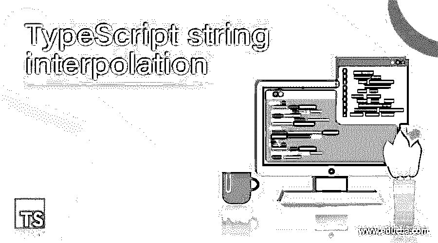
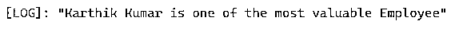
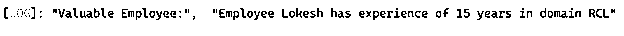
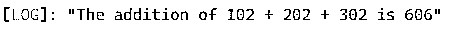
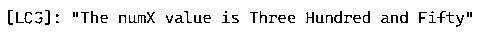
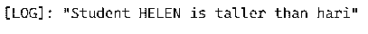
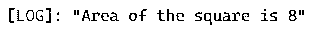

# 类型脚本字符串插值

> 原文：<https://www.educba.com/typescript-string-interpolation/>

## TypeScript 字符串插值简介

TypeScript 字符串插值是用于计算包含一个或多个表达式的字符串文字的表达式。字符串插值计算表达式并获得字符串中的结果，然后在原始字符串中替换该结果。在 TypeScript 中，模板字符串分为三部分，即字符串插值、多行字符串和标记模板。字符串插值以依赖注入的其他名称倒退，在 ES 6 中显然是作为模板文字出现的。字符串插值的一个常见用途是当用户想要从静态字符串和变量中生成一些字符串时，这需要模板逻辑，这就是模板字符串的作用。让我们进入语法和它的实现。

**语法:**

<small>网页开发、编程语言、软件测试&其他</small>

字符串插值没有特定的语法，但是我们需要使用使用反斜线的字符串，即 **`** 而不是用占位符＄{ }括起来的单引号'或双引号'

让我们看一个如何使用这个反勾号的例子。

将 employeeName 视为字符串表达式。预先进行计算，结果值“Karthik Kumar”被替换为最终字符串。

这个特殊的字符串插值[只在 ES6/ ES5](https://www.educba.com/es6-vs-es5/) 和更高版本中有效。

`let employeeName:string = "Karthik Kumar";
console.log(`${employeeName} is one of the most valuable Employee`)`

这里，我们使用反勾号来打印输出日志。以前我们习惯把它们放在单引号或双引号中。

在运行时，代码用实际值替换占位符

### 如何在 TypeScript 中执行字符串插值

让我们看几个如何在 TypeScript 中执行字符串插值的例子

#### 示例#1

TypeScript 字符串插值的基本示例

`let employeeName: string = "Karthik Kumar";
console.log(`${employeeName} is one of the most valuable Employee`)`

**输出:**

这里，我们在结果字符串中使用了一个表达式。$ { }，用花括号括起来的$将读取变量并被发送到结果字符串。

**用多个表达式进行字符串插值**，

一次插值多个表达式会导致多次插值。在下面的例子中，我们将传递三个插值表达式，然后将它们显示在结果字符串上。

#### 实施例 2

具有多个表达式的 TypeScript 字符串插值的基本示例

`const empName: String = 'Lokesh';
const empExp: number = 15;
const empPrd: String = 'RCL';
let empVal: string = `Employee ${ empName } has experience of ${ empExp } years in domain ${ empPrd }`;
console.log('Valuable Employee:',empVal);`

**输出:**

在这里，带有花括号的${ }，dollar 将读取 const 值并被发送到结果字符串。

**使用表达式键入字符串插值。**

插值表达式像算术表达式，三元运算符也可以使用字符串插值。

#### 实施例 3

算术表达式的字符串插值

`let numA=102
let numB=202
let numC=302
let addABC=`${numA+numB+numC}`
console.log(`The addition of ${numA} + ${numB} + ${numC} is ${addABC}`);`

**输出:**

所以这里我们插值 numA，num 和 numC 的算术表达式。

#### 实施例 4

在模板字符串中使用三元运算符的字符串插值。

`let numX = 350;
console.log(`The numX value is ${(numX==350) ?'Three Hundred and Fifty':'Forty five'}`);`

**输出:**

这里，我们使用三元运算符来检查表达式的值，并在控制台中对其进行插值。

**嵌套表达式的键入脚本字符串插值，**

正如我们在上面的例子 3 中看到的，插值被应用于算术表达式。插值也可以应用于像“＄{ a+b }”这样的嵌套表达式。

#### 实施例 5

嵌套表达式的字符串插值

`let numA=2
let numB=4
let numC=6
let mulABC=`${numA*numB*numC}`
console.log(`The Multiplication of ${numA} * ${numB} * ${numC} is ${mulABC}`);`

**输出:**

因此，控制台日志中的 mulABC 与另外 3 个表达式 numA、num 和 numC 嵌套在一起。

#### 实施例 6

用字符串方法进行字符串插值。

`let stuName1 = 'Helen';
let stuName2 = 'Hari';
console.log(`Student ${stuName1.toUpperCase()} is taller than ${stuName2.toLowerCase()}`);`

**输出:**

所以在这里，字符串方法也可以使用字符串插值。

#### 实施例 7

函数的字符串插值

`function squareArea(length: number, breadth: number): number {
return length * breadth;
}
console.log(`Area of the square is ${squareArea(2,4)}`);`

**输出:**

插值也可以应用于函数，如上所示。

### 打字稿字符串插值的规则和规定

*   字符串插值用任何类型的字符串值替换占位符。
*   因为它们在现代编程语言中非常有用，所以在 TypeScript 中，它们用反勾号括起来，表示字符串的开始和结束。
*   反斜线称为模板文字，定义为嵌入了表达式的字符串文字。
*   字符串插值也称为模板化。
*   在将复杂表达式发送到占位符之前，最好使用中间变量来保存它们。
*   插值的主要用途是使用为构建包含静态和可变部分的字符串而创建的模板字符串。

### 结论

至此，我们将结束“类型脚本字符串插值”主题。我们已经看到了什么是字符串插值，以及如何使用花括号中的反勾号来显示它。模板字符串将一系列字符包装在一对反斜线中。插值有前途，因为它有助于以可读的格式将值插入到字符串中。如果模板字符串使用复杂的表达式，那么在将表达式发送到占位符之前，最好使用中间变量来保存表达式。这里解决的例子已经涵盖了使用字符串插值的所有概念。

### 推荐文章

这是一个打字稿字符串插值的指南。在这里，我们将讨论如何在 TypeScript 中执行字符串插值，并给出示例和输出。您也可以看看以下文章，了解更多信息–

1.  [TypeScript 可选参数](https://www.educba.com/typescript-optional-parameters/)
2.  [打字稿功能](https://www.educba.com/typescript-functions/)
3.  [打字稿类型](https://www.educba.com/typescript-types/)
4.  [什么是 TypeScript？](https://www.educba.com/what-is-typescript/)

