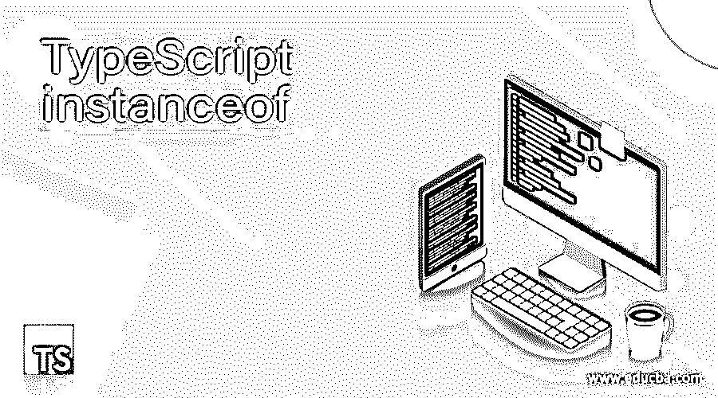
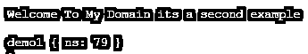
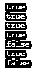

# TypeScript 实例 of

> 原文：<https://www.educba.com/typescript-instanceof/>

## TypeScript 实例简介

Typescript instanceof 是其中的一个操作符，它用于确定具体的构造函数，它将创建类的对象。如果我们使用一个可以通过类来实现和扩展的接口，它会在实例的帮助下调用这些方法。它将确定属性，并将它的链添加到它检查原型的实际情况的对象中。它返回布尔条件，在它的左边还有变量的名字，包括类的功能。

**语法**

<small>网页开发、编程语言、软件测试&其他</small>

instanceof 操作符是关键字，它主要用于对象验证它是否是一个类型，并通过构造函数跟踪它。关键字还使用并关注类区域，它可以在变量、条件语句、循环等中被访问和利用。

`function functionName(reference: class)
{
conditional statements(reference instanceof  another class)
{
----- some logics depends upon the user requirements --------
}
}`

上面的代码是在 typescript 类中使用 instanceof 运算符的基本语法。使用该实例，为特定的类调用方法，该类已经在该类上声明。甚至接口的实现也通过条件语句提交给操作者。

### instanceof 在 TypeScript 中是如何工作的？

在 Typescript 中，instanceof 是操作符之一，它的左边是变量的名称，也是函数或类的名称；接口也在类的左边初始化。每当我们想要在特定的类中创建对象时，instanceof 操作符用于在运行时验证对象；此外，如果所需的类需要创建实例，并且需要与其他代码逻辑进行验证，它总是返回布尔值，如 true 或 false 语句。基本上，instanceof 是 typescript 的高级类型；同时，对操作符进行测试，看基于类的构造函数的原型属性是否出现在对象的原型链中。

不同的作用域在运行时环境中具有不同的执行集合；此外，如果对特定类实例的验证失败，它会接受编译时脚本，然后在编译时本身抛出错误。有时，运算符属于运行时执行模式，因为它会在输出控制台上抛出异常。当我们使用条件语句评估类引用时，它会验证实际的类实例和新的类引用。

### TypeScript 实例的示例

下面给出了不同的例子:

#### 示例#1

`function demo(exam, exam1, exam2) {
this.exam = exam;
this.exam1 = exam1;
this.exam2 = exam2;
}
const demo1 = new demo('first', 'second', 'third');
console.log(demo1 instanceof demo);
console.log(demo1 instanceof Object);
function sample(vars, vars1, vars2, vars3, vars4, vars5, vars6, vars7){
this.vars = vars;
this.vars1 = vars1;
this.vars2 = vars2;
this.vars3 = vars3;
this.vars4 = vars4;
this.vars5 = vars5;
this.vars6 = vars6;
this.vars7=vars7;
}
const demo2 = new sample('four fsh35 hasd has has', 'secondfive', 'six', 'hs','js','sd','sde','sad sd swf fg fd');
console.log(demo2 instanceof demo);
console.log(demo2 instanceof Object);`

**输出:**

上面的例子显示了 instanceof 操作符的一种用法，我们可以创建两个方法，比如“demo”和“sample”。对于这两个方法，我们可以在每个方法中传递一组参数。如果我们采用“demo()”方法，它需要 3 个参数。在同一个方法中，我们可以像在 sample()方法中那样将值传递给单独的变量，传递多组参数。每个参数值应该用一个单独的变量类型初始化，如“const ”,并使用“instanceof”操作符为该类创建一个新对象；类引用被验证并打印在输出控制台上。

**例 2**

`interface demo {
example(): string;
}
class demo1 implements demo {
constructor(private ns: number) {}
example() {
return Array(this.ns + 1).join(" ");
}
}
class demo2 implements demo {
constructor(private vl: string) {}
example() {
return this.vl;
}
}
function examp() {
return Math.round(764.9834733746928374) < 10000000
? new demo1(79)
: new demo2("  ");
}
let pads: demo = examp();
if (pads instanceof demo1) {
console.log("Welcome To My Domain its a second example \n")
console.log(pads);
}
if (pads instanceof demo2) {
console.log("Welcome To My Domain its a second example \n")
console.log(pads)
}`

**输出:**

在第二个例子中，我们使用了额外的类和接口。通常，接口用于声明方法或函数；不能借助类来实现；接口方法被实现并打印在输出控制台上。在这里，我们调用了一些数学函数，比如 round()方法来验证数学值，它还比较另一个数字。通过使用 if 条件语句和 instanceof 运算符，对类的类型进行验证。

#### 实施例 3

`class demo {
vars;
constructor(vars) {
this.vars = vars;
}
}
const examp = new demo('Welcome To My Domain jwegd qiwdkgds kjqcgsd kjGCDS CWGKDS');
console.log(examp instanceof demo);
console.log(Object.getPrototypeOf(examp) === demo.prototype);
console.log(examp instanceof Object);
console.log(Object.getPrototypeOf(demo.prototype) === Object.prototype);
console.log(examp instanceof class name {
});
console.log(Object.getPrototypeOf(demo.prototype) === Object.prototype);
console.log(examp instanceof Function);`

**输出:**

对于最后一个示例，我们使用 instanceof 操作符的方式与我们在前面两个示例中使用的方式相同。此外，我们还以不同的方式使用了运算符 console.log 语句中的 typescript，如 instanceof 运算符，用 Object、Function、其他自定义或用户定义的方法(如“demo ”)来验证类型。在这里，我们还包含了 class name 关键字，用于使用 instanceof 运算符比较类型，以便创建用于实现类名的“{和}”左右括号。

### 实例的规则和规定

1.  instanceof 运算符比较类名、对象、函数，并包括其他用户定义的方法类型。
2.  它也适用于验证或比较两个引用的变量和其他条件语句。

### 结论

typescript 语言通常与许多操作符、关键字和其他预定义函数一起使用，以更加用户友好的方式实现应用程序。像 instanceof 操作符将通过使用条件语句来比较和验证两个对象引用、关键字和其他用户定义的函数，它将被求值；最后，它返回布尔值作为输出控制台。

### 推荐文章

这是一个关于类型脚本实例的指南。这里我们讨论 instanceof 如何在 TypeScript 中工作，以及示例和输出。您也可以看看以下文章，了解更多信息–

1.  [打字稿类型](https://www.educba.com/typescript-typeof/)
2.  [打字词典](https://www.educba.com/typescript-dictionary/)
3.  [什么是 TypeScript？](https://www.educba.com/what-is-typescript/)
4.  [打字稿版本](https://www.educba.com/typescript-versions/)

