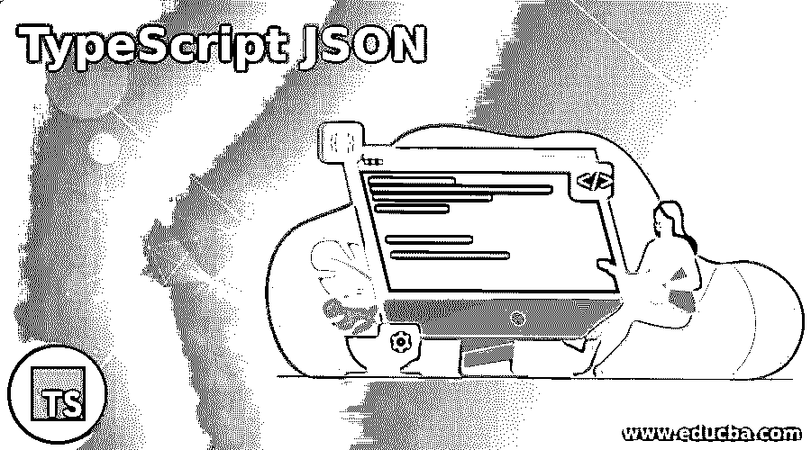
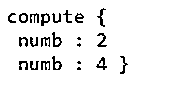
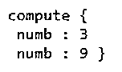

# TypeScript JSON

> 原文：<https://www.educba.com/typescript-json/>

## TypeScript JSON 简介

JSON 对象用于在客户端和服务器之间传输和存储数据，并且 JSON 对象能够访问 TypeScript 类的方法， 我们使用一种称为对象类的分配方法的方法，该分配方法为 TypeScript 类创建 JSON 对象的副本，JSON 对象能够访问该类的方法的另一种方式是在我们的 TypeScript 程序中使用类转换器工具，从该工具中导入 JSON 对象访问该类所需的方法。

【JSON 对象访问 TypeScript 类的语法:

<small>网页开发、编程语言、软件测试&其他</small>

`Object.assign(new TypeScript_class(), JSONobject);
plainToClass(TypeScript_class(), JSONobject);`

*   新的 Typescript 类创建该类的实例。
*   JSONobject 表示 JSON 中试图访问类中方法的对象。
*   plainToClass 是由类转换器工具导入的方法，使 JSON 对象能够访问类中的方法。

### JSON 在 TypeScript 中的工作

*   可以使用 JSON 对象在客户机和服务器之间存储和传输数据。
*   JSON 对象可以通过两种方式访问这些方法，一种是使用 assign 方法，另一种是使用 class transformer 工具。
*   assign 方法通过创建 JSON 对象的副本来帮助 JSON 对象访问这些方法。
*   类转换器工具导入必要的方法，使 JSON 对象能够访问这些方法。

### 例子

下面是提到的例子:

#### 示例#1

TypeScript 程序创建一个类和一个 JSON 对象，然后通过使用 assign 方法使 JSON 对象能够访问 TypeScript 类，然后在屏幕上显示输出。

**代码:**

`//a TypeScript class defined to compute the power of a number whose value is provided in the JSON object file
class compute
{
numb:number;
power()
{
//defining two variables whose scope is within the block and then obtaining the value of the number using which the power can be calculated from the JSON object file
let num = 2;
let num1 = Math.pow(num,this.numb);
this.numb = num1;
return this.numb;
}
}
//contents stored in the JSON object file saved as jsonobject.json
{
“numb”: 2
}
//Actual program to enable the json object to access the method in the TypeScript class
//the JSON object file is imported
import jsonobject from 'C:/Users/admin/Desktop/jsonobject.json';
class compute
{
numb:number;
power()
{
let num = 2;
let num1 = Math.pow(num,this.numb);
this.numb = num1;
return this.numb;
}
}
//an instance of the TypeScript class is created and passed as a parameter to the assign     function along with the data present in the JSON object file
let instcompute = Object.assign(new compute(), jsonData);
console.log(instcompute);`

**输出:**

在上面的程序中，我们定义了一个类，其中包含一个名为 compute 的函数，用于计算一个数的幂，该数的值由存储在特定位置的 JSON 对象文件提供。然后导入 JSON 对象文件，使 JSON 对象能够访问该类的方法。然后创建该类的一个实例，该实例作为参数传递给 assign 函数以及 JSON 对象文件中的数据。

#### 实施例 2

TypeScript 程序创建一个类和一个 JSON 对象，然后使 JSON 对象能够利用类转换器工具访问 TypeScript 类，然后在屏幕上显示输出。

**代码:**

`//a TypeScript class defined to compute the power of a number whose value is provided in the JSON object file
class compute
{
numb:number;
power()
{
//defining two variables whose scope is within the block and then obtaining the value of the number using which the power can be calculated from the JSON object file
let num = 2;
let num1 = Math.pow(num,this.numb);
this.numb = num1;
return this.numb;
}
}
//contents stored in the JSON object file saved as jsonobject.json
{
“numb”: 3
}
//Actual program to enable the json object to access the method in the TypeScript class
//the JSON object file is imported
import jsonobject from 'C:/Users/admin/Desktop/jsonobject.json';
//importing the necessary method to enable the JSON object to access the methods in the TypeScript class from class transformer tool
import { plainToClass } from “class-transformer”;
class compute
{
numb:number;
power()
{
let num = 2;
let num1 = Math.pow(num,this.numb);
this.numb = num1;
return this.numb;
}
}
//the plainToClass method from the class transformer tool will enable the Json Object to access the methods in the TypeScript class
let instcompute = plainToClass(compute(), jsonData);
console.log(instcompute);`

**输出:**

在上面的程序中，我们定义了一个类，它由一个名为 compute 的函数组成，该函数计算一个数的幂，该数的值由存储在特定位置的 JSON 对象文件提供。然后，导入存储在特定位置的 JSON 对象文件和使 JSON 对象能够访问类中的方法所需的必要方法，以使 JSON 对象能够访问类的方法。这里导入的方法是 plainToClass 方法。然后将 JSON 对象文件中的类和数据作为参数传递给 plainToClass 方法，以计算给定数字的幂。

### 结论

在本文中，我们看到了通过 JSON 对象使用 assign 方法和 class transformer 工具访问类的概念，class transformer 工具导入了必要的方法，使 JSON 对象能够访问类中的方法和相应的编程示例，并使用它们的输出来演示它们。

### 推荐文章

这是一个关于 TypeScript JSON 的指南。这里我们分别讨论 JSON 的简介、在 TypeScript 中的工作和例子。您也可以看看以下文章，了解更多信息–

1.  [打字词典](https://www.educba.com/typescript-dictionary/)
2.  [打字稿通用](https://www.educba.com/typescript-generic/)
3.  [打字稿数组](https://www.educba.com/typescript-array/)
4.  [打字稿操作符](https://www.educba.com/typescript-operators/)

