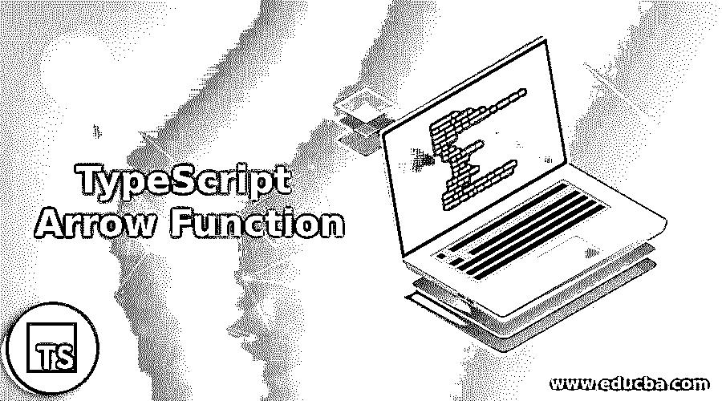
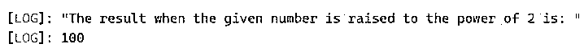
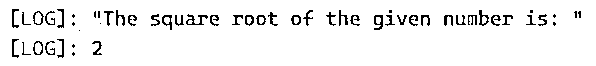
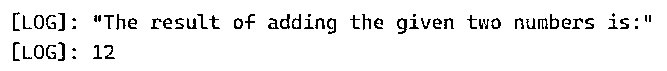
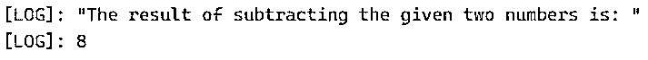
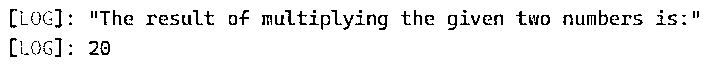

# 打字稿箭头函数

> 原文：<https://www.educba.com/typescript-arrow-function/>

## TypeScript 箭头函数简介

每当需要避免打字功能时， 我们在类型脚本中使用了一个名为 arrow function 的函数，这是一个定义匿名函数的简写语法，当我们使用 arrow function 时，不需要使用名为 function 的关键字，arrow function 由一个粗箭头或“= >”表示，也称为 lambda function，在使用 arrow function 时，关键字 this 有词法范围，参数的含义是按词法捕获的 使用箭头功能时，该箭头功能由参数、粗箭头和指令集组成。

**在 TypeScript 类中声明箭头函数的语法:**

<small>网页开发、编程语言、软件测试&其他</small>

`(parameter1, parameter2, parameter3,.. parametern) => {
set of instructions;
}`

在哪里，

parameter1、parameter2、parameter3、parameter 是传递给 arrow 函数的参数，该函数执行粗箭头所指的花括号内的指令集。

### 打字稿中箭头函数的使用

*   每当需要避免键入函数和定义匿名函数时，我们就使用一个名为 arrow function 的函数。
*   当我们使用箭头函数时，我们不必使用关键字函数。
*   箭头功能由粗箭头或“= >”表示。
*   arrow 函数接受一组用小括号括起来的参数，后面跟一个粗箭头，再后面跟一组用花括号括起来的要执行的指令。
*   这个关键字的含义和 arrow 函数的参数的含义是使用 arrow 函数从词汇上获取的。

### TypeScript 箭头函数的示例

下面是提到的例子:

#### 示例#1

演示 arrow 函数用法的 TypeScript 程序，使用它我们可以计算给定数字的幂，并在屏幕上显示输出。

**代码:**

`//defining an anonymous function using arrow function to compute the power of a number and display the result as the output on the screen
let power = (firstnum:number, secondnum:number) : number => {
return Math.pow(firstnum, secondnum);
}
console.log('The result when the given number is raised to the power of 2 is: ');
console.log(power(10,2));`

**输出:**

在上面的程序中，我们使用 arrow 函数定义了一个匿名函数来计算一个给定数字的幂，并将结果显示在屏幕上。

#### 实施例 2

演示 arrow 函数用法的 TypeScript 程序，使用 arrow 函数我们可以找到给定数字的平方根，并在屏幕上显示输出。

**代码:**

`//defining an anonymous function using arrow function to compute the square root of a number and display the result as the output on the screen
let squareroot = (firstnum:number) : number => {
return Math.sqrt(firstnum);
}
console.log('The square root of the given number is: ');
console.log(squareroot(4));`

**输出:**

在上面的程序中，我们使用 arrow 函数定义了一个匿名函数来查找给定数字的平方根，并将结果作为输出显示在屏幕上。

#### 实施例 3

这个程序演示了 arrow 函数的用法，我们用它把给定的两个数相加，并在屏幕上显示输出。

**代码:**

`//defining an anonymous function using arrow function to add the given two numbers and display the result as the output on the screen
let addit = (firstnum:number, secondnum:number) : number => {
return  firstnum + secondnum;
}
console.log('The result of adding the given two numbers is:');
console.log(addit(10,2));`

**输出:**

在上面的程序中，我们使用 arrow 函数定义了一个匿名函数，将给定的两个数相加，并将结果作为输出显示在屏幕上。

#### 实施例 4

这个程序演示了 arrow 函数的用法，我们用它来减去给定的两个数，并在屏幕上显示输出。

**代码:**

`//defining an anonymous function using arrow function to subtract the given two numbers and display the result as the output on the screen
let subit = (firstnum:number, secondnum:number) : number => {
return  firstnum - secondnum;
}
console.log('The result of subtracting the given two numbers is: ');
console.log(subit(10,2));`

**输出:**

在上面的程序中，我们使用 arrow 函数定义了一个匿名函数，将给定的两个数相减，并将结果作为输出显示在屏幕上。

#### 实施例 5

这个程序演示了 arrow 函数的用法，我们用它把给定的两个数相乘，并把结果显示在屏幕上。

**代码:**

`//defining an anonymous function using arrow function to multiply the given two numbers and display the result as the output on the screen
let mulit = (firstnum:number, secondnum:number) : number => {
return  firstnum * secondnum;
}
console.log('The result of multiplying the given two numbers is:');
console.log(mulit(10,2));`

**输出:**

在上面的程序中，我们使用 arrow 函数定义了一个匿名函数，将给定的两个数相乘，并将结果作为输出显示在屏幕上。

### 推荐文章

这是一个指导打字稿箭头功能。在这里，我们讨论了 arrow 函数在 TypeScript 中的介绍、工作原理和示例。您也可以看看以下文章，了解更多信息–

1.  [打字词典](https://www.educba.com/typescript-dictionary/)
2.  [打字稿通用](https://www.educba.com/typescript-generic/)
3.  [打字稿功能](https://www.educba.com/typescript-functions/)
4.  [打字稿操作符](https://www.educba.com/typescript-operators/)

