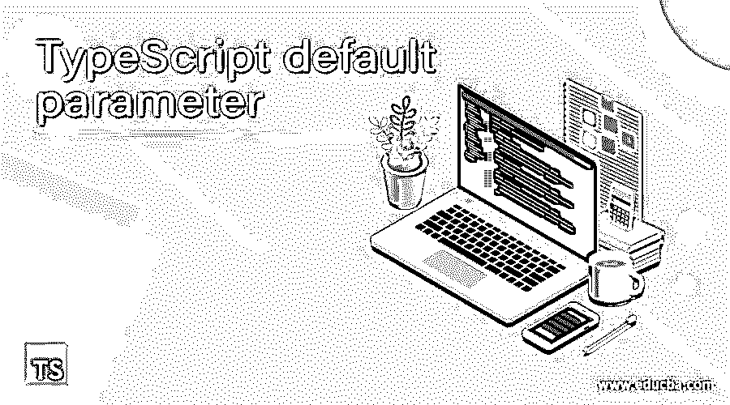
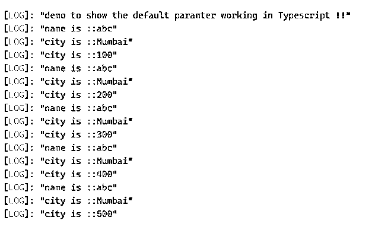

# TypeScript 默认参数

> 原文：<https://www.educba.com/typescript-default-parameter/>

## TypeScript 默认参数简介

TypeScript 中的 default 参数用于将一些默认值赋给变量。在 JavaScript 中，我们有这样的规定，不向被调用的函数传递所需的参数，因为它在内部管理，但在 TypeScript 中，我们不能这样做。相反，我们可以使用缺省参数给这样的参数赋值。在 TypeScript 中，我们不需要为默认参数分配类型。在本教程的下一节，我们将更详细地讨论应用程序内部的内部工作及其用法。

**语法**

<small>网页开发、编程语言、软件测试&其他</small>

如前所述，默认参数在 Typescript 的函数内部使用；通过使用它们，我们可以给函数参数一个默认值。让我们来看看它的语法，以便更好地理解，它的实现见下文；

`function function_name(variable1, variable2 = some_value){
// your logic will go here ..
}`

正如您在上面几行语法中看到的，我们定义了一个函数，并使用默认参数将默认值传递给该函数，因此它的值不会为 null 或未定义。让我们看一个语法练习的例子，见下文；

**举例:**

`function demo(name, city = "some value"){
// your logic will go here ..
}`

以上是初学者的一个示例语法；在下一节中，我们将更详细地看到它的内部工作，以便更好地了解它在应用程序中的用法。

### 默认参数在 TypeScript 中是如何工作的？

我们已经知道，TypeScript 中默认参数用于为函数内部传递的参数分配一些默认值，因为在 TypeScript 中，我们必须传递函数所需的所有参数，所以我们可以给它们一些默认值。如果我们没有传递所需的参数，那么它会给我们一个编译时错误，因为它会检查这些参数。通过使用缺省参数，我们可以使用同一个参数来执行一些逻辑，这些逻辑的值对于传递的每个变量都是相同的。让我们看看它在函数中的用法，见下文；

1) **函数内部**:默认参数可以在 TypeScript 中的函数内部使用。在声明函数时，我们可以给缺省参数赋值。此外，在声明默认参数的值时，我们不需要传递默认参数的类型。在 TypeScript 中它不是强制的。让我们仔细看看方法签名是什么样子的；

**方法签名:**

`function demo(val1, val2 = "some value"){
// your logic will go here ..
}`

在上面的签名中，我们定义了一个函数，它将默认参数作为这里的输入参数。该函数类似于 TypeScript 中的任何普通函数。我们可以使用“function”关键字来定义这个函数，并且在这个函数中，我们可以定义它的主体。这里我们有一个单一的元素要传递。同样，这个相同的值将用于整个函数逻辑。我们在这里没有为这个默认参数定义任何类型。

2) **同一个函数内的多个默认参数**:同样，我们可以在函数内传递任意数量的默认参数。只有我们必须给参数赋值；不需要再做什么了。让我们来看看它的示例语法，以便更好地理解。

**方法签名:**

`function demo(val1, val2 = "some value", vale, val4= some value, so on..){
// your logic will go here ..
}`

正如您在上面的语法中看到的，我们可以在同一个函数中使用多个默认参数。让我们看一个示例来理解它的内部工作和在实际程序中的实现，对于初学者见下文；

**举例:**

`function demo(name: string, city ="same value here ") {
console.log("name is ::" + name);
console.log("city is ::" + city);
}
console.log("demo to show the default parameter working in Typescript !!");
let result1 = demo("abc");`

在上面几行代码中，我们试图使用默认的参数。这里，我们将 city 变量定义为函数中的默认参数。所以每次执行函数时，它都会从函数中取默认值。此外，如您所见，我们还没有为“city”变量定义变量类型。这样，我们可以在函数内部定义默认参数。此外，我们也可以在需要时传递多个参数。

### 例子

1)在本例中，我们在函数中使用默认参数。多次调用该函数以查看效果。所以默认变量的值对于所有调用函数总是相同的。这是一个简单的例子，便于初学者理解它的实现。

**举例:**

`function demo(name: string, rollno : number, city = "Mumbai") {
console.log("name is ::" + name);
console.log("city is ::" + city);
console.log("city is ::" + rollno);
}
console.log("demo to show the default paramter working in Typescript !!");
let result1 = demo("abc", 100);
let result2 = demo("abc", 200);
let result3 = demo("abc", 300);
let result4 = demo("abc", 400);
let result5 = demo("abc", 500);`

**输出:**

### 默认参数的规则和规定

在 TypeScript 中，在函数内部使用缺省参数没有这样的规则和规定，但是在使用缺省参数时，我们需要记住一些要点，见下文；

1)在使用默认参数时，我们必须给它们分配一个默认值。

2)我们不需要为默认参数提供任何类型。

3)同样，我们可以在同一个函数中传递多个默认参数。

4)在 TypeScript 中，没有这样的关键字、符号或标识符来定义默认参数；它们就像是 TypeScript 中的另一个普通变量。

5)将所有默认参数传递到其他参数的末尾；否则，它将在输出中给出一个错误和错误的值。

### 结论

通过使用默认参数，我们可以为变量赋值。这对于传递的所有其他变量都是一样的，每次函数被调用时都是一样的。同样，因为在 TypeScript 中，我们必须传递所有需要的参数；否则，它会给出一个错误，所以我们可以传递默认的参数。

### 推荐文章

这是 TypeScript 默认参数的指南。这里我们讨论默认参数在 TypeScript 和 Example 中是如何工作的以及输出。您也可以看看以下文章，了解更多信息–

1.  [打字稿装璜师](https://www.educba.com/typescript-decorators/)
2.  [打字稿导出功能](https://www.educba.com/typescript-export-function/)
3.  [打字稿通用](https://www.educba.com/typescript-generic/)
4.  [打字稿版本](https://www.educba.com/typescript-versions/)

