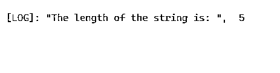
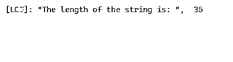
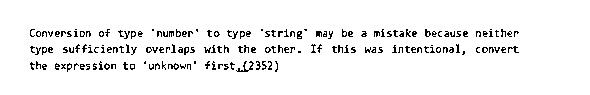

# 打字稿转换

> 原文：<https://www.educba.com/typescript-cast/>

## TypeScript 转换简介

以下文章提供了 TypeScript 强制转换的概述。类型转换也称为类型转换，有助于将一种类型转换为另一种类型。尽管它们在强编程语言中的工作方式不同，但它是存在的。也就是说，在面向对象编程中，类型转换是存在的，但是在 JavaScript 中，它没有类型转换的概念。令人惊讶的是，编译成编程语言 JavaScript 的 typescript 语言有强制转换的概念。在本文中，我们将在 typescript 编程语言中处理类型转换。

**语法**

<small>网页开发、编程语言、软件测试&其他</small>

可以使用两种语法进行类型转换，如下所示。

`let A: number = (<string> B).length;
let A: number = (B as string).length;`

### 在 TypeScript 中，cast 方法是如何工作的？

众所周知，我们选择编程语言会有一个特定的原因。

对于 Typescript 来说，它是一种类型化语言，可以提升开发体验，这也是它比 JavaScript 更受欢迎的主要原因。它提升体验的主要方式是在开发人员开始部署代码之前捕捉错误并提供修复。

通常，我们会将字符串、布尔值、数字、结构等类型分配给不同的变量，如下所述。

`let fruit: string = ‘apple’;
let mark: number = 35;
let workdone: boolean = false;`

现在，让我们考虑一个场景，我们必须将变量 fruit 的字符串长度赋给一个初始化为数字的变量。在这种情况下，你会怎么做？

`let fruit: string = ‘apple’;
let len: number = ??’`

这就是我们使用类型转换概念的情况。要么将变量显式类型转换为字符串类型，然后查找长度。也就是说，类型转换可以通过使用尖括号中的类型在前面加上水果变量来完成，如下所示。

`let fruit: string = ‘apple’;
let len: number = (<string> fruit).length;`

进行类型转换的另一种方法是在语法中添加“as”。

`let fruit: string = ‘apple’;
let len: number = (fruit as string).length;`

尽管这两种方法都可以用于类型转换，但 React 中的 typescript 将只支持使用“as”的类型转换。此外，在某些情况下，类型转换对于某些类型是不可能的。也就是说，考虑必须将数字转换为字符串的情况，如下所示。

`let len: number = 35;
let fruit: string =( len as string);`

如果我们尝试编译这个，会发生什么？

是的。编译器将抛出一个错误，因为字符串类型不能与数字重叠。

为了解决这个问题，首先，我们必须将 lento 转换为 unknown，然后转换为 string，如下所示。

`let len: number = 35;
let fruit: string =( len as unknown) as string;`

**注:**

在 typescript 中，可以向下转换类型，也可以向上转换类型。

### 例子

在这一节中，我们将研究一些关于 typescript 中强制转换的工作示例。

Program:使用“as”将字符串类型转换为数字的 Typescript 程序。

`//initialise fruit variable which is of string type
let fruit: string = "apple" ;
// initialise len variable which is of number type
let len: number = (fruit as string).length ;
console.log('The length of the string is: ', len) ;`

**输出:**

在这个程序中，变量 fruit 和 len 分别以 string 和 number 类型初始化。变量 fruit 中的字符串长度使用类型转换方法存储在变量 len 中。在执行代码时，将显示字符串的长度。

**Program:使用<T3 将字符串类型转换为数字的 Typescript 程序。**

`//initialise fruit variable which is of string type
let fruit: string = "apple" ;
//initialise fruit variable which is of string type
let len: number = (<string> fruit).length;
console.log('The length of the string is: ', len) ;`

**输出:**

在这个程序中，变量 fruit 和 len 被初始化为字符串和数字类型。变量 fruit 中的字符串长度使用类型转换方法存储在变量 len 中。这个程序与上述程序的不同之处在于它的排版方式。即在第一个程序中，用‘as’代替这个程序中的<>。但是，在执行代码时，将显示字符串的长度。

正如我们在类型转换工作中已经提到的，<>在 React 中不起作用。如果在 React 中使用它，将会显示一个错误，如下所示。

Program:使用“as”将数字类型转换为字符串的 Typescript 程序。

`//initialise len variable which is of number type
let len: number = 35;
//initialise fruit variable which is of string type
let fruit: string =( len as string);
console.log('The length of the string is: ', len);`

**输出:**

在这个程序中，变量 fruit 和 len 被初始化为字符串和数字类型。但是这个程序的问题是必须转换的类型。这里，数字类型试图转换为字符串。但是，这将导致一个错误，如下所示。

让 len:数字

作为一个解决方案，我们将修改如下程序所示的代码。

Program:使用“unknown”将数字类型转换为字符串的 Typescript 程序。

`//initialise len variable which is of number type
let len: number = 35;
//initialise fruit variable which is of string type
let fruit: string =( len as unknown) as string;
console.log(fruit);`

**输出:**

在这个程序中，首先将类型设置为 unknown，然后进行类型转换。因此，不会出现上述程序输出中的错误。

### 结论

类型转换是一种帮助将一种类型转换成另一种类型的技术。尽管 javascript 中没有，但令人惊讶的是，编译成编程语言 JavaScript 的 typescript 语言具有强制转换的概念。在这篇文章中，不同的方面，如语法，工作，以及类型转换的例子，都有详细的解释。

### 推荐文章

这是一个关于类型转换的指南。这里我们讨论 cast 方法如何在 TypeScript 和示例中工作以及输出。您也可以看看以下文章，了解更多信息–

1.  [打字稿字母](https://www.educba.com/typescript-let/)
2.  [打字稿类型](https://www.educba.com/typescript-typeof/)
3.  [打字稿导出功能](https://www.educba.com/typescript-export-function/)
4.  [打字词典](https://www.educba.com/typescript-dictionary/)

