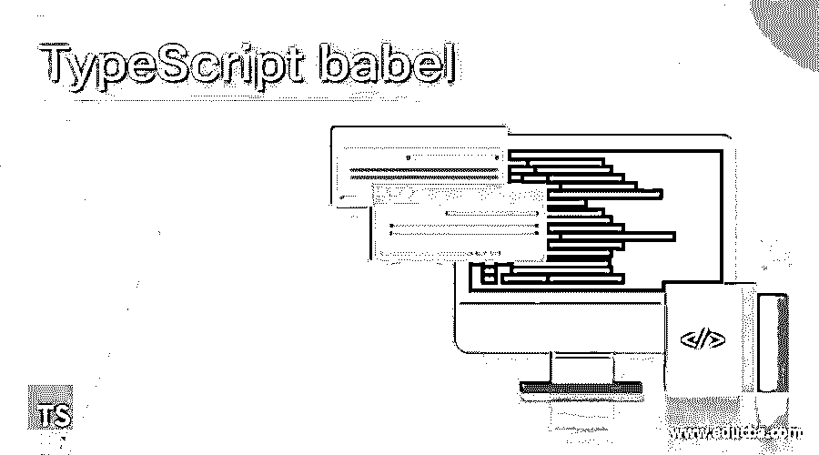

# 打字稿巴别塔

> 原文：<https://www.educba.com/typescript-babel/>

## TypeScript babel 简介

Babel 是一个用于将代码转换成 ES6、ES7、ES8 等所需的 EMCA 脚本版本的类型脚本转换器。因为 ES6 和其他旧版本中的 ES5 之后发布的新功能并不完全被所有浏览器支持，因此为了能够在我们的代码中使用这些功能并在所有可用的浏览器中运行代码，我们使用了名为 Babel 的工具来将所有 ES6、ES7、ES8 和其他旧版本转换为 ES5，Babel 有几个功能，如插件和预置来配置 EMCA 脚本版本。

**在 TypeScript 中声明 Babel 的语法如下:**

<small>网页开发、编程语言、软件测试&其他</small>

没有这样的语法来声明 Babel Transpiler

### 解释 Babel 在 TypeScript 中的用法的步骤

*   Babel 是一个用于将代码转换成所需的 EMCA 脚本版本，即 ES6、ES7、ES8 等的类型脚本转换器。
*   Babel 是一个类型脚本转换程序，用于将代码转换成 ES6、ES7、ES8 等所需的 EMCA 脚本版本。因为并不是所有的浏览器都完全支持 ES6 和其他老版本中 ES5 之后发布的新特性。
*   为了能够在我们的代码中使用这些特性，并在所有可用的浏览器中运行代码，我们使用名为 Babel 的工具将所有 ES6、ES7、ES8 和其他旧版本转换为 ES5。
*   巴别塔有几个功能，如插件和预置配置 EMCA 脚本版本。
*   Babel 提供了对 ES6 和其他旧版本 TypeScript 中添加的新功能的向后兼容性，这使得它可以在所有可用的浏览器上运行。
*   巴别塔也能够将代码移植到 EMCA 脚本的下一个版本中。
*   Babel 非常强大，因为它可以在 TypeScript 和 JavaScript、gulp 等中使用。
*   TypeScript 中的某些特性在使用 Babel 传输时不会被转换，也不能在旧版本的浏览器上运行。在这种情况下，我们利用称为 Babel polyfilling 的功能，并传输代码，使其也能在较旧的浏览器上运行。
*   有几个巴别塔特有的特性:巴别塔插件，巴别塔预置，巴别塔聚合填充等。
*   Babel 插件为 Babel 提供了编译代码的配置细节。Babel 插件可以在代码将要执行的环境中单独使用。
*   巴别塔预设是巴别塔的一组插件，用于指示巴别塔以特定模式传输代码。
*   巴别塔预设必须在这样一个支持代码转换的环境下使用。
*   最受欢迎的巴别塔预置是环境和反应。
*   Env preset 支持我们指定的环境，并支持 TypeScript 的所有新功能。
*   React preset 是我们在 TypeScript 中处理 React 时，在添加预置流和其他组件时使用的。
*   每当需要捆绑代码时，Webpack 就是与 Babel 一起使用的工具之一。
*   Babel 可以在客户端、服务器端以及命令行界面上使用。
*   与其他可用的 transpilers 相比，Babel 的配置非常简单，只需安装插件即可。
*   宏也可以用来代替插件，它们可以作为一个可以导入代码的依赖项来安装。
*   当编译正在进行的时候，宏会以自己的方式进行干预和必要的修改。
*   所有的宏都与 TypeScript 中的 Babel 兼容。
*   Babel 支持许多命令，使用这些命令也可以在命令行上编译代码。

### 与巴别塔一起工作时的规章制度。

*   Babel 在转换到 ES6 和其他更高版本时改变了代码的语法，这使得理解代码非常困难。
*   与原始代码相比，转换后的代码在大小上更大。
*   ES6 和其他更高版本中的一些新功能可能不会在即将到来的版本中使用 Babel 进行传输。
*   Babel 的 polyfill 属性是使代码在所有旧浏览器上运行所必需的。

### 结论-打字稿巴别塔

在本文中，我们通过 Babel 的定义和用法学习了 Babel 在 TypeScript 中的概念，以便将代码移植到 ES6 和其他更高版本，以及使用 Babel 时的限制。

### 推荐文章

这是一个打字稿巴别塔指南。这里我们通过 Babel 的定义和使用来讨论 TypeScript 中 Babel 的概念，以将代码移植到 ES6。您也可以看看以下文章，了解更多信息–

1.  [打字稿装璜师](https://www.educba.com/typescript-decorators/)
2.  [打字稿版本](https://www.educba.com/typescript-versions/)
3.  [TypeScript 可选参数](https://www.educba.com/typescript-optional-parameters/)
4.  [什么是 TypeScript？](https://www.educba.com/what-is-typescript/)

