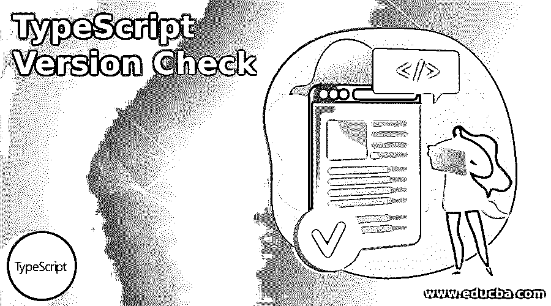
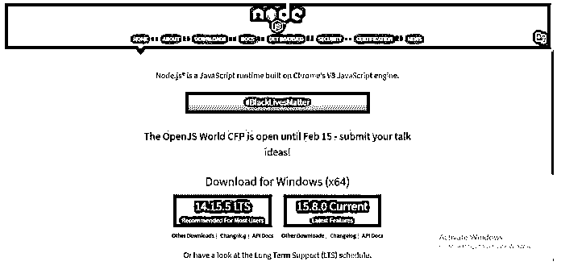
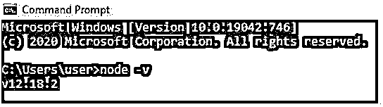
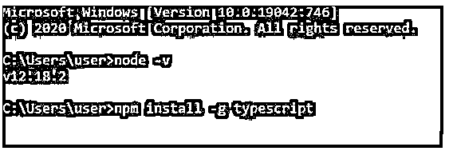
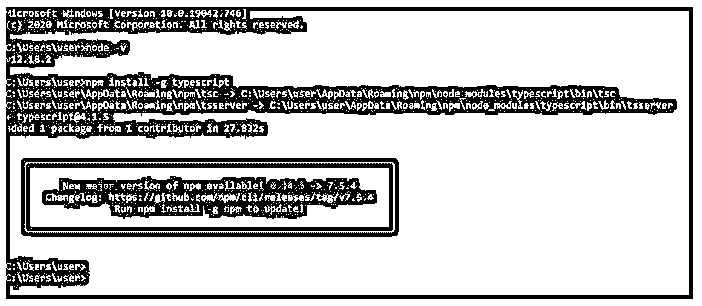
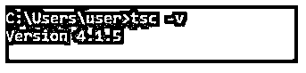

# 类型脚本版本检查

> 原文：<https://www.educba.com/typescript-version-check/>

## 类型脚本版本检查简介

TypeScript 版本检查是检查系统上安装的 TypeScript 的版本。TypeScript 是当今蓬勃发展的技术，是 JavaScript 语言的超集，简单地说，TypeScript 具有一些额外的字符串修改功能。TypeScript 是一种新的语言，由微软开发人员与开发 c# 0.8 版本的首席架构师之一安德斯·海尔斯伯格在两年内于 2012 年 10 月推出供公众使用。TypeScript 版本的设计方式使得它可以用于大型应用程序的开发。

**语法:**

<small>网页开发、编程语言、软件测试&其他</small>

下面是用户在 IDE 中检查 TypeScript 版本的一种方法。

在任何终端或命令提示符下使用的命令提示符。

`tsc -v`

不需要传递任何参数，这将只返回当前安装在系统上的 TypeScript 版本。

### TypeScript 版本检查示例

下面给出了 TypeScript 版本检查的示例:

要检查 TypeScript 版本，首先我们需要在我们的机器上安装 Node。

**后续步骤:**

**步骤 1:** 需要在你的机器上安装任意版本的 Node js。你可以在 nodejs.org 网站上找到它。

**第二步:**安装 nodejs，在命令提示符下检查 nodejs 的版本，如下图。

**代码:**

`node -v`

**输出:**

步骤 3: 现在我们可以使用 nodejs 设置 TypeScript 了。安装 TypeScript。

**代码:**

`npm install -g typescript`

**输出:**

这就是 TypeScript 的安装方式。现在我们可以检查 TypeScript 版本检查。

**第四步:**检查打字稿版本。

**代码:**

`tsc -v`

**输出:**

所以在这里，你可以，版本 4.1.5 是最新的版本，安装在我们的系统上。

您也可以使用 tsc 版本

### 打字稿版本

我们还需要知道市场上所有可用的 TypeScript 版本。首先，TypeScript 是在 0.8 版本中引入的。在 0.8 版本发布后，一位墨西哥程序员称赞了这种语言，但也批评了它缺乏 IDE 支持，不包括在 OS X 和 Linux 上不可用的 Microsoft Visual Studio。

2013 年发布了 TypeScript 版本，该版本实际上修复了 IDE 问题，并增加了对通用功能的支持。

后来是 2014 年的 TypeScript 版本。在这里，Visual Studio 2013 被作为对类型脚本语言的默认支持。

*   版本 1.1: 比以前的版本快 4 倍，最适合 JavaScript 项目。
*   版本 1.3: 它有一个额外的功能，即使用受保护的访问修饰符，该修饰符只提供对类或子类的访问。
*   版本 1.4: 引入了 ES6 的特性，比如声明 let 和 const 这样的变量，而不是使用 var 关键字。
*   版本 1.5: 它增强了导入和导出不同模块的功能。
*   **1.6 版本:**在 1.5 版本中，它已经有了。jsx 是 JavaScript 和 XML，但是只在 JavaScript 一端编译。新的扩展被发布为。嵌入的 tsx。jsx 和也引入了重命名导入。
*   **1.7 版本:**该版本支持异步编程，异步 await 和 promises。
*   **版本 1.8:** 该版本允许从相同的参数列表中引用参数。
*   **版本 2.0:** 这里支持使用空和未定义的数据类型，以前很难管理未定义和空的错误。
*   **版本 2.1:** 它提供了使用可选键的能力，在这种类型的版本中，查找类型得到了增强。
*   **2.2 版本:**支持 ES6 的 mixin 类及其构造函数类型。此外，该版本支持 JSX 扩展中的扩展运算符。
*   **2.3 版本:**该版本支持迭代器、生成器等 ES6 特性。
*   **版本 2.4:** 在这个版本中，用户可以将任何模块或库导入程序。还支持枚举的字符串初始化，称为动态导入表达式。
*   版本 2.5: 这个版本引入了可选的 catch 语句和断言。
*   **2.6 版本:**这个版本引入了-watch 标志来关注变化，它忽略了构造函数内部的方法。
*   **版本 2.7:** 这个版本允许使用 const 关键字声明属性。
*   **版本 2.8:** 该版本引入了条件运算符，即三元运算符，其工作原理与 if else 语句相同。
*   **版本 2.9:** 该版本提供对数字和符号命名属性的支持。
*   **3.0 版:**该版本允许用户借助称为项目引用的引用将项目拆分成更小的部分。
*   **3.1 版本:**该版本在 package.json 中新增了一个字段，简化了版本争议。
*   **3.2 版本:**该版本引入了 flag -strictBindCallApply，提供了调用、应用、绑定的访问。
*   **版本 3.3:** 该版本通过标记构建和观察将应用程序的总构建时间减少了 50%到 70%。
*   **版本 3.4:** 该版本引入了标记增量，有助于加快应用程序的构建过程。
*   版本 3.5: 这个版本通过构建和类型检查临时优化。
*   版本 3.6: 这个版本通过使用生成器改进了类型检查。它还支持 Unicode 字符，并具有智能自动导入语法..
*   版本 3.7: 这个版本引入了作为函数真值检查的中断更改，也有无效合并操作符(？?).
*   **版本 3.8:** 这个版本为仅类型导入和导出增加了新的语法。
*   **3.9 版本:**该版本增加了速度改进，JavaScript 中常见的 JS 自动导入，在推理和 promise.all 中也做了改进。
*   **4.0 版本:**这不是稳定版，是测试版。这个版本引入了可变元组类型和带标签的元组元素。

### 结论

4.1 版本是我们在示例中看到的最新版本。至此，我们将结束“类型脚本版本检查”主题。我们已经看到了什么是版本检查，以及如何使用命令提示符来完成。我们还检查了 TypeScript 的所有版本，以及在任何版本中所做的或添加的所有最新更改。您还可以使用任何 IDE 平台来检查 TypeScript 版本。和上面提到的一样。只要打开 IDE 终端，输入 tsc -v，就会显示版本。

### 推荐文章

这是一个打字稿版本检查的指南。这里我们分别讨论介绍、示例和类型脚本版本。您也可以看看以下文章，了解更多信息–

1.  [打字稿功能](https://www.educba.com/typescript-functions/)
2.  [打字稿操作符](https://www.educba.com/typescript-operators/)
3.  [打字稿版本](https://www.educba.com/typescript-versions/)
4.  [什么是 TypeScript？](https://www.educba.com/what-is-typescript/)

