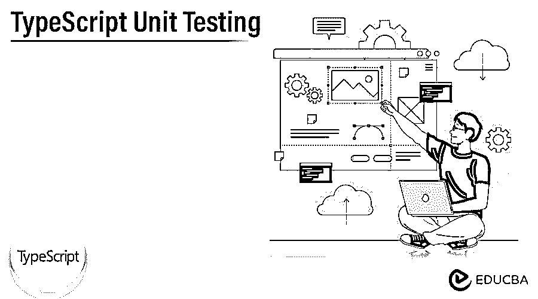

# 打字稿单元测试

> 原文：<https://www.educba.com/typescript-unit-testing/>




## TypeScript 单元测试简介

TypeScript 单元测试是一种测试技术，它挑选出运行的小的谨慎的代码单元。在我们可以说，如果我们有一个函数，可以计算两个数字的总和，可以做哪些单元测试，以确认它肯定是正确的工作？而且每一个单元测试都可以针对添加的单元单独独立地进行，单元测试就是可以实现其他代码来证明正在运行的代码工作正常的代码。

### 什么是 TypeScript 单元测试？

单元测试是我们代码库的最佳步骤之一。在类似的流程中，写下测试用例是非常乏味的，它可以是另一种接近我们核心代码的子应用程序，如果它得到了准确的控制，那么单元测试可以在调试代码时保留我们的生命和大脑。对于 TypeScript，单元测试是在创建的 JavaScript 代码上运行的，在大多数情况下，我们可以通过在代码中设置断点来调试单元测试。

<small>网页开发、编程语言、软件测试&其他</small>

### 如何创建 TypeScript 单元测试？

为了创建 TypeScript 单元测试，我们需要遵循一些约定:

*   我们需要将 JS/TS 文件放在“src”文件夹中，将测试类型脚本文件放在“test”文件夹中。
*   然后，我们必须为 TypeScript 安装一个“npm”包，然后需要定义一个执行测试用例所必需的测试脚本。
*   为了在节点中执行测试，我们必须在“package.json”中为测试定义“脚本”。
*   为了调试类型脚本测试，JSON 必须在“VS 代码调试”部分进行描述。
*   然后我们需要在 VS 代码中添加配置，npm 命令就在那里，可以用于调试。

### TypeScript 单元测试设置

让我们来看一个带有 typescript 的自以为是的单元测试环境的设置，通过它我们也能够以类似的态度创建一个项目。

因此，从项目文件夹布局开始，我们可以通过遵循“src”文件夹的相同内部结构来安排我们的测试，当我们想要支持公共态度时，它也可以操作。

```
root
| node_modules
| src
| test
| package.json
| tsconfig.json
```

TypeScript 项目需要一些依赖项:

```
"npm install --dev ts-node mocha @testdeck/mocha nyc chai ts-mockito"
```

我们将从中获得什么:

*   **ts-node:** 这已用于运行。ts 的文件，并及时编译它们。
*   摩卡:它已经被用作测试跑步者。
*   **@testdeck/mocha:** 有了它的帮助，我们就可以像编写测试套件一样编写类型脚本类了。
*   **nyc:** 能够创建覆盖报告。
*   **柴:**可以作为假设库使用。
*   **ts-mockito:** 是 mockito 已经倾向于 Java 的嘲讽库。

如果我们有一个根“tsconfig ”,那么我们需要配置“tsconfig.json ”,并且我们需要在“test”文件夹中创建一个用于测试的“tsconfig.json”。

```
| node_modules
| src
| test
| --- tsconfig.json
| package.json
| tsconfig.json
```

然后，我们需要注册文件，以便在 ts 节点上加载“tsconfig”工具，从而提高性能。

我们需要追加两个文件，如。/.mocharc.json '和'。/.nycrc.json。

**。/.mocharc.json:**

```
{
"require": "./register.js",
"reporter": "dot"
}
```

**。/.nycrc.json:**

```
{
  "extends": "@istanbuljs/nyc-config-typescript",
  "include": [
    "src/**/*.ts"
  ],
  "exclude":[
    "node_modules/"
  ],
  "extension":[
    ".ts"
  ],
  "reporter":[
    "text-summary",
    "html"
  ],
  "report-dir": "./coverage"
}
```

在最后阶段，我们需要运行测试，打开 package.json，并在脚本对象中添加以下命令。

```
"test": "nyc ./node_modules/.bin/_mocha 'test/**/*.ts'",
```

### TypeScript 单元测试项目

Visual Studio 2022 中的 CLI-build 项目可以与测试资源管理器一起运行，jest 是可以用于 React 和 Vue 项目的测试框架，因此我们可以路由每个框架给出的默认测试，也可以解释额外的测试，我们只需要破坏测试资源管理器中的“运行”按钮。

如果我们没有打开浏览器，那么我们需要通过选择菜单栏中的 Test >Test Explorer 来找出答案。Node.js 对于管理单元测试是必不可少的。Mocha 和 Tape 测试库也得到了 CLI-build 项目的帮助。

### 利益

*   单元测试是快速的，它给开发人员快速的反馈。
*   当它失败时，我们就能找到问题所在。
*   单元测试可以给出代码质量的反馈。
*   它可以被认为是对回归的一种保护。
*   它也被认为是一个可行的代码文档。
*   因为单元测试，重写代码是可行的。

### TypeScript 单元测试示例

让我们看一个例子，设置一个具有“加”、“减”、“乘”和“除”方法的“计算器”类，然后附加一个“描述”函数并提供一个可以概括测试集的字符串值，我们可以说为一个组下的每个测试或测试用例组附加一个“描述”方法是一个很好的目标，代码将在下面给出。

```
describe ('Calculations from Calculator class', () => {
describe (‘add two numbers', () => {
});
describe ('subtract two numbers', () => {
});
describe ('multiply two numbers', () => {
});
describe ('divide two numbers', () => {
});
});
```

在上面的例子中，我们能够在“描述”方法之后编写测试用例。

### 结论

在本文中，我们得出结论，单元测试是测试小代码单元的第一级测试。我们还看到了如何创建 typescript 单元测试、设置它、项目、示例和好处。所以这将有助于理解这个概念。

### 推荐文章

这是一个 TypeScript 单元测试指南。这里我们讨论一下简介，以及如何创建 TypeScript 单元测试。项目、优势和示例。您也可以看看以下文章，了解更多信息–

1.  [类型脚本枚举](https://www.educba.com/typescript-enum/)
2.  [打字稿图](https://www.educba.com/typescript-map/)
3.  [打字稿布尔型](https://www.educba.com/typescript-boolean/)
4.  [TypeScript 正则表达式](https://www.educba.com/typescript-regex/)


