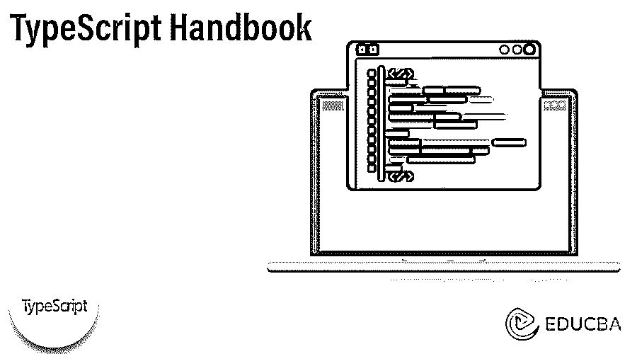
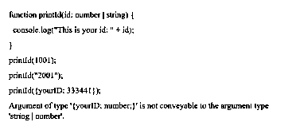

# 打字手册

> 原文：<https://www.educba.com/typescript-handbook/>




## 打字手册介绍

《typescript 手册》计划成为一个完整的文档，向普通程序员演示 typescript。我们可以通过在左侧导航中从上到下来解释手册，并且我们可以通过对所提供概念的深刻理解来展望每一章或每一页。typescript 手册的目标是成为 JavaScript 程序的静态类型检查器，因为它不是绝对的语言定义，而是所有语言特性的指南，它可以在代码实现之前运行。

typescript 手册并不完全是为语言描述而创建的，但它也可以用作所有语言功能和特征的指南，读者可以在其中浏览并识别常用的语法和设计。该手册还计划成为语言定义的替代品，在某些情况下，它的轴承可以跳过，以表彰高层次，不复杂的理解。相反，它有不同的参考页面，可以更准确地描述。它的参考页无法为不熟悉 typescript 的读者进行讨论，因此他们可以利用迄今为止尚未仔细检查的最新术语。

<small>网页开发、编程语言、软件测试&其他</small>

### TypeScript Handbook 是如何构造的？

打字稿手册的结构分为两部分:

#### 1.手册

打字稿手册的目的是每天向开发人员演示打字稿，并且手册是文档的形式，开发人员可以通过从上到下仔细检查手册，这在左侧导航中可用。我们可以期待每一章或每一页都能给我们对所提供假设的有力理解；这不是一个完善的语言定义，但它被认为是所有语言属性和礼仪的通用指南。

完成练习的读者应该能够:

*   理解和学习常用的语法和打字稿的设计。
*   展示主要编译器选项的结果。
*   在大多数情况下，预测类型系统的状态。

在透明和冗长的利润，手册的主要内容将不会检查每个边界的功能，被抵消，我们也可以搜索出额外的特殊概念。

#### 2.参考文件

导航手册的这一部分旨在让读者充分理解打字稿的具体部分是如何进行的，我们可以从上到下仔细阅读，但每一部分都侧重于对一个概念的高度简化，这意味着没有关注流程。

### 打字手册的基本类型

下面给出了打字稿手册的基本类型:

#### 1.联合类型

可以使用“union type”合并两种类型，union type 也可以从两种或更多种其他类型创建。它可以代表这些类型之一的值。让我们看看可以用在字符串或数字上的函数。

**代码:**

```
function printId(id: number | string) {
console.log("This is your id: " + id);
}
printId(1001);
printId("2001");
printId({yourID: 333441});
Argument of type '{yourID: number;}' is not conveyable to the argument type 'string | number'.
```

**输出:**




#### 2.对象类型

基本上在 JavaScript 中，数据可以通过对象处理，但是在 TypeScript 中，数据可以由对象类型构成。

**代码:**

```
function greet (human: {name: string; age: number})
{
return "Hi" + human.name;
}
```

在这个例子中，可以使用的函数保存具有属性“name”的对象，该属性是字符串，年龄是“number”。

#### 3.擦除类型

让我们看一下当我们试图用“tsc”编译“greet”函数来生成 JavaScript 时会发生什么。

**代码:**

```
"use strict";
function greet(human, date) {
console.log("Hi".concat(human, ", today is ").concat(date.toDateS
}
greet ("Clove", new Date ());
```

#### 4.显式类型

让我们用一个例子来说明什么是显式类型。

**代码:**

```
function greet (human: string, date: Date)
{
console.log ("Hi, ${human}, today is ${date.toDateString()}")
}
```

我们没有通知类型脚本什么是“人类”或“日期”，因此我们已更正代码，通知类型脚本“人类”是“字符串”，“日期”应该是“日期”对象，并且我们对“日期”使用了“toDateString()”方法。

### 打字手册对工程师的帮助

*   **向专家传授 JavaScript:**JavaScript 可以从各种资源中学习，包括书籍，因为没有必要参与其中。该手册的主要目标是帮助工程师理解 JavaScript 上的类型脚本构造过程，这样对我们的文档的关注可以创建关于背景的假设，并避免从头开始描述 JavaScript 特性。这并不是说我们不想在手册的帮助下尊重不同技能水平的人。
*   **循序渐进:**我们需要在每个人的基础上直接构建概念，以避开没有描述的打字稿特征，这种限制可以很好地迫使我们重新思考语言概念的顺序和分类。
*   **解释日常案例:**大约 8 年来，打字稿没有删除任何记录任何概念的所有可行利用和可行选项的功能，这些功能已经超出了手册的权限，并进入了我们不断增长的参考页。

### 结论

在这篇文章中，我们得出结论，打字稿手册可以帮助程序员规划可以表示打字稿的整个文档。我们还讨论了打字稿手册的结构，打字稿手册的基本类型，以及打字稿手册如何帮助工程师进行介绍。

### 推荐文章

这是一本打字手册指南。这里我们讨论一下入门，打字稿手册是怎么结构化的？和类型。您也可以看看以下文章，了解更多信息–

1.  [类型脚本枚举](https://www.educba.com/typescript-enum/)
2.  [打字稿图](https://www.educba.com/typescript-map/)
3.  [打字稿布尔型](https://www.educba.com/typescript-boolean/)
4.  [TypeScript 正则表达式](https://www.educba.com/typescript-regex/)


