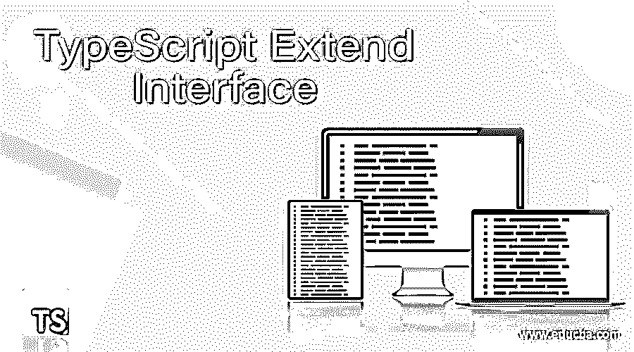
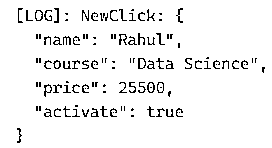
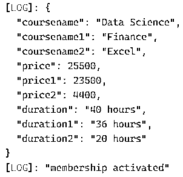
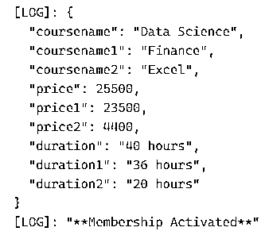
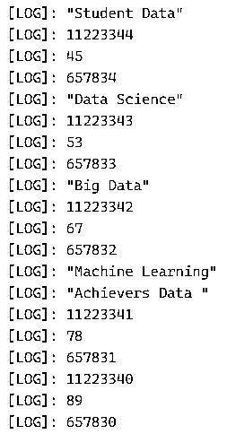

# 类型脚本扩展接口

> 原文：<https://www.educba.com/typescript-extend-interface/>

## TypeScript 扩展接口简介

Typescript 为我们提供了一种以我们都希望的方式编写 JavaScript 的方法。Typescript 被认为是 JavaScript 的超集，它将代码编译成普通的 JavaScript。Typescript 是一种具有接口和类的面向对象的编程语言，它像 Java 或 c 一样是静态类型的。我们都知道 Angular 2.0，这种语言实际上是用 Typescript 编写的。typescript 最好的特性是程序员可以编写基于 oops 概念的程序，并且可以在服务器和客户端将它们编译成 JavaScript。在本文中，我们将解释 Typescript 中使用的扩展接口。本文将包括几个例子来帮助读者理解 Typescript 扩展接口。

**在 Typescript 中扩展接口的语法:**

<small>网页开发、编程语言、软件测试&其他</small>

`interface EDUCBA {
coursename: string;
price: number;
coursename1: string;
price1: number;
coursename2: string;
price2: number;
}
interface New extends EDUCBA {
duration: string;
duration1: string;
duration2: string;
click(): void;
}
……………………`

### 例子

用示例解释 Typescript 中的扩展接口:

实体需要遵循的语法契约称为接口。我们也可以把它定义为接口代表了一个实体应该遵守的语法。属性、事件和方法由接口定义，它们也是接口的成员。接口中只包含成员的声明。成员由派生类定义。其他接口也可以通过 Typescript 中的一个接口来扩展，这意味着一次可以通过一个接口来扩展多个接口。该接口还可以扩展 Typescript 中的类。

#### 示例#1

**代码:**

`interface Old {
name: string;
course: string;
startSomething(activate: boolean): void;
}
interface Click extends Old {
price: number;
}
class NewClick implements Click {
name: string;
course: string;
price: number;
constructor( name: string, course: string, price: number) {
this.name = name;
this.course = course;
this.price = price;
}
startSomething(activate: boolean): void {
this.activate = activate;
}
}
let newcourse: Click = new NewClick('Rahul', 'Data Science', 25500);
newcourse.startSomething(true)
console.log(newcourse);`

**输出:**

#### 实施例 2

**代码:**

`interface EDUCBA {
coursename: string;
price: number;
coursename1: string;
price1: number;
coursename2: string;
price2: number;
}
interface New extends EDUCBA {
duration: string;
duration1: string;
duration2: string;
click(): void;
}
let clk: New = {
coursename: "Data Science", coursename1: "Finance", coursename2: "Excel",
price: 25500, price1: 23500, price2: 4400,
duration: "40 hours", duration1: "36 hours", duration2: "20 hours",
click: function () {
console.log("membership activated")
}
};
console.log(clk);
clk.click();`

**输出:**

#### 实施例 3

**代码:**

`interface EDUCBA {
coursename: string;
price: number;
coursename1: string;
price1: number;
coursename2: string;
price2: number;
}
interface Action {
click(): void;
click1(): void;
click2(): void;
}
interface New extends EDUCBA, Action {
duration: string;
duration1: string;
duration2: string;
}
let clk: New = {
coursename: "Data Science", coursename1: "Finance", coursename2: "Excel",
price: 25500, price1: 23500, price2: 4400,
duration: "40 hours", duration1: "36 hours", duration2: "20 hours",
click: function () {
console.log("**Membership Activated**")
},
click1: function () {
console.log("**Plan is 1 year long**")
},
click2: function () {
console.log("**Happy Learning!!**")
}
};
console.log(clk);
clk.click();`

**输出:**

#### 实施例 4

**代码:**

`interface EDUCBA {
rollnumber:number,
marks:number,
registrationnumber: number,
rollnumber1:number,
marks1:number,
registrationnumber1: number,
rollnumber2:number,
marks2:number,
registrationnumber2: number,
bestcourse: string,
bestcourse1: string,
bestcourse2: string
}
var first:EDUCBA = {
rollnumber:11223344,
marks:45,
registrationnumber: 657834,
bestcourse:"Data Science",
rollnumber1:11223343,
marks1:53,
registrationnumber1: 657833,
bestcourse1: "Big Data",
rollnumber2:11223342,
marks2:67,
registrationnumber2: 657832,
bestcourse2:"Machine Learning",
}
console.log("Student Data")
console.log(first.rollnumber)
console.log(first. marks)
console.log(first.registrationnumber)
console.log(first.bestcourse)
console.log(first.rollnumber1)
console.log(first.marks1)
console.log(first.registrationnumber1)
console.log(first.bestcourse1)
console.log(first.rollnumber2)
console.log(first.marks2)
console.log(first.registrationnumber2)
console.log(first.bestcourse2)
var second:EDUCBA = {
rollnumber:11223341,
marks:78,
registrationnumber: 657831,
bestcourse:"Artificial Intelligence",
rollnumber1:11223340,
marks1:89,
registrationnumber1: 657830,
bestcourse1:"Software Development",
rollnumber2:11223348,
marks2:81,
registrationnumber2: 657839,
bestcourse2:"Cloud Computing",
}
console.log("Achievers Data ")
console.log(second.rollnumber);
console.log(second.marks);
console.log(second.registrationnumber);
console.log(second.rollnumber1);
console.log(second.marks1);
console.log(second.registrationnumber1);
console.log(second.rollnumber2);
console.log(second.marks2);
console.log(second.registrationnumber2);`

**输出:**

### 结论

在上述文章的基础上，我们理解了 typescript 的概念并扩展了接口。本文解释了 Typescript 扩展接口及其工作和不同的例子，这将有助于每个人理解和实现这个概念。本文将帮助那些希望为自己的程序实现扩展信息的 Typescript 初学者。

### 推荐文章

这是一个关于 TypeScript 扩展接口的指南。在这里，我们讨论代码实现的介绍、语法和示例。您也可以看看以下文章，了解更多信息–

1.  [打字稿可选链接](https://www.educba.com/typescript-optional-chaining/)
2.  [对象的类型脚本数组](https://www.educba.com/typescript-array-of-objects/)
3.  [枚举的键入关键字](https://www.educba.com/typescript-keyof-enum/)
4.  [键入脚本键值对](https://www.educba.com/typescript-key-value-pair/)

