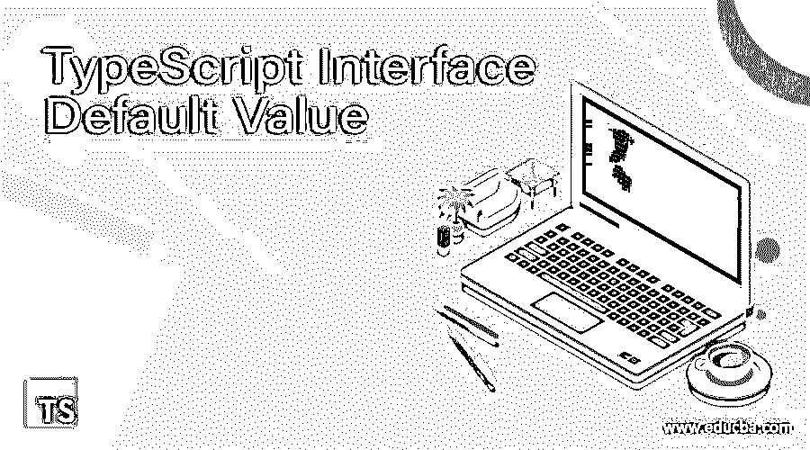
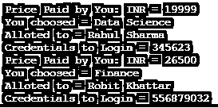
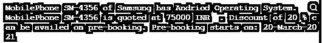

# TypeScript 接口默认值

> 原文：<https://www.educba.com/typescript-interface-default-value/>

## TypeScript 接口默认值介绍

实体必须遵守称为接口的语法契约。这里，语法由接口定义，每个实体都必须遵循。方法、属性和事件由接口定义，也是接口的成员。只有成员在接口中声明。派生类负责定义成员。一个接口甚至为它必须遵循的派生类提供了一个标准结构。在本文中，Typescript 接口默认值已经用它的工作和不同的例子进行了解释。该示例将帮助读者实现 Typescript 接口默认值。

**type script 语法中的接口默认值:**

<small>网页开发、编程语言、软件测试&其他</small>

要声明接口，需要使用 interface 关键字。下面的语法显示了如何在 TypeScript 中声明接口

`interface interface_name {
…………
}`

现在，在接口的声明语法中，可以定义不同的对象，例如，

`interface EDUCBA {
courseName:string,
courseDuration:number,
courseCode:number,
loginAccess: number,
supplementaryCourse: string,
greetings: ()=>string
}
Moving further these default values are given data as,
var course1:EDUCBA = {
courseName:"Data Science",
courseDuration:22,
courseCode: 22435,
supplementaryCourse: "Data Analyst",
loginAccess: 10,
greetings: ():string =>{return "Heyoo! We have Updated your Learning Course"}
}
In last it is called as,
console.log("Earlier Course ")
console.log(course1.courseName)
console.log(course1.courseDuration, "Hours")
console.log(course1.courseCode)
console.log(course1.supplementaryCourse)
console.log(course1.loginAccess, "Weeks")
console.log(course1.greetings())`

### 例子

使用 TypeScript 中的接口默认值用示例解释:

#### 示例#1

**代码:**

`interface EDUCBA {
courseName:string,
courseDuration:number,
courseCode:number,
loginAccess: number,
supplementaryCourse: string,
greetings: ()=>string
}
var course1:EDUCBA = {
courseName:"Data Science",
courseDuration:22,
courseCode: 22435,
supplementaryCourse: "Data Analyst",
loginAccess: 10,
greetings: ():string =>{return "Heyoo! We have Updated your Learning Course"}
}
console.log("Earlier Course ")
console.log(course1.courseName)
console.log(course1.courseDuration, "Hours")
console.log(course1.courseCode)
console.log(course1.supplementaryCourse)
console.log(course1.loginAccess, "Weeks")
console.log(course1.greetings())
var course2:EDUCBA = {
courseName:"Finance",
courseDuration:24,
courseCode: 346678,
supplementaryCourse: "Business Analyst",
loginAccess: 10,
greetings: ():string =>{return "Heyoo!! Welcome"}
}
console.log("Updated Course ")
console.log(course2.courseName);
console.log(course2.courseDuration, "Hours");
console.log(course2.courseCode);
console.log(course2.supplementaryCourse);
console.log(course2.loginAccess, "Weeks")`

**输出:**

#### 实施例 2

**代码:**

`interface EDUCBA
{
(pricePaid: number,
courseName: string,
allotedTo: string,
loginID: number,
): void;
};
function newData
(
pricePaid:number,
courseName:string,
allotedTo: string,
loginID: number,
):void {
console.log(" Price Paid by You: INR = " + pricePaid)
console.log(" You choosed = " + courseName)
console.log(" Alloted to = " + allotedTo)
console.log(" Credentials to Login = " + loginID)
}
function updatedData
(
pricePaid: number,
courseName:string,
allotedTo: string,
loginID: number,
):void {
console.log(" Price Paid by You: INR = "+ pricePaid)
console.log(" You choosed = " + courseName)
console.log(" Alloted to = " + allotedTo)
console.log(" Credentials to Login = " + loginID)
}
let hi: EDUCBA = newData;
hi(19999,
'Data Science',
"Rahul Sharma",
345623);
hi = updatedData;
hi(26500,
'Finance',
"Rohit Khattar",
556879032);`

**输出:**

#### 实施例 3

**代码:**

`interface MobilePhone {
modelName: string;
modelNumber: number;
operatingSystem: string;
company: string;
price: number;
discount: number;
preBooking: string;
}
let Information = (type: MobilePhone): void => {
console.log(
'MobilePhone ' + type.modelName + ' of ' + type.company + ' has ' + type.operatingSystem + ' Operating System.'
);
};
let Information1 = (type: MobilePhone): void => {
console.log(
'MobilePhone ' + type.modelName + ' is quoted at ' + type.price + ' INR ' + ' . Discount of ' + type.discount + ' % can be availed on pre-booking' + ". Pre-booking starts on: " + type.preBooking
);
};
let Info = {
modelName: 'SM-4356',
modelNumber: 7823095467,
operatingSystem: 'Andriod',
company: 'Samsung',
price: 75000,
discount: 20,
preBooking: '20-March-2021'}
Information(Info),
Information1(Info);`

**输出:**

### 结论

在上述文章的基础上，我们理解了 typescript 接口的概念和接口的默认值。本文用不同的例子和工作来解释这个概念。这些例子将帮助初学者理解这个概念，并根据他们的要求实现它。

### 推荐文章

这是一个关于 TypeScript 接口默认值的指南。这里我们分别用例子来讨论 TypeScript 中的简介、语法、使用接口默认值。您也可以看看以下文章，了解更多信息–

1.  [键入多个构造函数](https://www.educba.com/typescript-multiple-constructors/)
2.  [打字稿类型](https://www.educba.com/typescript-typeof/)
3.  [类型脚本转换对象](https://www.educba.com/typescript-cast-object/)
4.  [循环的打字稿](https://www.educba.com/typescript-for-loop/)

