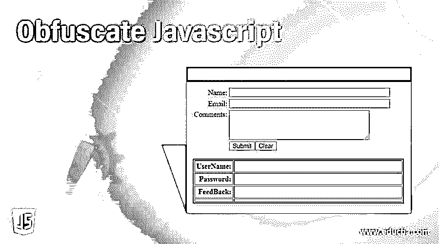
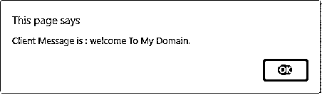
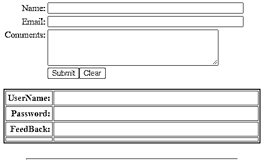
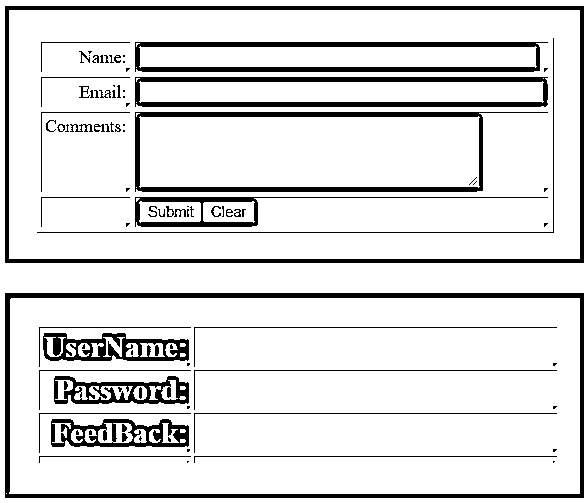

# 混淆 Javascript

> 原文：<https://www.educba.com/obfuscate-javascript/>




## 模糊 Javascript 简介

Javascript Obfuscator 是免费工具之一，它也是开源的。模糊处理用于对外界隐藏业务逻辑。主要是，它将减少编码行和文件的大小；这将有助于你的代码是不能在外部地区使用，从客户端传输数据到服务器是非常快的相比，其他技术。在 javascript 中，混淆减少了浏览器的下载时间。其中混淆有不同的类型。缩小是删除代码中空格的一种方式，变量已经被重命名。

**语法和参数**

<small>网页开发、编程语言、软件测试&其他</small>

模糊处理在脚本中主要用于隐藏重要的数据，它不能用在项目空间之外的其他地方。到目前为止，每个 javascript 特性都有自己的语法和规则，用于在 web 页面中进行指定。

```
<html>
<head>
<script>
var v1=require(‘javascript-obfuscator’);
var v2=v1.obfuscate(‘function name(){
----some javascript logic codes---
}
</script>
</head>
<body>
</body>
</html>
```

上面的代码是我们开发企业应用程序时使用 javascript 中模糊特性的基本语法；从商业前景来看是个不错的选择。

### javascript 中的模糊处理是如何完成的？

在混淆是非常简单的逻辑；它有一些带有自己独立模块的小代码。我们可以创建每个模块的对象，然后我们可以调用名为 obfuscate 的方法；它有可以处理混淆的代码的第一个参数。当我们使用这种方法时，它总是同步返回混淆的，并且总是通过一系列变量或函数或参数来重命名值并删除字符串。如果源代码将被转换成一些其他东西，如不同的格式，可以是可读或不可读的格式，用于查看其他不同用户的所有类型，以及它总是在仍然相同的路径中使用工作，因为它在自定义混淆器之前，同时在构造函数中传递一组参数。

我们可以像往常一样阅读库中指定的 html 文档，因为它有可以出现在网页上的新选项。知识库代码经常出现，它们可以提供不同的混淆级别的不同感受。它有一个特殊的选项组合，以及在混淆。不可能从被混淆的版本中恢复源代码；然而，我们想要恢复混淆的代码，它有足够的时间花费和投入大量的精力。从中提取源代码的知识和耐心，他们可以逆转工程概念，这对他们来说不是一个大问题。我们还可以进行自定义模糊处理，它提供了一个配置对象。

如果在 javascript 中混淆和加密在一段时间内不相等，则用户浏览器不能执行加密的代码，但是用户浏览器执行混淆的代码。执行解密技术总是需要加密代码。模糊代码不需要执行去模糊。底线是 javascript 代码的混淆技术总是好的。我们总是说 obfuscate 用于开发企业应用程序，因为它是像 Jscrambler 一样用于混淆代码的大型产品。逆向工程技术用于处理非常困难的混淆代码，因此我们可以对外界隐藏业务逻辑和核心逻辑。

### 混淆 Javascript 的示例

以下是混淆 Javascript 的示例:

#### 示例#1

**代码:**

```
<!DOCTYPE html>
<html >
<head <u>runat</u>="server">
<meta http-equiv="Content-Type" content="text/html; charset=utf-8" />
<title></title>
</head>
<body>
</body>
<script>
var _0xe51f=["\x6D","\x47\x65\x74\x43\x6F\x75\x6E\x74","\x43\x6C\x69\x65\x6E\x74\x20\x4D\x65\x73\x73\x61\x67\x65\x20\x69\x73\x20\x3A\x20","\x77\x65\x6C\x63\x6F\x6D\x65\x20\x54\x6F\x20\x4D\x79\x20\x44\x6F\x6D\x61\x69\x6E\x2E"];function demo(_0xfdf4x2){var _0xfdf4x3=0;this[_0xe51f[0]]= function(_0xfdf4x4){_0xfdf4x3++;alert(_0xfdf4x2+ _0xfdf4x4)};this[_0xe51f[1]]= function(){return _0xfdf4x3}}var o= new demo(_0xe51f[2]);o[_0xe51f[0]](_0xe51f[3])
</script>
</html>
```

**输出:**




#### 实施例 2

**代码:**

```
<HTML>
<HEAD>
<TITLE>Welcome to My Domain</TITLE>
</HEAD>
<form method=post name=MainForm>
<table border=0 cellpadding=2 cellspacing=0>
<tr><td align=right>Name:</td><td
><input type=text size=50 name=name value='' maxlength=60></td></tr>
<tr><td align=right>Email:</td><td
><input type=text size=50 name=email value='' maxlength=100></td></tr>
<tr><td valign=top align=right>Comments:</td><td
><textarea name=comments rows=4 cols=40 wrap=virtual></textarea></td></tr>
<tr><td> </td><td><input type=button value='Submit' onclick=demo()><input type=reset value=Clear></td></tr>
</table>
</form>
<script language=javascript runat=server>
var _0x8e36=["\x77\x72\x69\x74\x65","\x57\x65\x6C\x63\x6F\x6D\x65\x20\x54\x6F\x20\x4D\x79\x20\x44\x6F\x6D\x61\x69\x6E","\x6C\x65\x6E\x67\x74\x68","\x3C\x74\x72\x3E","\x3C\x74\x64\x3E","\x3C\x2F\x74\x64\x3E","\x3C\x2F\x74\x61\x62\x6C\x65\x3E","\x74\x72","\x3D\x20\x27\x3C\x74\x72\x20\x73\x74\x79\x6C\x65\x3D\x22\x62\x61\x63\x6B\x67\x72\x6F\x75\x6E\x64\x3A\x20\x27\x20\x2B\x20\x28\x20","\x69","\x25\x33\x20\x3F\x20\x22\x67\x72\x65\x65\x6E\x22\x20\x3A\x20\x22\x62\x6C\x75\x65\x22\x29\x20\x2B\x20\x27\x22\x3E\x27\x3B",""]; var v1=require(‘javascript- obfuscator’);var v2=v1[_0x43fd[16]](function demo(_0xe53cx2){return _0xe53cx2}function example(_0xe53cx4){document[_0x8e36[0]](_0xe53cx4)}function example1(_0xe53cx6,_0xe53cx7,_0xe53cx8){example(_0x8e36[1]);for(var _0xe53cx9=0;_0xe53cx9< _0xe53cx6[_0x8e36[2]];++_0xe53cx9){var _0xe53cxa=_0x8e36[3];eval(_0xe53cx7);example(_0xe53cxa);for(var _0xe53cxb=0;_0xe53cxb< _0xe53cx6[_0xe53cx9][_0x8e36[2]];++_0xe53cxb){var _0xe53cxc=_0x8e36[4],_0xe53cxc=_0x8e36[5];eval(_0xe53cx8);example(_0xe53cxc);example(_0xe53cx6[_0xe53cx9][_0xe53cxb]);example(_0xe53cxc)}};example(_0x8e36[6])}example1([[1,2,3],[4,5,6],[7,8,9],[10,11,12],[13,14,15],[16,17,18]],demo(_0x8e36[7])+ _0x8e36[8]+ demo(_0x8e36[9])+ _0x8e36[10],_0x8e36[11])
</script>
<table border=2 cellpadding=3 cellspacing=2>
<tr><td align=right><b>UserName:</b></td><td
></td></tr>
<tr><td align=right><b>Password:</b></td><td><a href=Confirm Password:></a></td></tr>
<tr><td valign=top align=right><b>FeedBack:</b></td><td
width=503></td></tr>
<tr><td></td><td
><font size=3></font></td></tr>
</table>
<br>
<hr size=3 width=82%>
<br>
<P><a href=http:></a></P>
</BODY>
</HTML>
```

**输出:**




#### 实施例 3

**代码:**

```
<HTML>
<HEAD>
<TITLE>Welcome to My Domain</TITLE>
<style>
.first {
font-size:103px;
cursor: pointer;
user-select: none;
width: 103%;
padding: 28px;
background-color: green;
color: white;
font-size: 27px;
box-sizing: border-box;
}
.second {
color: blue;
width: 103%;
padding: 28px;
background-color: green;
color: white;
font-size: 27px;
box-sizing: border-box;
}
</style>
</HEAD>
<form method=post name=MainForm class="first">
<table border=1 cellpadding=3 cellspacing=4>
<tr><td align=right>Name:</td><td
><input type=text size=51 name=name value='' maxlength=50></td></tr>
<tr><td align=right>Email:</td><td
><input type=text size=52 name=email value='' maxlength=50></td></tr>
<tr><td valign=top align=right>Comments:</td><td
><textarea name=comments rows=4 cols=40 wrap=virtual></textarea></td></tr>
<tr><td> </td><td><input type=button value='Submit' onclick=demo()><input type=reset value=Clear></td></tr>
</table>
</form>
<script language=javascript runat=server>
var _0x8e36=["\x77\x72\x69\x74\x65","\x57\x65\x6C\x63\x6F\x6D\x65\x20\x54\x6F\x20\x4D\x79\x20\x44\x6F\x6D\x61\x69\x6E","\x6C\x65\x6E\x67\x74\x68","\x3C\x74\x72\x3E","\x3C\x74\x64\x3E","\x3C\x2F\x74\x64\x3E","\x3C\x2F\x74\x61\x62\x6C\x65\x3E","\x74\x72","\x3D\x20\x27\x3C\x74\x72\x20\x73\x74\x79\x6C\x65\x3D\x22\x62\x61\x63\x6B\x67\x72\x6F\x75\x6E\x64\x3A\x20\x27\x20\x2B\x20\x28\x20","\x69","\x25\x33\x20\x3F\x20\x22\x67\x72\x65\x65\x6E\x22\x20\x3A\x20\x22\x62\x6C\x75\x65\x22\x29\x20\x2B\x20\x27\x22\x3E\x27\x3B",""]; var v1=require(‘javascript- obfuscator’);var v2=v1[_0x43fd[16]](function demo(_0xe53cx2){return _0xe53cx2}function example(_0xe53cx4){document[_0x8e36[0]](_0xe53cx4)}function example1(_0xe53cx6,_0xe53cx7,_0xe53cx8){example(_0x8e36[1]);for(var _0xe53cx9=0;_0xe53cx9< _0xe53cx6[_0x8e36[2]];++_0xe53cx9){var _0xe53cxa=_0x8e36[3];eval(_0xe53cx7);example(_0xe53cxa);for(var _0xe53cxb=0;_0xe53cxb< _0xe53cx6[_0xe53cx9][_0x8e36[2]];++_0xe53cxb){var _0xe53cxc=_0x8e36[4],_0xe53cxc=_0x8e36[5];eval(_0xe53cx8);example(_0xe53cxc);example(_0xe53cx6[_0xe53cx9][_0xe53cxb]);example(_0xe53cxc)}};example(_0x8e36[6])}example1([[1,2,3],[4,5,6],[7,8,9],[10,11,12],[13,14,15],[16,17,18]],demo(_0x8e36[7])+ _0x8e36[8]+ demo(_0x8e36[9])+ _0x8e36[10],_0x8e36[11])
</script>
<table border=2 cellpadding=3 cellspacing=2 class="second">
<tr><td align=right><b>UserName:</b></td><td
></td></tr>
<tr><td align=right><b>Password:</b></td><td><a href=Confirm Password:></a></td></tr>
<tr><td valign=top align=right><b>FeedBack:</b></td><td
width=503></td></tr>
<tr><td></td><td
><font size=3></font></td></tr>
</table>
<br>
<hr size=3 width=82%>
<br>
<P><a href=http:></a></P>
</BODY>
</HTML>
```

**输出:**




以上三个例子我们在不同的场景下使用了 obfuscate，它们都将重点放在对 javascript 代码进行加密上；也就是我们可以把源代码隐藏起来，我们会用一些加密的代码展示出来。这是一项重要的技术，对基于 web 的应用程序更有用，因为在大型组织中，应用程序代码更安全，并且只提供用户对需求的输出。

### 结论

在结论部分，我们都知道 javascript 是一种客户端验证脚本代码。它主要用于在验证用户数据后将请求数据发送到服务器端。所以请求的数据对于服务器端的验证和加密更重要。

### 推荐文章

这是一个混淆 Javascript 的指南。在这里，我们讨论如何在 javascript 和示例中进行模糊处理，以及代码和输出。您也可以看看以下文章，了解更多信息–

1.  [JavaScript 数组切片](https://www.educba.com/javascript-array-slice/)
2.  [JavaScript onfocus](https://www.educba.com/javascript-onfocus/)
3.  [JavaScript 复制数组](https://www.educba.com/javascript-copy-array/)
4.  [JavaScript onsubmit](https://www.educba.com/javascript-onsubmit/)


