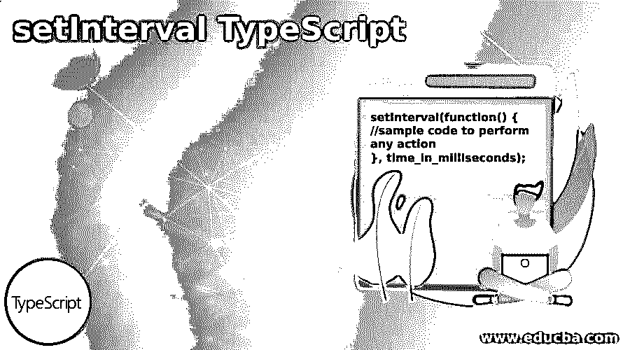
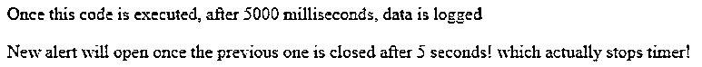
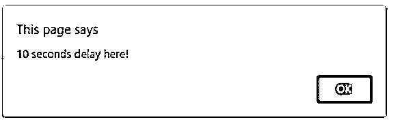
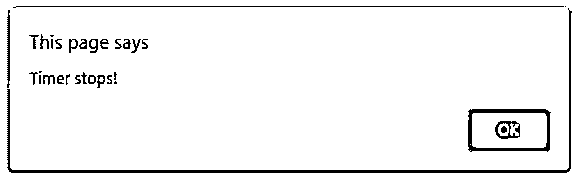
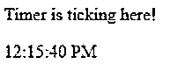
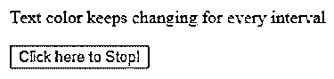
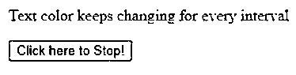

# setInterval 类型脚本

> 原文：<https://www.educba.com/setinterval-typescript/>

## setInterval 类型脚本简介

setInterval TypeScript 是一种用于以每个给定的时间间隔重复特定功能的方法。setInterval()将以一定的间隔计算表达式或调用函数。该方法将继续调用函数，直到窗口关闭或 clearInterval()方法被调用，并返回一个非零的数字来标识创建的计时器或一个数值。TypeScript 提供了许多函数，这些函数允许代码在特定时间间隔过后异步执行，并重复执行，直到用户停止。异步代码运行在主函数上。

### setInterval 类型脚本的语法

下面给出了 TypeScript 中 setInterval()的语法:

<small>网页开发、编程语言、软件测试&其他</small>

或者

`let timer = setInterval(callback function, delay,[arg1, arg2, arg3, ...]);`

*   按照语法，function()实际上是每毫秒执行的回调函数。
*   time_in_milliseconds，涉及计时器在执行回调函数之间实际应该具有的延迟。
*   arg1、arg2、arg3、…是传递给回调函数的参数。
*   setInterval()函数将返回一个非零数值，用于标识创建的计时器。它的工作方式与 setTimeout()类似，但是针对每个特定的延迟重复执行回调。

### setInterval 类型脚本的示例

下面给出了 setInterval 类型脚本的示例:

#### 示例 1: setInterval()定时器

**代码:**

`<!DOCTYPE html>
<body>

Once this code is executed, after 5000 milliseconds, data is logged

New alert will open once the previous one is closed after 5 seconds! which actually stops timer!

</body>
</html>`

**输出:**

因此，在代码执行 5 秒钟后，您就有了登录的输入。

在另外 5 秒钟内，计时器停止，如下所示。

当用户想要重复运行代码时，例如在动画或任何递归算法的情况下，setInterval()就会出现。

它的工作方式与 setTimeout()类似，但唯一的区别是作为第一个参数传递的函数被重复执行，执行时间不少于另一个参数给出的毫秒值。用户可以像传递后续参数一样，向正在执行的函数传递任意数量的参数。

#### 示例 2:用于显示计时器的 setInterval()

**代码:**

`<!DOCTYPE html>
<html>
<head>
<title>Clock using setInterval() method</title>
</head>
<body>

Timer is ticking here!

</body>
</html>`

**输出:**

这里我们显示的是间隔为 1 毫秒的计时器。

在输出中，它显示为一个常量值，但是在执行时，您可以看到 timer 每秒钟都在计时，也就是说，与 setInterval()一起使用的函数被重复调用。在这里，setInterval()方法将返回一个可识别的值，该值可以在其他方法中使用，例如设置间隔或停止计时器。setInterval()计时器将继续运行代码，直到用户做了一些事情来停止。用户应该停止此类操作，因为可能会出现错误，浏览器将无法完成其他任务。setInterval()方法的返回值被传递给 clearInterval()方法，以停止间隔。

使用 setInterval()方法的递归:选择的间隔时间包括执行用户想要运行的代码的给定部分所花费的时间。例如，让我们说，代码运行需要 60 毫秒，因此剩余的 40 毫秒将作为一个间隔结束。

#### 示例 3:用于改变文本颜色的 setInterval()

**代码:**

`<!DOCTYPE html>
<html>
<head>
<title>setInterval() to bring changes in text color, along with clearInterval to stop</title>

</head>
<body onload="colorChange();">

Text color keeps changing for every interval

<button onclick="stopColorChange();">Click here to Stop!</button>
</body>
</html>`

**输出:**

这里，一旦执行了这段代码，3 毫秒后，文本颜色将变为橙色。

另外 3 毫秒后，文本颜色变为蓝色，如下所示，基于 if 条件。

一旦您单击停止按钮，更改文本颜色将会停止。

### 结论

至此，我们将结束“setInterval TypeScript”主题。我们已经了解了什么是 setInterval TypeScript，并通过几个例子解释了它是如何工作的。我们已经看到了 setInterval()方法实现程序的语法。我们还有 clearInterval()方法来停止间隔计时器。上面的例子将清楚地说明 setInterval()是如何被实现的。

### 推荐文章

这是 setInterval 类型脚本的指南。为了更好地理解，我们在这里讨论 setInterval 类型脚本的介绍和示例。您也可以看看以下文章，了解更多信息–

1.  [打字稿 npm](https://www.educba.com/typescript-npm/)
2.  [打字稿可选链接](https://www.educba.com/typescript-optional-chaining/)
3.  [对象的类型脚本数组](https://www.educba.com/typescript-array-of-objects/)
4.  [枚举的键入关键字](https://www.educba.com/typescript-keyof-enum/)

