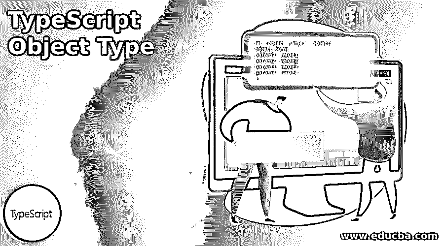
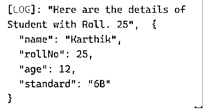
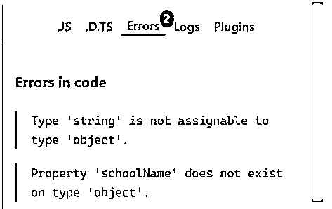
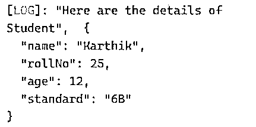
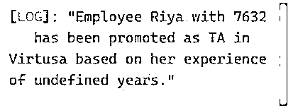
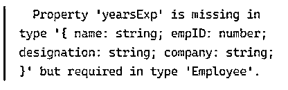

# TypeScript 对象类型

> 原文：<https://www.educba.com/typescript-object-type/>




## TypeScript 对象类型介绍

TypeScript 对象类型是任何非基元值的类型。TypeScript 在 2.2 版中引入了名为 object 的新类型。它表示所有非原始类型。有一些基本类型，如字符串，数字，bigint，空，布尔，符号，未定义。所有其他类型都被认为是非基元类型。对于此对象类型，use 不能访问任何属性值。基本上，在 JavaScript 中，数据被分组并通过对象传递数据。同样，在 TypeScript 中，这个概念通过对象类型来表示。在这里，我们将看到声明的语法以及它是如何用于实现逻辑的。

**语法:**

<small>网页开发、编程语言、软件测试&其他</small>

下面给出了如何声明 TypeScript 对象类型的语法:

`let <object_name> : object;
object_name = {
param1: value1,
param2: value2,
param3: value3,
param4: value4
};`

这里，我们在 TypeScript 中声明一个对象类型，并向它传递一些参数。这些对象类型可以是匿名的，甚至可以由接口或类型别名使用。

### TypeScript 对象类型的示例

下面是提到的例子:

#### 示例#1

宣言。

**代码:**

```
let student: object;
student = {
name: 'Karthik',
rollNo: 25,
age: 12,
standard: '6B'
};
console.log('Here are the details of Student with Roll. 25', student);
```

**输出:**




因此，我们在这里将其声明为 student，并向 student 对象传递 4 个参数，从而在控制台上打印这些值。在这里，如果用户试图将任何原始值直接赋给对象 student，我们将得到一个错误，因为“类型“X”不可赋给类型 student”。

基本上，TypeScript 对象(如上面示例中的 student)具有固定的属性列表。因此，如果用户试图访问对象 student 不存在的属性，我们将得到一个错误:

类型“student”上不存在属性“X”。

让我们实际看到以上两个错误。

#### 实施例 2

TypeScript 对象类型:基本错误。

**代码:**

```
let student: object;
student = {
name: 'Karthik',
rollNo: 25,
age: 12,
standard: '6B'
};
student='26';
console.log('Here are the details of Student', student);
console.log('Here are the details of Student', student.schoolName);
```

**输出:**




所以这里的第一个错误，我们给对象赋了一个字符串值，因此不是可赋值的错误。

第二个错误是由于对象类型为 student 的学校名称参数不存在，因此不存在错误。

在 TypeScript 中，用户可以指定对象类型的属性。应该首先用传递给对象的每个参数的类型来声明它。

**语法:**

```
let student: {
name: string;
rollNo: number;
age: number;
standard: string;
schoolName: string;
};
```

#### 实施例 3

具有指定的参数。

**代码:**

```
let student: {
name: string;
rollNo: number;
age: number;
standard: string;
} = {
name: 'Karthik',
rollNo: 25,
age: 12,
standard: '6B'
};
console.log('Here are the details of Student', student);
```

**输出:**




与示例 1 相比，基于的输出没有变化，但是在实现上有所不同，因为这里我们已经明确声明了参数。

TypeScript 也有属性修饰符，即对象的每个属性都可以指定该属性是否是可选的。大多数时候，用户发现很难处理带有属性集的对象。在这种情况下，用户可以通过在属性名的末尾添加问号来将它们标记为可选的，例如 name？:字符串；

接口也是描述 TypeScript 对象的属性类型的一种方式。声明对象很好，但是在示例 1 中没有定义每个属性的类型。如果用户希望将此对象用于任何函数，并且忘记传递所有参数，则可能会得到垃圾值，因此为了防止垃圾值，TypeScript 使用对象类型的接口。

#### 实施例 4

带接口。

**代码:**

```
interface Employee {
name: string,
empID: number,
designation: string,
company: string,
yearsExp: number
}
let empInfo = (emp: Employee):string => {
return `Employee ${emp.name} with ${emp.empID}
has been promoted as ${emp.designation} in ${emp.company} based on her experience of ${emp.yearsExp} years.`
}
let emp = {
name: "Riya",
empID: 7632,
designation: "TA",
company: "Virtusa",
}
console.log(empInfo(emp))
```

**输出:**




因此，根据接口理论，这里的一个参数没有分配任何值，即 yearsExp，因此它在输出中是未定义的。

下面是错误:




### 结论

我们已经看到了它的语法，它是如何声明的，以及它是如何在编程中使用的。我们还看到了另一种语法，其中提供了参数的类型，这样在给参数赋值时就不会混淆。我们也看到了一些例子，这将有助于更好地理解概念，也看到了用户在编程时会面临什么样的错误。

### 推荐文章

这是一个关于类型脚本对象类型的指南。这里我们分别讨论 TypeScript 对象类型的介绍和例子。您也可以看看以下文章，了解更多信息–

1.  [打字稿功能](https://www.educba.com/typescript-functions/)
2.  [打字稿操作符](https://www.educba.com/typescript-operators/)
3.  [打字稿版本](https://www.educba.com/typescript-versions/)
4.  [什么是 TypeScript？](https://www.educba.com/what-is-typescript/)


