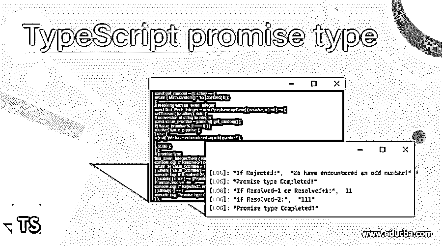
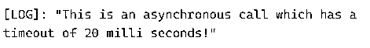
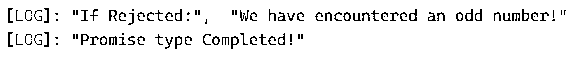
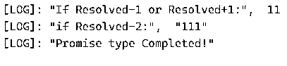

# 打字稿承诺类型

> 原文：<https://www.educba.com/typescript-promise-type/>

## TypeScript promise 类型介绍

TypeScript Promise type 是一个用于编写异步程序的 TypeScript 对象。当用户必须管理多个异步操作、可读性和错误处理时，Promise 是一个很好的选择。异步编程允许用户在完成前一个任务或前一行之前移动到代码中的下一行。Promise 类型在所有现代 JavaScript 引擎中都可用，这促使用户引入异步风格代码，也称为回调风格代码。在本教程中，我们将了解什么是 TypeScript 承诺类型，这些承诺如何工作，何时使用，以及如何使用。

**语法:**

<small>网页开发、编程语言、软件测试&其他</small>

下面是 Promise 类型的语法，

`var sample_promise = new Promise(function(resolve, reject) {
// body of the code
}`

在 TypeScript 中，promise 类型接受一个内部函数，该函数进一步接受 resolve 和 rejects 作为参数。

Promise 接受一个回调函数作为参数，反过来，回调函数接受另外两个参数 resolve 和 reject。如果条件为真，则返回 resolve 否则，返回拒绝。基本上，承诺类型的返回类型是紧接在关键字 Promise 之后定义的。

### TypeScript Promise type 是如何工作的？

promise 类型的一个好处是它可以理解通过 Promise 链的价值流。每当实现承诺类型时，用户可以提供返回值的数据类型。

*   由于 promise 类型返回的错误可以是任何类型，因此 promise 类型返回值的默认数据类型在 TypeScript 中被设置为 any。
*   泛型类型声明用于注释 promise 类型的解析值。
*   它有一个新的 Promise <type>()形式的 Promise 构造函数，指示 Promise 类型的解析值。</type>
*   TypeScript 承诺:

待定:承诺类型中的这种状态是指承诺既未实现也未被拒绝时的第一种状态。

已完成:承诺类型中的这种状态是指承诺操作执行成功。

拒绝:承诺类型中的这种状态是指承诺操作失败。

#### 示例#1

TypeScript promise 类型超时异步函数

`var sample_promise = new Promise((resolve, reject) => {
setTimeout(() => {
console.log("This is an asynchronous call which has a timeout of 20 milli seconds!");
resolve();
}, 2000);
});`

**输出:**

这里，我们正在处理一个带有两个参数的 Promise 类型，并将其用于一个异步函数，该函数在 20 毫秒后返回一条消息。

#### 实施例 2

用随机数键入承诺类型

`const emp_promise = new Promise<boolean | string>((resolve, reject) => {
const pr_random_nm = Math.random() * 5;
if (pr_random_nm > 21) {
resolve(true);
return;
}
reject("pr_random_nm is less than 5");
});
emp_promise.catch(error => console.log("Error if any - ", error));`

**输出:**

这里，Math.random()是一个在每次点击时生成随机整数的函数。因此，根据生成的随机数，将其乘以 5，并检查结果是否符合条件。如果条件满足，则返回 resolve(true)，否则返回 reject(“error”)。

在这里，你是否注意到 reject()是如何返回一个字符串的？这是因为我们在 Promise 类型的声明类型中添加了一个 union，因此 resolve 和 reject 这两种返回类型在这里都是可以接受的。

#### 实施例 3

TypeScript promise 类型，查找偶整数。

`const get_random = (): string => {
return ( Math.random() * 10 ).toFixed( 0 );
};
// resolving with an `even` integer
const find_Even_integer = new Promise<number>( ( resolve, reject ) => {
setTimeout( function(): void {
// conversion of string to integer
const value_promise = parseInt( get_random() );
if( value_promise % 2 === 0 ) {
resolve( value_promise );
} else {
reject( 'We have encountered an odd number!' );
}
}, 2000 );
} );
// promise type
find_Even_integer.then( ( value_promise ) => {
console.log( 'If Resolved-1 or Resolved+1:', value_promise + 1 );
return `${ value_promise + 1 }`;
} ).then( ( value_promise ) => {
console.log( 'if Resolved-2:', value_promise + 1 );
} ).catch( ( error ) => {Promise.any
Promise.resolve
console.log( 'If Rejected:', error );
} ).finally( () => {
console.log( 'Promise type Completed!' );
} );`

**输出:**

产生的随机数在计算时给出了一个奇数，因此产生了这个结果。

由于生成的数字是一个随机值，因此其他输出基于计算。

**Promise.resolve** :这是一个静态方法，用于解析 Promise 调用，如果成功解析，则返回 Promise，其值为 resolve Promise.resolve(value)。这比承诺电话简单多了，给电话增加了立即解决问题的逻辑。

**Promise.reject:** 类似于 Promies.resolve()方法。它总是返回一个被拒绝的承诺类型作为 Promise.reject(错误)。该承诺拒绝值和类型 any 和取自错误参数。

**Promise.all** :在一些场景中，用户需要处理多个承诺。在这种情况下，要成功执行回调并解析所有函数，需要使用 Promise.all，这也是一个静态方法。

### 结论

在本文中，我们已经看到了什么是 TypeScript promise 类型，以及它是如何按语法编写的。也看到了所需的各种 Promise 参数以及它们在实际编码场景中的用法。我们展示了几个例子，从一个简单的例子到一个复杂的例子，这将有助于更好地理解 Promise 如何为异步调用工作。

### 推荐文章

这是一个打字稿承诺类型的指南。在这里，我们将讨论 TypeScript Promise 类型如何与示例和输出一起工作。您也可以看看以下文章，了解更多信息–

1.  [循环的打字稿](https://www.educba.com/typescript-for-loop/)
2.  [打字稿字母](https://www.educba.com/typescript-let/)
3.  [打字稿类型](https://www.educba.com/typescript-typeof/)
4.  [打字稿操作符](https://www.educba.com/typescript-operators/)

