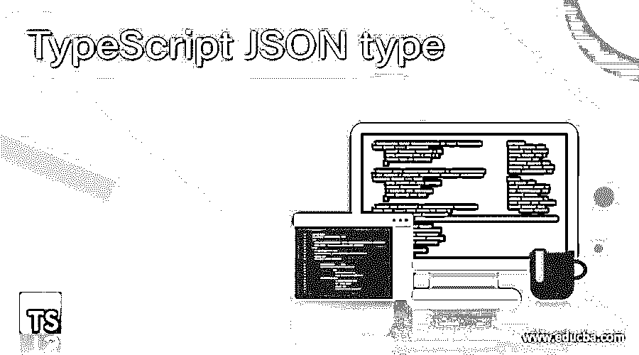
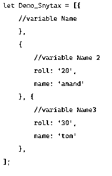
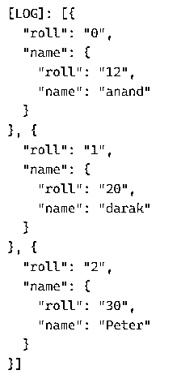
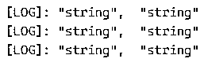

# TypeScript JSON 类型

> 原文：<https://www.educba.com/typescript-json-type/>

## TypeScript JSON 类型介绍

TypeScript 提供了处理 JSON 类型数据的功能。JSON 是 JavaScript 对象符号，用于创建易于读写的数据模型。我们可以用这个 TypeScript JSON 类型轻松分析大型复杂数据集。

在 TypeScript 中，我们也可以获取这些数据并对 JSON 数据进行操作。JSON 支持动态数据模型，这使得工作起来更加灵活。我们可以在 TypeScript 中从 JSON 进行类型推断。TypeScript 使用类型断言机制，该机制允许我们重写类型的视图。有一些方法可以帮助我们处理 TypeScriptJSON 类型的数据。

<small>网页开发、编程语言、软件测试&其他</small>

**语法**

`let Demo_Snytax = [{
//variable Name
},
{
//variable Name 2
roll: '20',
name: 'anand'
},{
//variable Name3
roll: '30',
name: 'tom'
},
];`

截图:-

### 使用 TypeScript JSON 类型

我们可以在 TYPESCRIPT 中动态创建一个 JSON 对象。TypeScript 中有两种类型的对象。

我们用 json.parse()实现的一个普通对象，它产生普通对象，以及返回类对象的 TypeScript 类。

当 json 用于存储或建模数据时，我们需要导入名称空间中使用的 JSON 文件，并获取 JSON 数据以使用 assign 方法，该方法返回一个可以访问以获取数据的类对象。

还接受了第二个名为 reviver 的参数，该参数在解析键值对时被调用。

我们还可以将数据推入 JSON 数组。并且可以将 JSON 解析回类型脚本中的 object。

让我们借助例子，试着多理解一些。

### 例子

让我们看看 TypeScript 中 JSON 类型的一些例子:-

让我们使用名为:- studata 的变量在 TypeScript 中生成 JSON 数据，该数据包含 JSON 格式的学生的详细信息，包括学号和姓名。

**代码:**

`let studata = [{
roll: '12',
name: 'anand'
},
{
roll: '20',
name: 'darak'
},{
roll: '30',
name: 'Peter'
},
];`

让我们在 TypeScript 中处理一个简单的 JSON 类型，并尝试使用 JSON.push 方法推送 JSON 数据。

这个 JSON.push 方法将 JSON 数据放入一个新变量中。

**代码:**

`var studata2 = [];
for (let w in studata) {
studata2.push({
roll: w,
name: studata[w] });
}
console.log(studata2)`

以下代码的输出将打印 studata2 中的 JSON 数据。

样本输出:

完整代码快照:

现在让我们给上面的代码添加一个接口来支持类型推断和代码验证。

这样做是为了避免代码的运行时错误，因为当属性更改为不同的类型时，映射不会发生。

**代码:**

`let studata = [{
roll: '12',
name: 'anand'
},
{
roll: '20',
name: 'darak'
},{
roll: '30',
name: 'Peter'
},
];
interface Student {
roll: string;
name: string;
}`

现在让我们试着检查驻留在 JSON 中的数据类型。

这可以通过使用 For Each 循环和的函数类型来实现

`const a: Student[] = studata as Student[];
a.forEach((item: Student) => {
console.log(typeof(item.roll), typeof(item.name));
})`

其输出将给出 JSON 的类型。

`[LOG]: "string",  "string"
[LOG]: "string",  "string"
[LOG]: "string",  "string"`

完整代码快照:

由此，我们看到了 JSON 类型在 TypeScript 中是如何工作的。

### Json 类型的规则和规定

让我们看看在 TypeScript 中使用 JSON 类型所需的规则和规定。

1.  我们可以动态创建一个 JSON 对象。
2.  JSON 对象用于保存复杂的数据模型。
3.  JSON 使用无模式的动态数据模型。
4.  需要确保安全的类型。
5.  避免使用对象。
6.  使用 json 函数如 json.parse、json.stringify 来解析 JSON 对象。
7.  Stringify 用于将对象转换为 JSON 字符串。
8.  通过使用 PUSH 方法遍历 JSON，也可以将 JSON 转换成数组对象。
9.  Object.assign 方法也用于分配对象值。

JSON 数据的序列化/反序列化也可以在 TypeScript 中完成。

从上面的文章中，我们看到了使用 JSON 类型的规则。

### 结论

从上面的文章中，我们看到了 JSON 类型在 TypeScript 中的使用。我们试图从各种示例和分类中理解 JSON 值在 TypeScript 中是如何工作的，以及在编程级别使用了什么。

我们还看到了我们为各种编程目的定义的键-值对的内部工作和优点。此外，语法和例子帮助我们更准确地理解函数。

### 推荐文章

这是一本关于 TypeScript JSON 类型的指南。在这里，我们讨论了 TypeScript JSON 类型的工作方式，以及用法、示例和分类。您也可以看看以下文章，了解更多信息–

1.  [打字稿抽象类](https://www.educba.com/typescript-abstract-class/)
2.  [循环的打字稿](https://www.educba.com/typescript-for-loop/)
3.  [打字稿通用](https://www.educba.com/typescript-generic/)
4.  [什么是 TypeScript？](https://www.educba.com/what-is-typescript/)

