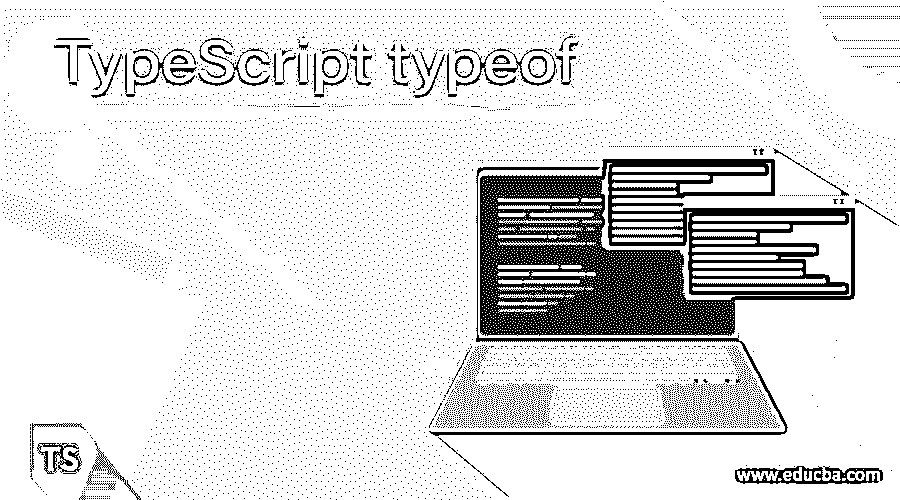
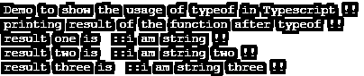
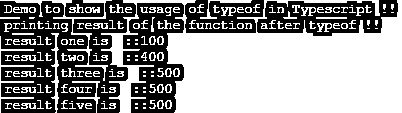
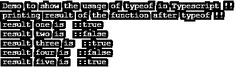

# 类型脚本类型

> 原文：<https://www.educba.com/typescript-typeof/>

## TypeScript 类型的定义

TypeScript 中的 typeof 与 JavaScript 同名，但功能不同。typeof 用于区分 TypeScript 中的不同类型。通过使用 typeof，我们可以区分数字、字符串、符号、布尔值等。typeof 可以与 TypeScript 中的任何类型一起使用，通过使用它，我们可以通过传递任何参数类型来重用代码。在下一节中，我们将看到更多关于 TypeScript 中的 typeof 的内容，以便更好地理解它。

**语法:**

<small>网页开发、编程语言、软件测试&其他</small>

我们知道 typeof 是一个关键字，用于处理 TypeScript 中的不同类型。为了更好地理解，让我们详细地看看它的语法。

`typeof variable === "your_type"`

正如你在上面的语法行中看到的，我们可以直接使用这种类型的 of 和我们想要计算的变量名。在此之后，我们可以根据需求编写自己的逻辑。在本文的下一节中，我们将更详细地讨论这种用法，以便更好地理解。

### typeof 在 TypeScript 中是如何工作的？

我们已经知道，在 TypeScript 中，typeof 用于处理 typeof 中的几种类型。这允许我们在 TypeScript 中帮助我们处理各种类型，我们可以在 TypeScript 中为多种类型重用相同的代码。在这一节中，我们将看到在用 TypeScript 编程时如何使用它。让我们看看它的用法，更好地理解它，以便将来使用。

**关键字用法:**

`typeof variable_name //`

在上面几行代码中，我们使用了 typeof 关键字和变量，它会告诉我们变量的类型，然后我们可以用它来执行任何操作。现在，让初学者看看 TypeScript 中的 typeof 的一个示例，以理解它的内部工作方式(见下文);

**例如:**

`class Demo{
testFunction(val: any): any{
if(typeof val === "string"){
// your logic will go here ..
return val;
}
}
}
let demoobj = new Demo();
let result= demoobj.testFunction("i am string !!");
console.log(result);`

在上面的例子中，我们创建了一个接受任何类型参数的函数。在“Demo”类中，我们创建了一个名为“testFunction”的函数。在这个函数中，我们使用 typeof 关键字来比较被传递的变量的类型。typeof 将返回参数的类型。这类似于已经可用的 instanceOf 关键字。比较之后，我们可以根据需求编写自己的逻辑。最后，为了调用 TypeScript 中的函数，我们创建了该类的一个对象并调用了该函数。我们创建的这个函数有一个参数，这个参数可以是任何类型，因为我们已经在函数声明中将类型指定为“any”。这就是它在 TypeScript 中的工作方式，就像任何其他编程语言一样。它也有一些好处，让我们逐一讨论；

1)通过在 TypeScript 中使用 typeof，我们可以轻松地进行检查，这有助于我们在试图错误地转换异常时获得任何进一步的异常。

2)但是做一些小的检查，我们可以在 TypeScript 中重用任何不同类型的代码。

### 例子

在此示例中，我们尝试在 Typescript 中使用带有数字的 typeof，如果 passes 参数与字符串类型匹配，则它将返回值，否则将不打印任何内容。这是一个示例，帮助初学者理解如何使用和检查 Typescript 中的数字类型。

#### 示例#1

**代码:**

`class Demo{
testFunction(val: any): any{
if(typeof val === "string"){
return val;
}
}
}
console.log("Demo to show the usage of typeof in Typescript !!");
let demoobj = new Demo();
let result1 = demoobj.testFunction("i am string !!");
let result2 = demoobj.testFunction("i am string two !!");
let result3 = demoobj.testFunction("i am string three !!");
console.log("printing result of the function after typeof !!");
console.log("result one is::" +result1);
console.log("result two is::" +result2);
console.log("result three is::" +result3);`

**输出:**

#### 实施例 2

在本例中，我们尝试在 Typescript 中将 typeof 与 numbers 一起使用，如果 passes 参数与 number 类型匹配，那么它将返回值，否则将不打印任何内容。这是一个示例，供初学者理解如何使用和检查 Typescript 中的数字类型。

**代码:**

`class Demo{
testFunction(val: any): any{
if(typeof val === "number"){
return val;
}
}
}
console.log("Demo to show the usage of typeof in Typescript !!");
let demoobj = new Demo();
let result1 = demoobj.testFunction(100);
let result2 = demoobj.testFunction(400);
let result3 = demoobj.testFunction(500);
let result4 = demoobj.testFunction(500);
let result5 = demoobj.testFunction(500);
console.log("printing result of the function after typeof !!");
console.log("result one is::" +result1);
console.log("result two is::" +result2);
console.log("result three is::" +result3);
console.log("result four is::" +result4);
console.log("result five is::" +result5);`

**输出:**

#### 实施例 3

在此示例中，我们尝试在 Typescript 中使用带有数字的 typeof，如果 passes 参数与 boolean 类型匹配，则它将返回值，否则将不打印任何内容。这是一个示例，帮助初学者理解如何使用和检查 Typescript 中的数字类型。

**代码:**

`class Demo{
testFunction(val: any): any{
if(typeof val === "boolean"){
return val;
}
}
}
console.log("Demo to show the usage of typeof in Typescript !!");
let demoobj = new Demo();
let result1 = demoobj.testFunction(true);
let result2 = demoobj.testFunction(false);
let result3 = demoobj.testFunction(true);
let result4 = demoobj.testFunction(false);
let result5 = demoobj.testFunction(true);
console.log("printing result of the function after typeof !!");
console.log("result one is::" +result1);
console.log("result two is::" +result2);
console.log("result three is::" +result3);
console.log("result four is::" +result4);
console.log("result five is::" +result5);`

**输出:**

### 结论

在 typeof 关键字中易于使用和理解。我们可以简单地通过在变量名前使用 typeof 关键字来检查参数的类型。这对于在 TypeScript 中使用变量非常方便。我们可以比较整数、数字、布尔、符号、未定义、字符串、对象等。通过在 Typescript 中使用 typeof。

### 推荐文章

这是一个打字指南。在这里我们讨论定义，typeof 在 TypeScript 中是如何工作的？以及代码实现的例子。您也可以看看以下文章，了解更多信息–

1.  [打字稿功能](https://www.educba.com/typescript-functions/)
2.  [打字稿数组](https://www.educba.com/typescript-array/)
3.  [打字稿操作符](https://www.educba.com/typescript-operators/)
4.  [打字稿类型](https://www.educba.com/typescript-types/)

