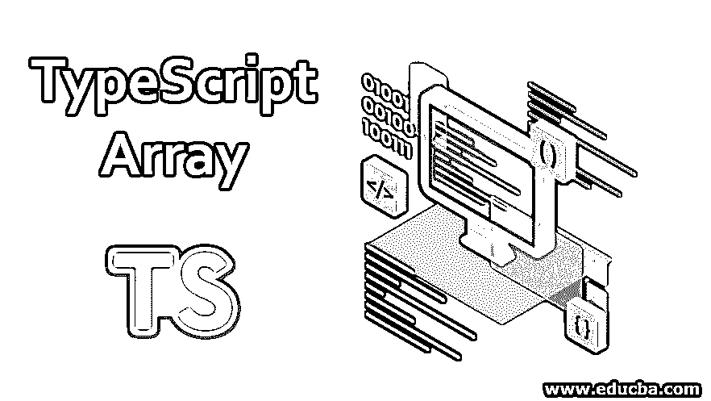
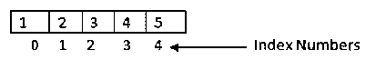
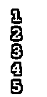

# 类型脚本数组

> 原文：<https://www.educba.com/typescript-array/>




## TypeScript 数组简介

如果你看过我们知道有许多数据类型。我们可以把它们分为原始的和用户自定义的。该数组属于用户定义的数据类型。所有的[编程语言](https://www.educba.com/what-is-a-programming-language/)都有一个数组作为它们的数据类型。所以我们在 typescript 中有相同的概念。数组的一般定义是，它是单个元素中同类数据项的集合。如果你来自计算机世界，我们都熟悉数组这个词。所以让我们深入探讨一下。

### 如何在 TypeScript 中声明数组？

首先，我们将看到 [TypeScript 中数组的语法。这和 javascript 中的](https://www.educba.com/what-is-typescript/)是一样的。但只有一个附加条件，那就是我们给出类型。

<small>网页开发、编程语言、软件测试&其他</small>

像 Java 一样，我们有多种方式在 TypeScript 中编写数组。

**语法#1:**

```
let colors: string[] = ["DourgerBlue", "NavyBlue", "SkyBlue"];
console.log(colors)
```

**输出:**


在上面的例子中，我们用字符串类型的 let 关键字声明了一个变量，之后，我们用方括号表明它是一个数组类型。之后，它是等号(=)，我们在方括号中给出了用逗号分隔的值。

**语法#2:**

现在，在这种类型中，我们显式地编写数组。

```
let colors: Array<string> = ["DourgerBlue", "NavyBlue", "SkyBlue"];
console.log(colors[0]);
console.log(colors[1]);
console.log(colors[2]);
```

**输出:**


在上面的例子中，我们在冒号(:)后给定了带有变量名的 let 关键字，并将数据类型指定为数组，数组的类型是字符串。

我们只是在上面的例子中使用了不同的语法。你可以互换使用它们。有一些常见的步骤可以进一步了解。在接下来的课程中，我们将会看到初始化数组的含义。

### 如何在 TypeScript 中初始化数组？

在上面两个语法示例中，我们看到声明和初始化都是在一行中同时完成的。让我们把它们分散开来，看看实际上是如何实现的**。**

#### 语法#1

**声明数组**

```
let colors: string[];
```

**初始化数组**

```
colors = ['DourgerBlue', 'NavyBlue', SkyBlue];
```

#### 语法#2

**声明数组**

```
let colors: Array<string>
```

**初始化数组**

```
colors = ['DourgerBlue', 'NavyBlue', SkyBlue];
```

我们可以分别声明和初始化数组，也可以在同一行中组合使用。

这只是我们需要的语法和编程风格的问题。

### 如何访问数组元素？

到目前为止，我们知道如何声明和初始化数组。现在主要部分来了。在编程中，当然需要做一些运算。在数组元素上执行一些操作，我们需要访问它们。为了访问这些元素，我们需要理解它的结构。

众所周知，我们可以在一个变量中存储多个元素。但是这些元素由一个从零(0)开始的唯一数字来标识。这些数字被称为数组元素的索引号。

更准确地说，考虑包含 5 个 no 的 int 数组。

```
let toffee: number [] = [1,2,3,4,5];
```

现在，太妃糖是一个有五个元素的数组。

让我们来看看访问数组元素的内存表示。




在上图中，我们有了索引号。在这些索引号的帮助下，我们可以访问数组中的特定元素。

**举例:**

```
let toffee: number [] = [1,2,3,4,5];
console.log(toffee[0]);
console.log(toffee[1]);
console.log(toffee[2]);
console.log(toffee[3]);
console.log(toffee[4]);
```

**输出:**




如果您将此记录到控制台，您将获得所需的输出。

### 类型脚本数组的各种方法

数组中有一些预定义的方法，帮助我们有效地获得输出。以下是这些方法的列表。

*   **filter():** 这个函数主要在你想修改现有数组，创建一个新数组的时候起作用。它将使用新条件转换现有值。
*   **every():** 该功能主要用于测试目的。它检查数组中的每个元素是否为真。
*   **forEach():** 这类似于 for 循环，但是作用于数组中的每个元素。
*   **concat():** 顾名思义它将两个不同数组的数组值具体化并返回一个新数组。
*   **indexOf():** 正如我们已经看到的，数组有一个索引值。此方法返回数组中元素的索引。
*   lastIndexOf(): 我们知道数组没有元素。此方法给出数组的最大索引值。只有数组中最后一个值的索引号。
*   **join():** 这个方法连接所有的数组元素并返回指定的分隔符。
*   **push():** 如果你以前使用过 array，那么你一定知道这个方法。此方法将一个或多个元素添加到数组的最后。
*   **map():** 这个函数返回新数组。这个新数组是 map 中提供的条件的输出。
*   **pop():** 该方法用于获取数组的最后一个元素，并将其从数组中移除。
*   **reverse():** 顾名思义，它只是以相反的格式创建数组。
*   **reduceRight():** 应用于数组，从右边开始减少数组元素。/它将给定的数组缩减为单个值。
*   **reduce():** 它的工作原理和上面的函数 reduceRight 一样。但是方向相反。
*   我们可以说它与 pop 相反，它从数组中移除第一个元素。它返回移除的元素。
*   我们可以从一个数组中取出一张图片，并通过这个函数返回新数组。
*   使用这种方法，我们可以添加或删除数组中的元素。
*   **sort():** 该函数实现的数组元素的排序。
*   测试场景中的 some(): 如果至少有一个条件为真，则返回 true。
*   **unshift():** 这个方法有助于在数组的开头添加元素，并返回一个新数组。
*   **toString():** 将数组元素转换为字符串并返回。

### 推荐文章

这是一个关于类型脚本数组的指南。这里我们讨论如何在 TypeScript 中初始化数组？以及 Typescript 数组和输出的各种方法。您也可以浏览我们的其他相关文章，了解更多信息——

1.  [JavaScript 中的字符串数组](https://www.educba.com/string-array-in-javascript/)
2.  [JavaScript indexOf()](https://www.educba.com/javascript-indexof/)
3.  [JavaScript 中的 pop()](https://www.educba.com/pop-in-javascript/)
4.  [打字稿功能](https://www.educba.com/typescript-functions/)


