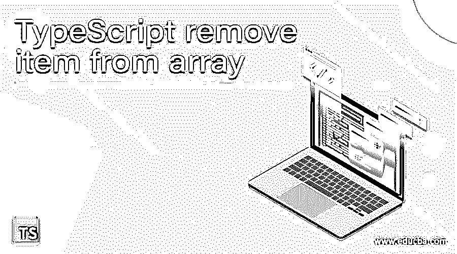
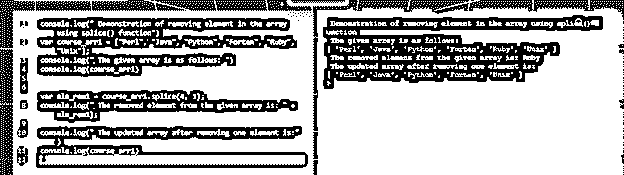
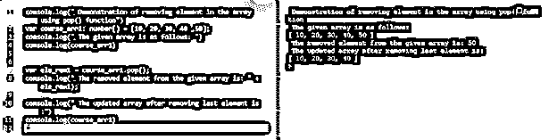
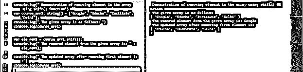

# TypeScript 从数组中移除项

> 原文：<https://www.educba.com/typescript-remove-item-from-array/>

## TypeScript 简介从数组中移除项。

在 typescript 中，删除或移除元素被定义为提取数组的指定索引的元素，并用新元素替换该元素，或者从数组中完全删除该项被称为移除数组中的项。因此，移除数组中的元素是借助于类型脚本数组提供的方法(如 pop()、shift()和 splice()函数)从给定数组中移除或删除任何项的过程。delete 运算符用于移除数组中的项，但 delete()函数仅在我们想要移除数组对象的属性时使用，该属性的孔留在数组中，不能因索引或键不移动 id 而移动。使用 delete()函数。所以建议不要使用删除操作符。

**语法:**

<small>网页开发、编程语言、软件测试&其他</small>

在 typescript 中，为了移除数组中的元素，我们使用不同的函数，每个函数都有不同的语法。

*   **拼接()**

这是一个数组函数，用于通过使用 splice()函数添加或删除元素来更新数组，该函数具有给定的参数，根据传递给该函数的参数是删除还是添加数组中的元素。

`arr1.splice( index_num, no_of_ele, [ele_to_add1],[….., n]);`

**参数:**

**index_num:** 该参数指定从哪里开始改变或更新数组的索引号。

**num_of_ele:** 该参数以整数格式指定在指定的特定索引之后必须移除多少个元素。

**Ele_to_add:** 该参数指定从数组中删除旧元素后，要添加到数组中的元素集。

这个 splice()函数在根据指定的参数向数组中添加和删除元素之后，返回更新后的数组。

*   **Shift()**

语法:arr2.shift()

这个数组函数用于移除数组中的一个元素，这个函数没有参数，因为它总是移除给定数组的第一个元素。它还返回相同的已移除元素，这是返回的单个元素。

*   **pop()**

语法:arr3.pop()

这也是一个数组函数，用于移除数组中的元素，其工作原理与 shift()函数完全相反。这个函数也没有参数，因为它总是从给定的数组中删除最后一个元素，这个元素本身作为这个函数的返回值返回。

### 如何在 typescript 中从数组中移除元素或项？

在 typescript 中，要移除或删除数组中的任何项，我们可以像 JavaScript 一样使用 delete 操作符，但它会移除数组中不能移动任何索引或键值的对象的属性。我们可以使用删除操作符来删除元素，但是不太推荐使用其他数组函数，比如 splice()、shift()和 pop()。所有这些函数都是数组函数，用于添加或删除元素、删除数组开头的元素以及删除数组结尾的元素。

**例子:**

在下面的例子中，我们将演示 splice()函数来删除数组中的元素。

`console.log(" Demonstration of removing element in the array using splice() function")
var course_arr1 = ["Perl", "Java", "Python", "Fortan", "Ruby", "Unix"];
console.log(" The given array is as follows: ")
console.log(course_arr1)
var ele_rem1 = course_arr1.splice(4, 1);
console.log(" The removed element from the given array is: " + ele_rem1);
console.log(" The updated array after removing one element is:")
console.log(course_arr1)`

**输出:**

在上面的程序中，我们先声明一个数组，数组有元素，值为“course_arr1”，由 6 个元素组成，索引从 0 开始。因此，当 splice()函数应用于这个数组并传递了参数 as (4，1)时，这表示从索引 4 中移除元素并仅移除 1 个元素。因此，这导致更新后的数组中第 4 个索引处的元素被删除，新数组只包含 5 个元素，上面代码的输出可以在上面的屏幕截图中看到。

**举例:**

现在让我们演示 pop()函数从数组末尾删除一个元素。

`console.log(" Demonstration of removing element in the array using pop() function")
var course_arr1: number[] = [10, 20, 30, 40 ,50];
console.log(" The given array is as follows: ")
console.log(course_arr1)
var ele_rem1 = course_arr1.pop();
console.log(" The removed element from the given array is: " + ele_rem1);
console.log(" The updated array after removing last element is:")
console.log(course_arr1)`

**输出:**

在上面的程序中，我们声明了一个 number 类型的数组，该数组由 5 个元素组成。然后，在对给定的数组应用 pop()函数之后，默认情况下，它会删除最后一个元素，因为它不接受任何参数。因此，该函数返回删除的元素而不是更新的数组，因此我们在删除元素后显示更新的数组，现在使用 console.log()只包含 4 个元素。

**举例:**

`console.log(" Demonstration of removing element in the array using shift() function")
var course_arr1: string[] = ["Google", "Educba", "Institute", "Delhi"];
console.log(" The given array is as follows: ")
console.log(course_arr1)
var ele_rem1 = course_arr1.shift();
console.log(" The removed element from the given array is: " + ele_rem1);
console.log(" The updated array after removing first element is:")
console.log(course_arr1)`

**输出:**

在上面的程序中，我们声明了一个由 4 个元素组成的数组，然后我们应用了 shift()函数，它的工作方式与 pop()函数完全相反，因为它总是删除给定数组的第一个元素，因为我们不向该函数传递任何参数，它会生成一个包含 3 个元素的更新后的数组，并删除第一个元素。输出可以在上面的截图中看到。

### 结论

在本文中，我们得出结论，在 typescript 中，我们可以使用 3 个不同的数组函数移除数组中的一个项，其中；值得注意的是，我们根据上面文章中给出的描述来使用这些函数。在这里，我们也建议不要使用删除操作符来删除，这并不意味着我们不能使用这个操作符来删除元素。因此，我们得出结论，我们按照需求使用函数和操作符。

### 推荐文章

这是一个从数组中移除项的指南。在这里，我们讨论可以使用 3 个不同的数组函数在 typescript 中移除数组中的一个项。您也可以看看以下文章，了解更多信息–

1.  [打字稿功能](https://www.educba.com/typescript-functions/)
2.  [打字稿通用](https://www.educba.com/typescript-generic/)
3.  [打字稿版本](https://www.educba.com/typescript-versions/)
4.  [打字稿操作符](https://www.educba.com/typescript-operators/)

