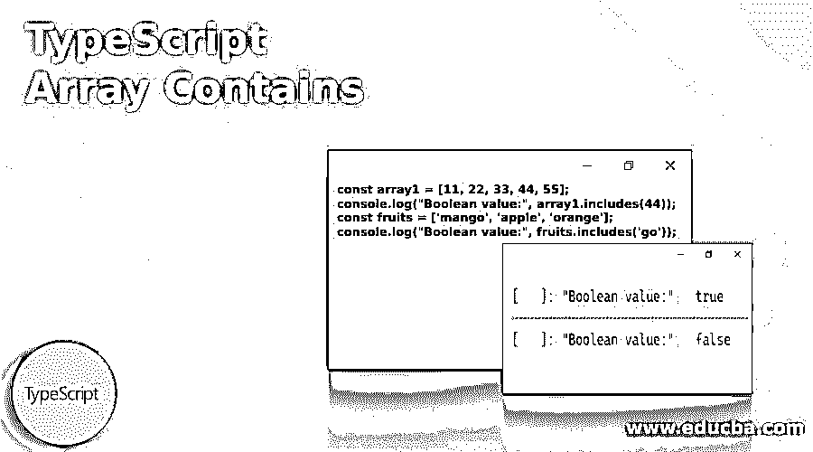
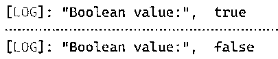
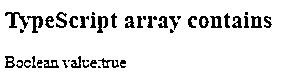
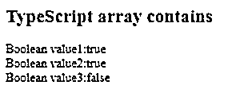

# TypeScript 数组包含

> 原文：<https://www.educba.com/typescript-array-contains/>

## TypeScript 数组简介包含

TypeScript array contains 是一种确定数组是否包含特定元素的方法。这是 TypeScript 的数组方法之一，如果数组包含特定元素，则返回 true，否则返回 false。由于 TypeScript 类似于 JavaScript，数组方法也将类似于 JavaScript，但只有语法和符号方面会有所变化。在 JavaScript 中，数组 contains 也与 TypeScript 中的相同。

**语法:**

<small>网页开发、编程语言、软件测试&其他</small>

下面给出的是 TypeScript 数组包含/includes 的语法:

`Array.inlcudes(element, start)`

这是用来检查数组中特定值的方法。该方法将接收两个参数。

*   **元素:**必选参数，是要搜索的元素。
*   **start:** 可选参数，默认值为 0，即在数组中开始搜索的位置。

返回布尔值“真”或“假”。

### TypeScript 数组包含的示例

下面给出了数组包含/包含在 TypeScript 中如何工作的示例:

#### 示例#1

简单的 TypeScript 数组包含。

**代码:**

`const array1 = [11, 22, 33, 44, 55];
console.log("Boolean value:", array1.includes(44));
const fruits = ['mango', 'apple', 'orange'];
console.log("Boolean value:", fruits.includes('go'));`

**输出:**

这里，在这个例子中，array1 有 5 个元素，用户搜索 44 个元素，返回 true。

fruits 数组有 3 个元素，用户在其中搜索“go ”,它不在 fruits 数组中，因此返回 false。

#### 实施例 2

示例数组. includes()。

**代码:**

`<!DOCTYPE html>
<html>
<body>
<h2>TypeScript array contains</h2>

</body>
</html>`

**输出:**

#### 实施例 3

Array.includes(元素，索引)。

**代码:**

`<!DOCTYPE html>
<html>
<body>
<h2>TypeScript array contains</h2>

</body>
</html>`

**输出:**

这里，在这个例子中，employeeBoolean1，其中我们搜索 JKL 从第二个索引开始搜索。所以从第二个索引开始搜索，JKL 被发现在第三个位置。在 employeeBoolean2 中，我们从第三个位置开始搜索 JKL，因此 array includes 返回 true。employeeBoolean3，其中我们从第 4 个位置搜索 JKL，但是 JKL 在第 3 个位置，所以它返回 false。

### 阵列包含/包含的规则和规定

*   由于数组是 IT 领域中最常用的数据结构之一，因此在处理数组项目列表时，用户必须在数组列表中寻找特定的值。
*   由于 TypeScript 类似于 JavaScript，它包含很少的内置方法来检查数组是否有特定的值或对象。
*   检查数组中原始值的最简单方法是使用 includes()方法。
*   如果我们看看上面的例子，检查数组中原始值的最简单的方法是使用 include()方法。
*   在某些情况下，当用户需要指定元素的准确位置时，indexOf(element)也可以用来首先获取元素的位置。
*   如果方法 indexOf call 的 receiver 对象包含一个方法，并且两者具有相同的参数，则它有一个类似于 types、String、Array、ReadonlyArray 和其他类型化数组的建议。
*   EcmaScript 2015 为字符串添加了 includes()，EcmaScrpt 2016 为数组添加了 includes()。
*   Includes()方法是通用的，因此不要求该值是数组对象，但可以应用于类似数组的对象。
*   所有现代浏览器都支持 includes()方法。但是如果你用的是 ie 或者任何旧的浏览器，我们需要使用 indexOf。
*   从技术上讲，includes()方法使用 sameValueZero 算法来判断是否找到了数组中的特定元素。
*   我们用作第二个参数的 fromIndex 是一个可选参数。如果它在 fromIndex 处搜索第一个元素，那么它是一个正值。
*   Or 在数组长度加上 fromIndex 处表示负值，默认值为 0。
*   比较字符串和字符时，array contains/ includes()方法区分大小写。
*   如果 fromIndex 大于或等于数组长度，则返回布尔值 false 因此不会搜索数组。
*   如果 fromIndex 为负，则计算一个计算索引，该索引将用作开始搜索的位置。如果这个值小于或等于-1 *数组长度，将搜索整个数组。

### 结论

至此，我们结束了主题“TypeScript 数组包含”，也称为数组包含。我们已经看到了数组包含什么含义，以及如何构建语法来查找数组中的指定值。我们也已经通过几个例子看到了 array includes()方法是如何使用的。每个例子都以这样的方式解释，人们可以很容易地理解什么参数是给定的，以及它何时以及如何影响输出。我们还看到了 TypeScript array contains 方法的一些规则和规定，这将清楚地说明如何以及以何种方式在现实世界的编码中使用这个 array includes()方法。

### 推荐文章

这是一个包含类型脚本数组的指南。这里我们讨论数组包含/包含的介绍、例子、规则和规定。您也可以看看以下文章，了解更多信息–

1.  [打字稿功能](https://www.educba.com/typescript-functions/)
2.  [打字稿操作符](https://www.educba.com/typescript-operators/)
3.  [打字稿版本](https://www.educba.com/typescript-versions/)
4.  [什么是 TypeScript？](https://www.educba.com/what-is-typescript/)

