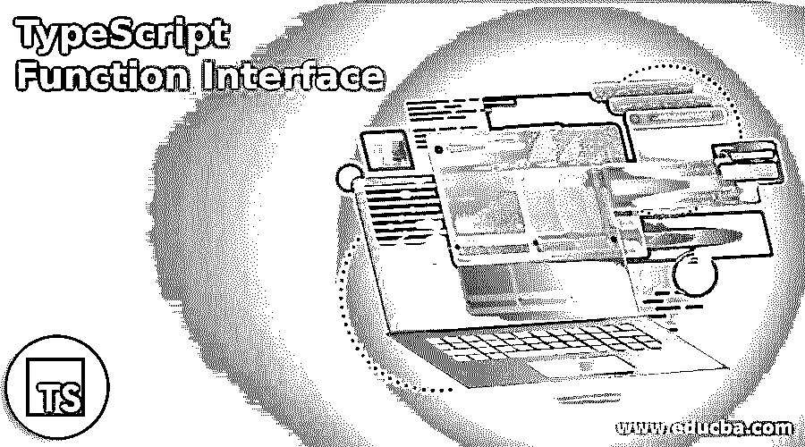
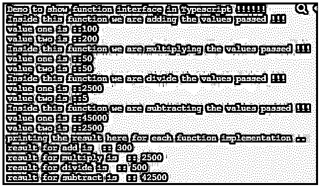

# TypeScript 函数接口

> 原文：<https://www.educba.com/typescript-function-interface/>

## TypeScript 函数接口介绍

在 TypeScript 中，我们可以将接口用作不同的类型，其中一个接口将用作函数类型。通过使用 TypeScript 中的函数接口，我们可以在函数接口中定义方法签名。它们与 TypeScript 中的普通接口一样，都是易于使用的键，唯一的区别是我们可以在其中定义一个函数，并且可以根据需要使用它们，就像接口中的相同函数可以用于添加、删除或更新数据一样。

**语法:**

<small>网页开发、编程语言、软件测试&其他</small>

如前所述，它们类似于 TypeScript 中任何其他接口类型。在它们里面，我们可以定义我们的函数签名。

让我们更详细地了解它的语法，以便在应用程序内部更好地使用它，使它更高效:

`interface interface_name_here
{
(your variable1, your variable 2): return type;
};`

正如你在上面几行语法中看到的，我们在这里使用了“interface”关键字，在它里面我们也声明了可以进一步使用的函数。

让我们看一个练习语法来理解:

`interface Demo
{
(a:string, b:string, c:string): string;
};`

在上面几行语法中，你可以看到在 TypeScript 中声明一个函数接口是非常容易的。

### 函数接口在 TypeScript 中是如何工作的？

正如我们现在已经知道的，在 TypeScript 中，我们可以创建不同类型的接口。其中之一是函数接口，我们可以在其中定义或声明我们的函数签名，稍后可以使用它来拥有它的主体和实现。如果我们更一般地讨论它，那么我们可以使用相同的函数来添加、更新或删除基于相同参数的数据。接口通常是应用程序之间的契约。此外，如果我们在接口中定义任何方法，那么它的实现应该由应用程序中实现该接口的类提供。这提供了应用程序内部的抽象层。

让我们看看可用的接口类型:

#### 1.作为数组的接口

在这个接口中，我们可以定义数组的类型。

**语法:**

`interface name_interface {
[val:type]:type
}`

通过使用它，我们可以定义数组的类型，也可以定义索引类型和值类型。

#### 2.接口类型

这个接口可以用来定义接口中变量的类型。

**语法:**

`interface name_interface {
variable_name: type;
// logic goes here .
}`

在上面几行中，我们只是使用了“interface”关键字，并在其中定义了变量类型。让我们看一个示例来理解 TypeScript 中函数接口的内部工作。

**举例:**

**代码:**

`interface AddvalueFunction
{
(a: number, b: number): number;
};
function adding(a:number, b:number):number {
return a + b;
}
let obj1: AddvalueFunction = adding;
let result = obj1(100, 200);
console.log(result)`

这里我们在 TypeScript 中创建了一个函数接口。首先，我们创建包含函数签名的“AddvalueFunction”接口，该接口负责将 TypeScript 中的两个数字相加。但是这里我们也定义了方法的签名，而不是实现。在此之后，我们将提供“AddvalueFunction”接口函数的实现。

它将返回一个数字，可能是这两个值中的一个。但是这里我们需要注意的是，在为接口创建对象的时候，我们只是提到了接口名，并给它赋了包含函数接口实现的函数名。在此之后，我们可以立即将所需的参数传递给它，并获得结果。在上面它会打印两个的结果。

### 例子

下面给出了一个例子:

在这个示例中，我们试图展示 Typescript 中函数接口的工作方式，我们在 Typescript 中提供了相同方法的几个实现，这些实现对我们在方法中作为 param 传递的相同类型的输入执行加、减、乘和除操作。

**代码:**

`interface AddvalueFunction
{
(a: number, b: number): number;
};
function adding(a:number, b:number):number {
console.log("Inside this function we are adding the values passed !!!");
console.log("value one is ::" + a);
console.log("value two is ::" + b);
return a + b;
}
function multiply(a:number, b:number):number {
console.log("Inside this function we are multiplying the values passed !!!");
console.log("value one is ::" +a);
console.log("value two is ::" +b);
return a * b;
}
function divide(a:number, b:number):number {
console.log("Inside this function we are divide the values passed !!!");
console.log("value one is ::" +a);
console.log("value two is ::" +b);
return a / b;
}
function subtract(a:number, b:number):number {
console.log("Inside this function we are subtracting the values passed !!!");
console.log("value one is ::" +a);
console.log("value two is ::" +b);
return a - b;
}
console.log("Demo to show function interface in Typescript !!!!!!")
let obj1: AddvalueFunction = adding;
let result1 = obj1(100, 200);
let obj2: AddvalueFunction = multiply;
let result2 = obj2(50, 50);
let obj3: AddvalueFunction = divide;
let result3 = obj3(2500, 5);
let obj4: AddvalueFunction = subtract;
let result4 = obj4(45000, 2500);
console.log("printing the result here for each function implementation ..")
console.log("result for add is  :: " +result1)
console.log("result for multiply is  :: " +result2)
console.log("result for divide is  :: " +result3)
console.log("result for subtract is  :: " +result4)`

**输出:**

### 功能接口的规则和规定

在 TypeScript 中使用函数接口时，需要考虑一些规则:

*   函数接口应该只包含方法签名，而不包含实现。
*   应该使用“interface”关键字后跟接口名称来创建接口。
*   在为接口函数创建对象时，它应该引用已实现的函数。
*   在接口内部定义函数时，应该适当提及变量类型和函数返回类型。
*   在给出函数接口的实现时，方法签名应该正确匹配，否则它将不起作用。

### 结论

通过使用函数接口，我们可以给出该方法的任何实现，并且可以在程序中的任何地方使用。我们只需要有一个类似于 TypeScript 中的函数接口类型方法的方法签名。

### 推荐文章

这是一个 TypeScript 函数接口指南。这里我们讨论一下入门，函数接口是如何工作的？范例、规则和条例。您也可以看看以下文章，了解更多信息–

1.  [类型脚本转换对象](https://www.educba.com/typescript-cast-object/)
2.  [打字稿字母](https://www.educba.com/typescript-let/)
3.  [打字稿通用](https://www.educba.com/typescript-generic/)
4.  [什么是 TypeScript？](https://www.educba.com/what-is-typescript/)

