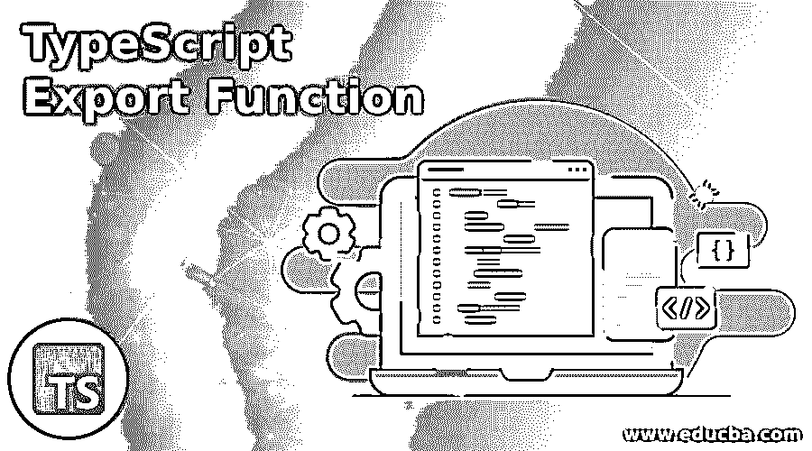
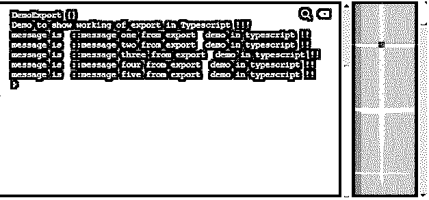

# 类型脚本导出功能

> 原文：<https://www.educba.com/typescript-export-function/>

## TypeScript 导出函数的定义

在 TypeScript 中，我们几乎可以使用“export”关键字导出任何内容。它不是一个函数，而是可以用来在 TypeScript 中导出一些东西。通过使用 export 关键字，我们可以导出类、函数、文件、接口、类型等。在打字稿中。默认情况下，它会提供我们在 TypeScript 中创建的所有类或接口，之后我们可以使用' import '关键字轻松导入这些文件。导出有助于我们随时使用 while 应用程序中的现有组件。在下一节中，我们将更详细地讨论导出函数，以便更好地理解。

**语法**

<small>网页开发、编程语言、软件测试&其他</small>

因为这是可以与函数、类、接口等一起使用的关键字。在打字稿中。让我们看看它的语法，以便更好地理解 TypeScript 中的 export 关键字，见下文；

*   **导出类 Your_class_name:** 此语法用于导出 TypeScript 中的类，我们使用“export”关键字，在此之后，我们可以在应用程序中的任何位置轻松导出此类，以重用现有功能。
*   **导出函数 function_name:** 此语法用于导出 TypeScript 中的函数。是的，我们可以通过在函数的开头使用“export”关键字来导出 TypeScript 中的函数。
*   **导出接口 interface _ name:**在 TypeScript 中，我们也可以导出接口，我们可以遵循以下语法使接口可导出。

正如你在上面几行语法中看到的，我们使用“export”关键字使它们在应用程序中可导出，在下一节中，我们将通过一些更实际的例子来说明如何在程序中实现它们，以便更好地理解它的详细用法。

### 导出函数在 TypeScript 中是如何工作的？

现在我们已经知道 export 关键字用于导出 TypeScript 中的类、接口、函数和类型，并通过在 TypeScript 程序的开头使用 import 语句将它们导入到任何其他模块中，使它们可用于重用组件。正如我们在 angular 库中看到的，我们能够导入它们的原因是它们在本质上是可导出的。通过使用“export”关键字，环形库中的所有类都可以导出。在这一节中，我们首先将看到如何在 TypeScript 中导出带有语法签名的组件、函数，然后是每个组件的练习示例。让我们详细讨论它们中的每一个，见下文；

#### 1.导出功能

在 TypeScript 中，我们可以从整个类中导出一个函数。为此，我们必须在函数声明的开头使用 export 关键字。在此之后，我们可以使用 import 语句将它们导入任何其他模块。下面我们将看到它的语法和一个练习例子，让初学者更好地理解它，我们如何在用 TypeScript 编程时使用它。

`export function function_name(){}`

**举例:**

`export function mydemo(){
// logic will go here ..
console.log("this is exportable function in TypeScript. !!")
}`

在上面的代码行中，我们创建了一个示例函数来理解在 TypeScript 中 export with function 的用法。我们所做的是创建一个函数，并通过使用“export”关键字使其可导出。我们在函数声明的开始使用这个关键字。现在在任何类中，我们都可以导入这个函数，并按原样使用它。要导入此功能，我们可以遵循下面提到的步骤/路径，见下文；

**举例:**

`import {function_name} from ./path_to _file;`

#### 2.出口类别

在 TypeScript 中，我们可以导出一个类，也可以说是一个完整的组件。为此，我们必须在类声明的开头使用 export 关键字。在此之后，我们可以使用 import 语句将它们导入任何其他模块。下面我们将看到它的语法和一个练习例子，让初学者更好地理解它，我们如何在用 TypeScript 编程时使用它。

`export class class_name(){}`

**举例:**

`export class Demo{
// logic will go here ..
}`

在上面的代码行中，我们创建了一个示例类来理解在 TypeScript 中 export with class 的用法。我们所做的是创建一个类，并通过使用“export”关键字使其可导出。我们在类声明的开始使用这个关键字。现在在任何类中，我们都可以导入这个类并照原样使用。要导入这个类，我们可以遵循下面提到的步骤/路径，见下文；

**举例:**

`import {class_name} from ./path_to _file;`

#### 3.导出接口

在 TypeScript 中，我们可以导出一个接口，也可以说是一个完整的组件。为此，我们必须在接口声明的开头使用 export 关键字。之后，我们可以使用 import 语句将它们导入任何其他模块。下面我们将看到它的语法和一个练习例子，让初学者更好地理解它，我们如何在用 TypeScript 编程时使用它。

`export class interface_name(){}`

**举例:**

`export interface DemoInterface{
// logic will go here ..
}`

在上面的代码行中，我们创建了一个示例类来理解在 TypeScript 中 export with class 的用法。我们所做的是创建一个类，并通过使用“export”关键字使其可导出。我们在类声明的开始使用这个关键字。现在在任何类中，我们都可以导入这个类并按原样使用它。要导入此接口，我们可以遵循下面提到的步骤/路径，见下文；

**举例:**

`import {interface_name} from ./path_to _file;`

### TypeScript 导出函数的示例

在这个示例中，我们尝试使用从 Typescript 导出，它不是一个函数，而是一个可以与函数一起使用的关键字，以使它们在我们的 Typescript 应用程序中可重用。下面是一个简单的例子，让初学者了解出口的详细见下文；

**举例:**

`export class DemoExport {
DemoExport(){
console.log("hello");
}
getmessage(msg : string){
console.log("message is  ::" + msg);
}
}
let z = new DemoExport();
console.log(z);
console.log("Demo to show working of export in Typescript !!!");
z.getmessage("message one from export  demo in typescript !!");
z.getmessage("message two from export  demo in typescript !!");
z.getmessage("message three from export  demo in typescript !!");
z.getmessage("message four from export  demo in typescript !!");
z.getmessage("message five from export  demo in typescript !!");`

**输出:**

### 结论

这样，我们就可以在 TypeScript 中使用 export 关键字。当我们想要重用在 TypeScript 中创建组件时，这非常有用。导出后，我们可以很容易地将它们导入任何类或模块本身，使其对整个应用程序是全局的。这将增加 TypeScript 中函数、类、接口和类型的可重用性。

### 推荐文章

这是一个关于打字稿导出功能的指南。这里我们还讨论了导出函数的定义以及它在 typescript 中是如何工作的？以及一个示例及其代码实现。您也可以看看以下文章，了解更多信息–

1.  [打字稿功能](https://www.educba.com/typescript-functions/)
2.  [打字稿操作符](https://www.educba.com/typescript-operators/)
3.  [打字稿版本](https://www.educba.com/typescript-versions/)
4.  [打字稿数组](https://www.educba.com/typescript-array/)

