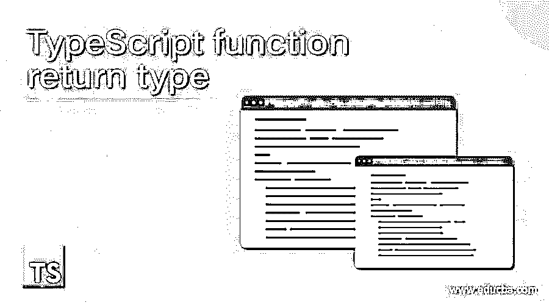
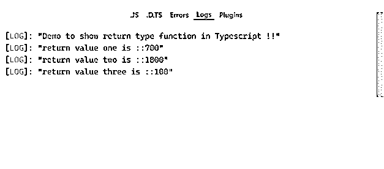

# TypeScript 函数返回类型

> 原文：<https://www.educba.com/typescript-function-return-type/>

## TypeScript 函数返回类型介绍

TypeScript 中的函数返回类型就是我们希望从函数中返回的值。当我们从函数返回值时使用的函数返回类型。在 TypeScript 中，我们可以从函数中返回任何类型的值，也可以不返回任何值。有些返回类型是字符串、数字、对象或任意等。如果我们没有从函数中返回预期的值，那么我们将有一个错误和异常。在下一节中，我们将详细讨论内部工作以及如何实现不同的返回类型或不同的函数。

**语法**

<small>网页开发、编程语言、软件测试&其他</small>

如前所述，我们可以从我们编写的函数中返回任何值；这取决于要求。但是在返回时，我们必须返回正确的值以避免错误。让我们看一下它的语法，以便更好地理解它的用法；见下文；

`function function_name(val1 , val2, so on..): return type {
// logic goes here ..
}`

正如你在上面几行语法中看到的，要从一个函数中返回一些东西，我们必须遵循 TypeScript 的标准定义，这在任何其他语言中都很常见。让我们来看一个初学者练习语法的例子，见下文；

**举例:**

`function demo(vale:string ): string {
// logic goes here ..
}`

我们将在下一节详细讨论这一点；现在，只要有一个基本的概念来定义它，以便以后在程序中使用。

### 函数返回类型在 TypeScript 中是如何工作的？

在 TypeScript 或任何其他编程语言中，我们可以从函数中返回不同类型的值。这在编写好的代码时很重要，因为我们在调用函数时可能会遇到一些错误。如果我们没有从函数返回任何东西，我们不需要指定函数的返回。像任何其他编程语言一样，我们可以在有或没有返回类型的 TypeScript 中拥有这两个函数。让我们仔细看看在 TypeScript 中处理返回类型时需要遵循的函数签名(见下文);

**方法签名:**

`function function_name(paam ..): return_type{
// body goes here
return val ;
}`

1.function_name:在这里，我们可以给函数赋值。这是我们能给出的正常函数名。

2.(PAM..):这用于在函数内部传递参数。其可以是任何数字；此外，我们可以定义函数中传递的参数的类型。

3.:return_type:这是 TypeScript 文档给出的在 TypeScript 中定义返回类型的标准。我们必须使用':'冒号符号来使这个函数从它返回任何值。紧接着，我们可以指定我们想从函数中返回的类型；它可以是字符串、数字或任意等等。

4.return:如果我们的函数需要返回一些值，我们必须在函数体中使用 return 关键字。该关键字用于从任何编程语言中调用的函数返回预期的结果。如果我们没有在函数体中提供这个返回语句，那么我们将会有一个编译时错误，说明函数必须包含返回语句，并且返回值应该与函数的返回类型相匹配。

让我们在 TypeScript 中列出我们可以从函数返回的内容，见下文；

1.数字:我们可以从函数中返回数字；为此，我们必须使用 TypeScript 中可用的“number”类型。让我们来看看它的实现，以便更好地理解，见下文；

**举例:**

`function demo(val:number): number{
return val ;
}`

2.string:我们可以从函数中返回一个字符串；为此，我们必须使用 TypeScript 中可用的“string”类型。让我们来看看它的实现，以便更好地理解，见下文；

**举例:**

`function demo(val:string): string{
return val ;
}`

3.any:我们可以从函数中返回 any；为此，我们必须使用 TypeScript 中可用的“any”类型。让我们来看看它的实现，以便更好地理解，见下文；

**举例:**

`function demo(val:string): any{
return val ;
}`

在 TypeScript 中使用“any”类型的一个好处是，我们可以从函数中返回任何内容。通过使用它，我们的函数并不特定于返回数字或字符串；相反，我们可以从中返回任何内容。现在我们将看到一个简单的例子，让初学者理解它的实现和用法，见下文；

**举例:**

`function demofunction(i: number): number {
console.log("value is " + i);
return i;
}
let returnvalue  = demofunction(100);`

在上面的代码行中，我们实现了一个返回数字类型的函数；在这里，我们使用了 return 关键字来返回传递给函数的值。在调用时，它将返回结果值，我们可以将该值保存在任何变量中，并用于进一步的需求。

### 例子

1.在这个例子中，我们试图从函数体返回数字。使用 return 语句作为作为值传递的所有参数的总和。这是一个简单的例子，让初学者在编程时开始实现它。

**举例:**

`function demofunction(i: number, j: number, k: number): number {
let addition  = i + j+ k;
return addition;
}
console.log("Demo to show return type function in Typescript !!");
let returnvalue1  = demofunction(100, 200, 400);
console.log("return value one is ::"+ returnvalue1);
let returnvalue2  = demofunction(500, 600, 700);
console.log("return value two is ::"+ returnvalue2);
let returnvalue3  = demofunction(20, 30, 50);
console.log("return value three is ::"+ returnvalue3);`

**输出:**

### 函数返回类型的规则和规定

在 TypeScript 中使用返回类型时，我们需要遵循一些规则，如下所示:

1.  如果我们从函数中返回任何值，那么我们必须在函数体内使用' return '语句。
2.  我们可以从函数中返回任何值，如字符串、数字、任意、字符等。
3.  要定义函数的返回类型，我们必须在 TypeScript 中函数的参数之后和函数体之前使用“:”符号。
4.  函数体的返回值应与函数返回类型匹配；否则，我们的代码中会出现编译时错误。

### 结论

通过使用 return 语句或 return 类型函数，我们使我们的函数更加标准，错误更少。调用者更容易理解调用后 t 将返回什么值。

### 推荐文章

这是 TypeScript 函数返回类型的指南。这里我们讨论函数返回类型如何在 TypeScript 中工作，以及函数返回类型的规则和规定。您也可以看看以下文章，了解更多信息–

1.  [循环的打字稿](https://www.educba.com/typescript-for-loop/)
2.  [打字稿字母](https://www.educba.com/typescript-let/)
3.  [打字稿版本](https://www.educba.com/typescript-versions/)
4.  [打字稿类型](https://www.educba.com/typescript-types/)

