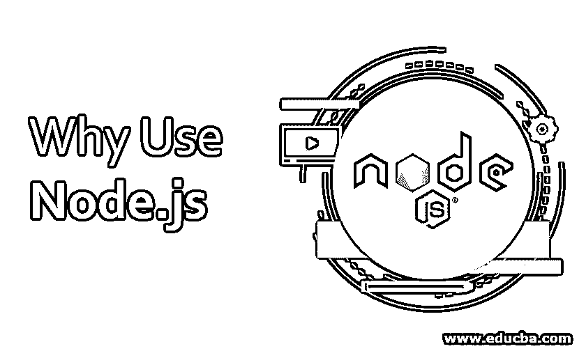
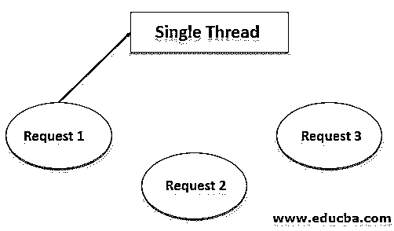

# 为什么使用 Node.js

> 原文：<https://www.educba.com/why-use-node-js/>

## Node.js 简介

Node.js 是一个在服务器端使用 JavaScript 的开源运行时环境。它基于谷歌 Chrome 的 V8 引擎，运行在 Windows、Linux、Mac 等多种平台上。Node.js 使用异步编程。它用于构建高度可伸缩的数据密集型 web 应用程序。构建这样的 web 应用程序需要框架。这个框架是工具、助手和库的集合。为此构建的流行框架有 Express.js、Sails.js、AdonisJs、Meteor.js、Nest.js、Koa.js、LoopBack.js、Hapi.js、Derby.js 和 Total.js。

### **为什么要用 Node.js？**

虽然有多种框架带来了一些好处，但 Node.js 是接管企业开发的框架。Node.js 提供的多种功能，如事件驱动和异步编程。此外，它使用单线程来操作请求。

<small>网页开发、编程语言、软件测试&其他</small>

### Node.js 的特性

下面是提到的特征:

#### 1.单线程的

Node.js 在单线程上运行。它基于“单线程事件循环模型”架构，可以处理多个客户端请求。主事件循环由单个线程执行，但在后台，输入输出工作在单独的线程上执行；因为 Node.js 是异步的。事件循环允许 node.js 执行所有非阻塞操作。

#### 2.异步的

默认情况下，Node.js 是异步的，即它以非阻塞的方式运行。这意味着，当客户端向服务器请求时，单个线程处理请求；它检查请求是否涉及任何数据库交互，如果不涉及；请求被处理，服务器向客户机发回响应。线程准备好处理下一个请求。

#### 3.事件驱动的

事件驱动的概念类似于异步编程中回调函数的概念[。唯一的区别是，一旦异步函数返回结果，回调函数就会执行，并且事件在其关联的事件处理程序上被触发。](https://www.educba.com/callback-function-in-jquery/)

#### 4.表演

Node.js 建立在 Google Chrome 的 V8 JavaScript 引擎上，这有助于我们更快地执行代码。该引擎将 JavaScript 代码编译成机器码，这使得我们的代码更容易、更快地以有效的方式实现。像异步编程这样的概念和它对非阻塞输入输出操作的操作方式使它的性能很高。 [Node.js 高度使用](https://www.educba.com/events-in-node-js/)事件，这使得它非常快。

#### 5.高度可扩展

这些应用程序高度可伸缩，因为它们以异步(非阻塞)方式运行。它在单个线程上工作，当单个请求到达时，开始处理它，并准备好处理下一个请求。此外，一旦准备好响应，它将被发送回客户端。

#### 6.节点程序包管理器(NPM)

正如我们所熟悉的，节点包管理器是节点 JavaScript 运行时环境的包管理器，也是 Node.js 安装程序的推荐特性。它是世界上最大的在线知识库。对于 Node.js 提供的上述所有特性，在企业行业开发中更为首选。

### Node.js 的工作

它使用异步编程。

让我们看看它是如何工作的:

1.Node.js 中的单个线程处理所有传入的请求。

2.客户端向服务器发送请求。

3.分配一个线程来处理该请求。

4.然后，线程检查请求是否需要查询数据库或任何复杂的操作，线程不等待数据库返回数据，而是准备好为另一个请求服务。

5.同时，对于涉及与数据库交互的第一个请求，线程将该特定请求放在事件队列中。

6.事件队列仅在单个线程上运行。

7.当一个请求被放入事件队列时，它开始处理这个特定的客户端请求。

8.然后，它检查内部线程池中线程的可用性。内部线程池由多个线程组成。

9.然后，分配一个线程来处理请求，该线程将请求转发、处理、准备响应并将其发送回事件循环。

10.反过来，事件循环将响应发送回客户端。

11.当下一个请求到达时，它会再次检查当前请求是否需要查询数据库，如果不需要，那么线程会继续处理请求，然后将响应发送回客户端。

因此，上面的场景解释了 Node.js 如何处理并发客户端的请求，并在单线程上操作，而不需要创建多个线程。它使用较少的线程，因此可以使用较少的资源。此外，该示例解释了默认情况下这是异步的、事件驱动的，并且以非阻塞方式运行。

### Node.js 的实时示例

以下是实时示例:

**1。网飞:**网飞是一个流媒体服务，拥有大量的消费者。

**2。PayPal:** PayPal 是一个在线支付平台，拥有超过 2 亿活跃用户账户。

**3。优步:**“优步”是一个连接出租车司机和顾客的平台。由于其处理大量数据的特性和方便的错误分析，它被选为后端技术。

**4。LinkedIn:** LinkedIn 是一个专业的社交网站。它是支持 LinkedIn 应用程序后端的主要技术。LinkedIn 是以商业和服务就业为导向的服务。

**5。沃尔玛:**沃尔玛是全球最大的零售连锁店。

**6。易贝:**易贝是一家跨国电子商务公司。开发人员希望应用程序是实时的。

### 结论

因此，我们忽略了选择 Node.js 作为 web 应用程序开发技术的原因，并查看了 Node.js 的实时示例。

### 推荐文章

这是为什么使用 Node.js 的指南。在这里，我们讨论 Node.js 的介绍、功能、工作和实时示例。您也可以查看以下文章以了解更多信息

1.  [node . js 的特性](https://www.educba.com/features-of-node-js/)
2.  [Node.js 流程](https://www.educba.com/node-dot-js-process/)
3.  [Node.js 文件系统](https://www.educba.com/node-dot-js-file-system/)
4.  [Node.js 缓冲区](https://www.educba.com/node-js-buffers/)

