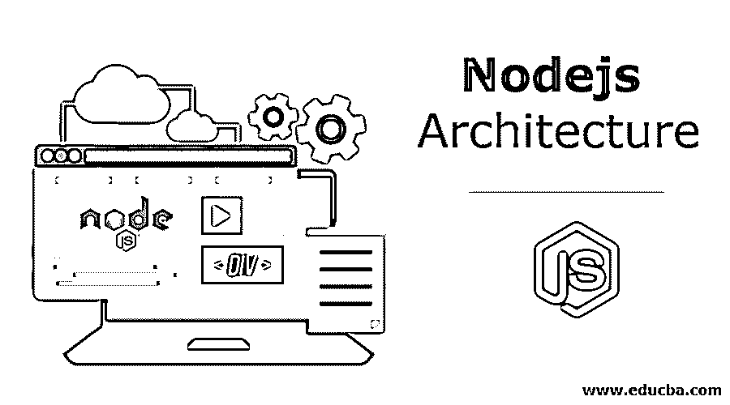
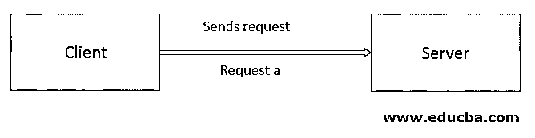
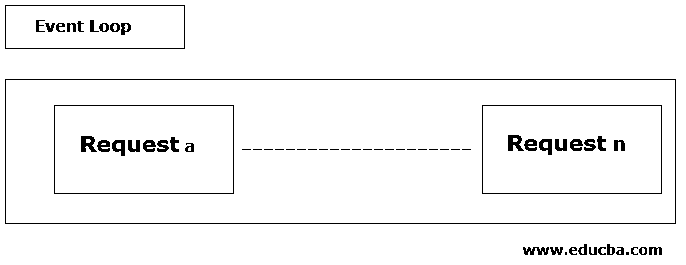
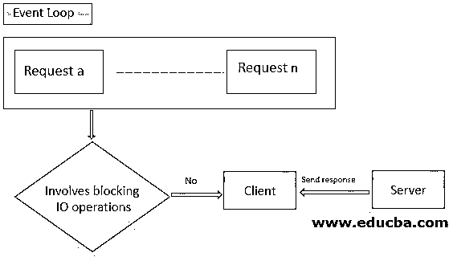
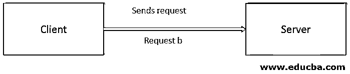
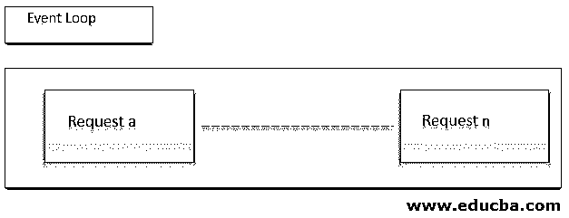

# Nodejs 体系结构

> 原文：<https://www.educba.com/nodejs-architecture/>

## Node.js 架构简介

Node.js 架构基于单线程事件循环模型，将使我们更好地理解 Node.js 提供的优势，它可以在不创建多线程的情况下处理并发客户端请求的方式，以及 Node.js 如何使用更少的线程；只是为了利用更少的资源。我们将关注单线程的本质以及 Node.js 如何处理特定的请求？事件队列和线程池的概念如何帮助 Node.js 以高可伸缩性和高性能更好地处理请求。

**单线程特性的优势**

<small>网页开发、编程语言、软件测试&其他</small>

1.  我们可以轻松处理并发的客户请求。
2.  JS 使用更少的线程，因此可以使用更少的资源。当一个节点。JS web 服务器接收并发请求，由于事件循环，它不需要创建多个线程。

### 节点体系结构

节点。JS 基于单线程事件循环模型。其处理主要基于 JavaScript 事件循环模型。

让我们看一下下面两个场景，这将有助于我们理解 Node.js 的架构:

#### 场景#1

*   客户端向服务器发送请求。

*   该请求在事件循环中注册。

*   单线程事件循环允许节点执行非阻塞的输入输出操作。
*   对传入的请求进行检查，以确定它是否包括与数据库的任何交互或繁重的计算。

*   由于上述请求不包含任何复杂的操作，因此准备好请求，然后将响应发送回客户端。

**场景#1 的图解说明**

1.  在场景 1 中，客户机向服务器发送请求(a)。
2.  请求(a)在事件循环中注册。
3.  然后，事件循环检查请求(a)是否包含任何复杂的操作或与数据库的任何交互。
4.  由于传入的请求(a)不包含任何繁重的计算，节点 js 开始处理请求(a)，准备响应并将其发送回客户端。

#### 场景#2

*   如上所述，客户端向服务器发送请求。

*   传入的请求在事件循环中注册。
*   然后，事件循环检查传入的请求是否包含任何复杂的操作、数据库查询或任何与文件系统的交互。

*   如果传入的请求包含与数据库的交互，事件循环将检查 Nodejs 服务器中的内部线程池。
*   Nodejs 服务器的内部线程池由负责执行包含与数据库或文件系统交互的请求的线程组成。
*   线程是进程中的执行路径，也称为轻量级进程。
*   事件循环检查线程是否可用于执行内部线程池中的请求。
*   如果线程可用，则请求被分配给该线程。
*   然后，被分配的线程负责执行请求，准备其响应，并将其提交给事件循环。
*   然后，事件循环最终将响应返回给客户端。

**场景#2 的图解说明**

1.  在场景 2 中，客户端向服务器发送请求(b)。
2.  请求(b)在事件循环中注册。
3.  然后，事件循环检查请求(b)是否包含任何与数据库的交互或任何要执行的复杂操作。
4.  因为传入的请求(b)包含繁重的计算，即与数据库的交互；节点 js 检查内部线程池中线程的可用性。
5.  当发现该线程可用于处理请求(b)时，将请求(b)分配给该线程。
6.  然后，线程负责处理该请求，准备其响应，并将其发送回客户端。

### **js 平台**

Node.js 是一个 [JavaScript 运行时环境](https://www.educba.com/what-is-javascript/)。Node.js 帮助我们构建 web 应用程序。它基于谷歌 Chrome 的 V8 引擎。Node.js 运行在各种平台上，如 [Windows、Mac、Linux](https://www.educba.com/linux-vs-mac-vs-windows/) 等。

Node.js 默认遵循异步编程的机制，由于其单线程的特性，Node.js 基本上用于事件驱动的服务器。NPM 代表节点包管理器，它是节点 JavaScript 运行时环境的包管理器。这是 Node 的推荐功能。JS 安装程序。它可以管理特定项目的本地依赖包，并且是世界上最大的在线存储库。

Node.js 给了我们在框架的帮助下构建高度可伸缩的 web 应用程序的特权。适用于 Node.js 的流行框架有 Express.js、Sails.js、Meteor.js、Total.js 等等。框架为我们提供了一种轻松构建应用程序的方式。非阻塞 I/O 模型(异步编程)和事件驱动的特性使得 Node.js 高效而轻量。

### Node.js 的优势

以下是一些优点。

*   单线程特性
*   异步编程(非阻塞 I/O 操作)
*   事件驱动的
*   无缓冲
*   节点程序包管理器(NPM)
*   缓存的优势
*   开放源码
*   表演
*   高度可扩展

### 结论

因此，我们研究了基于单线程事件循环模型的 Node.js 架构。它帮助我们理解如何通过事件队列和线程池的概念来处理特定的请求；如何将包含任何阻塞输入输出操作的请求放置在事件队列中，以及如何分配一个线程来传送请求并在响应准备好之后将响应发送回客户端。

我们还了解了 Node.js 平台的概念、可用于构建数据密集型、高可伸缩性 Node.js 应用程序的流行框架及其优势。

### 推荐文章

这是 Nodejs 架构的指南。这里我们讨论单线程的本质以及 Node.js 如何处理特定的请求。您也可以看看以下文章，了解更多信息–

1.  [焉节点。JS 管用？](https://www.educba.com/how-node-dot-js-works/)
2.  [Node.js 备选方案](https://www.educba.com/node-dot-js-alternatives/)
3.  [节点命令](https://www.educba.com/node-commands/)
4.  [node . js 的用途](https://www.educba.com/uses-of-node-dot-js/)

