# Node.js 流程

> 原文：<https://www.educba.com/node-dot-js-process/>

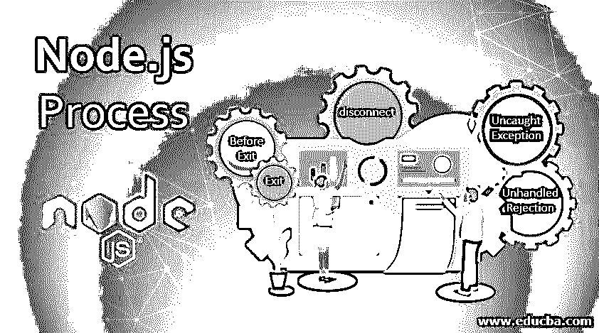


## Node.js 流程简介

Node.js 为我们提供了检索流程信息的权限，比如架构、平台、版本、流程 id、版本。它还允许中止进程等等。

流程是全局对象，可以从任何地方访问。它是 EventEmitter 类的一个实例。process 对象提供对一系列流程事件的访问，如“beforeExit”、“Exit”、“disconnect”、“uncaughtException”、“unhandledRejection”等，以及 process.cwd()、process.abort()等函数。广泛使用的 process 对象的几个属性是 process.env、process.stdout、process.stdin、process.stderr 等。

<small>网页开发、编程语言、软件测试&其他</small>

### 流程事件

让我们列出一些流程事件:

#### 1.退出前

通常，当事件循环为空并且没有进一步的计划工作要执行时，节点退出。beforeExit 流程事件用于在节点退出之前执行异步调用。

#### 2.出口

exit 事件在节点即将退出时发生。它不能执行任何类似 beforeExit 事件的异步调用。

#### 3.拆开

如果 node.js 进程是通过 IPC(进程间通信)通道生成的，则当 IPC 通道关闭时，将发出 disconnect 事件。

#### 4.uncaughtException

当一个未捕获的 JavaScript 异常一路弹出回到事件循环时，uncaughtException 事件发生。未捕获的 JavaScript 异常的默认行为是，node 将堆栈跟踪打印到 stderr。但是显式添加一个处理 uncaughtException 的处理程序会覆盖节点的默认行为。

#### 5.未处理的排斥

当承诺被拒绝并且没有提供错误处理程序来处理错误时，将发出 unhandledRejection 事件。通常，catch()方法用于处理承诺期间发生的错误或异常。

### 几个事件的演示

**代码:**

```
const process = require('process')
process.on('beforeExit', (code) => {
console.log(`With code ${code} process beforeExit event`);
});
process.on('exit', (code) => {
console.log(`With code ${code} process exit event`);
});
console.log('This message is displayed first');
```

**输出:**

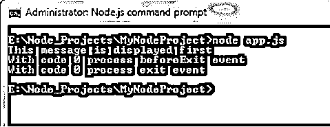


### Node.js 流程的属性

让我们看一下几个过程属性:

**1。process.env**

process.env 包含一个包含用户环境值的对象。

**2。process.pid**

process.pid 属性返回 node.js 进程的 pid。

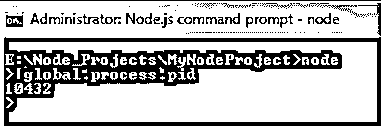


**3。process.ppid**

process.ppid 属性返回当前父 node.js 进程的 pid。

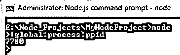


**4。process.release**

process.release 属性返回当前版本的信息，包括 URL 和标头。

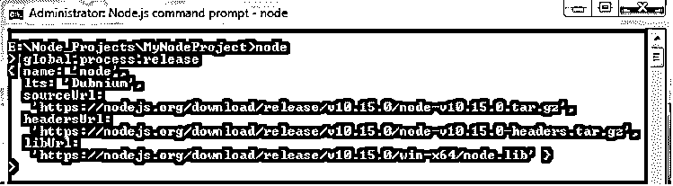


**5。process.title**

process.title 属性返回当前进程的标题。

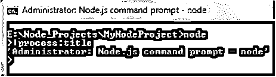


**6。process.version**

process.version 提供当前安装的节点版本。如果您真的想检查它，请转到命令提示符并执行以下步骤:

1.  结节
2.  流程.版本

我们使用了 global.process，因为我们知道 process 对象可以从任何地方访问。

**输出:**

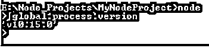


7 .**。process.versions**

process.versions 也为我们提供了版本值，但是正如我们在下面使用 global.process.versions 所看到的，我们能够检索节点堆栈中存在的所有其他模块或依赖项的版本。

**输出:**

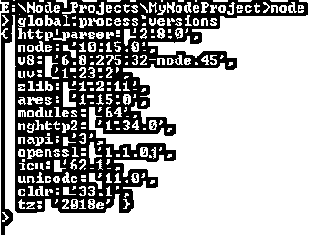


**8。process.platform**

使用 global.process.the platform，我们可以获取运行 Node.js 流程的操作系统平台的名称。可能的值有 linux、win32、darwin 等。

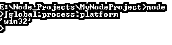


**9。process.channel**

如果 Node.js 进程是由 IPC 通道产生的，则 process.channel 属性是对 IPC 通道的引用。如果 IPC 通道不存在，process.channel 属性返回“undefined”作为其值。

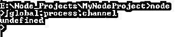


10。process.connected

如果 Node.js 进程是通过 IPC 通道生成的，则 process.connected 返回其值“true ”,并且只要它处于连接状态，就会保留该值。它根据 process.disconnect()返回“false”值。一旦断开连接，我们就无法再使用 process.send()方法发送消息。

**11。process.argv**

process.argv 返回一个由所有命令行调用参数组成的数组。下面的屏幕截图说明了同样的情况:


**12。process.argv0**

它由 Node.js 启动时 argv[0](只读副本)的原始值组成。

13。process.arch

为了获取操作系统 CPU 架构的值，我们使用 process.arch 属性。可能的值有:x32、x64、arm64、ia32 等。

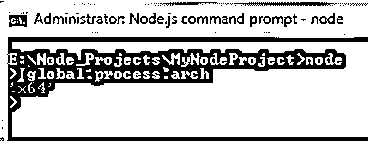


**14。process.stdin**

为了读取输入，stdin 代表“标准输入”。

15。process.stdout

写输出，stdout 代表‘标准输出’。

16。process.stderr

异常是使用 process.stderr(标准错误)编写的

### Node.js 流程的功能

让我们快速浏览一些 node.js 流程函数:

**a) process.cwd()**

要检索当前工作目录的信息，我们可以使用 process.cwd()方法，如下所示:

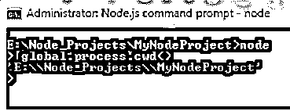


**b) process.abort()**

process.abort()方法赋予我们立即退出当前进程的权限。

**c) process.setuid(id)**

为了设置节点流程的用户标识，我们使用 process.setuid()。id 的值可以是用户名(字符串)或数字类型。

**d) process.getuid()**

为了获取节点流程的数字用户标识，我们使用 process.getuid()方法。

**e) process.seteuid(id)**

我们使用 process.seteuid()来设置节点流程的有效用户标识。

id 的值可以是用户名(字符串)或数字类型。

**f) process.geteuid()**

为了获取节点流程的数字有效用户标识，我们使用 process.geteuid()方法。

**g) process.setgid(id)**

为了设置节点进程的组标识，我们使用 process.setgid(id)方法。

id 的值可以是组名(字符串)或数字类型。

**h) process.getgid()**

为了检索节点流程的数字组标识，使用 process.getgid()方法。

**i) process.setegid(id)**

为了设置节点流程的有效组标识，我们使用 process.setgid(id)方法。id 的值可以是组名(字符串)或数字类型。

**j) process.getegid()**

为了检索节点进程的数字有效组标识，使用 process.getgid()方法。

### 结论

因此，我们通过节点的全局流程对象(作为 EventEmitter 的实例)忽略了它的几个事件，如 beforeExit、Exit、uncaughtException 等。

我们还研究了 node.js 流程的一些属性，如 process.pid、process.arch 和一些流程函数。

### 推荐文章

这是一个 Node.js 流程指南。这里我们讨论 node.js 流程的属性和一些流程函数。您也可以看看以下文章，了解更多信息–

1.  [Nodejs 体系结构](https://www.educba.com/nodejs-architecture/)
2.  [Node.js 命令](https://www.educba.com/node-dot-js-commands/)
3.  [节点。JS DNS](https://www.educba.com/node-js-dns/)
4.  [Node.js 子进程](https://www.educba.com/node-js-child-process/)


