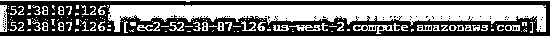

# 节点。JS DNS

> 原文：<https://www.educba.com/node-js-dns/>


## Node 简介。JS DNS

节点。JS DNS 是一个用于实际 DNS 查找和使用底层操作系统名称解析的模块。域名系统(DNS)并不总是使用 DNS 协议进行查找。DNS 的主要优势是用户不需要记住所有的 IP 地址，因为 DNS 提供了一个很好的解决方案来转换域名或子域名为 IP 地址。这个节点。JS DNS 包含各种获取主机名信息的方法。

### **语法**

```
var dns = require('dns');
```

### 节点的方法。JS DNS

DNS 模块中的所有其他功能都连接到实际的 DNS 服务器来执行名称解析，这些方法有不同的配置文件集。让我们看看不同的 DNS 方法。

<small>网页开发、编程语言、软件测试&其他</small>

```
dns.lookup(hostname[, options], callback)
```

查找主机名，回调函数包含关于主机名及其 IP 地址的信息。

```
dns.lookupService(address, port, callback)
```

查找地址和端口号，回调函数包含有关主机名及其 IP 地址的信息。使用 getnameinfo 服务，给定的地址和端口被解析为主机名。

```
dns.resolve(hostname[, rrtype], callback)
```

解析并返回属于特定主机名的记录数组，例如[www.gmail.co](https://www.google.com/gmail/about/#)T2【m】T3】

这里，rrtype 指定资源记录类型，默认值设置为“A”，记录列表如下。

**答:** IPv4 地址

**AAAA:** IPv6 地址

**任意:**任意记录

**CNAME** :规范的名字记录

**NAPTR:** 命名权限指针记录

**MX:** 邮件交换记录

**PTR:** 指针记录

**NS:** 名称服务器记录

**SOA:** 授权记录的开始

**服务记录:**

**TXT:** 文字记录

回调指定了 dns 解析后要调用的函数

```
dns.resolve4(hostname, callback)
```

查找 IPv4 地址，类似于 dns.resolve，包括 IPv4 地址数组

```
dns.resolve6(hostname, callback)
```

查找 IPv6 地址，类似于 dns.resolve，包括 IPv6 地址数组。

```
dns.resolveMx(hostname, callback)
```

类似于 dns.resolve，解析特定主机名的邮件交换记录。

```
dns.resolveTxt(hostname, callback)
```

类似于 dns.resolve，解析特定主机名的文本查询记录。

```
dns.resolveSrv(hostname, callback)
```

类似于 dns.resolve，解析特定主机名的服务记录。

```
dns.resolveSoa(hostname, callback)
```

类似于 dns.resolve，它解析特定主机名的授权起始记录。

```
dns.resolveNs(hostname, callback)
```

类似于 dns.resolve，解析特定主机名的名称服务器记录。

```
dns.resolveCname(hostname, callback)
```

类似于 dns.resolve，解析特定主机名的规范名称记录。

```
dns.reverse(ip, callback)
```

将 IP 地址转换成主机名数组。

```
dns.getServer()
```

返回包含所有属于当前服务器的 IP 地址的数组。

```
dns.setServer(servers)
```

设置服务器的 IP 地址。

### 节点示例。JS DNS

让我们看一个简单的例子，检索网站的 IP 地址。

#### 示例#1

**代码:**

```
var dns = require('dns');
var demo = dns.lookup('www.educba.com', function (err, addresses, family) {
console.log(addresses)
});
```

**输出:**


在这里，我们包括“dns”模块并创建一个对象。调用 dns 的查找功能显示网站“www.educba.com”的 IP 地址

#### 实施例 2

**代码:**

```
var dns = require('dns');
var demo = dns.lookup('www.educba.com', function (err, address, family) {
console.log(address);
dns.reverse(address, function (err, hostnames) {
if(err) {
console.log(err.stack);
}
console.log(address + ': ' + JSON.stringify(hostnames));
});
});
```

**输出:**




在这里，我们还包括' dns '模块和对象的创建，与查找功能，我们还调用反向功能，扭转了 IP 地址。

#### 实施例 3

**代码:**

```
var dns = require('dns');
var demo = dns.lookupService('127.0.0.1', 22, (err, hostname, service) => {
console.log(hostname, service);
});
```

**输出:**


#### 实施例 4

**代码:**

```
const { Resolver } = require('dns');
const resolver = new Resolver();
resolver.setServers(['127.0.0.0']);
console.log(resolver.getServers());
```

**输出:**


#### 实施例 5

**代码:**

```
const dns = require('dns');
const rrtype="A";
dns.resolve('www.gmail.com', rrtype, (err,
records) => console.log('records: %j', records));
const rrtype1="TXT";
dns.resolve('www.gmail.com', rrtype1, (err,
records) => console.log('records: %j', records));
const rrtype2="NS";
dns.resolve('www.gmail.com', rrtype2, (err,
records) => console.log('records: %j', records));
```

**输出:**


DNS 方法可能会返回一些错误代码，

*   未找到:如果找不到域
*   BADQUERY: DNS 查询格式不正确
*   超时:如果连接到 dns 服务器时超时
*   文件:如果读取文件出错
*   文件结尾
*   取消:如果 dns 查询被取消
*   诺姆:如果没有记忆

还有很多。

### 结论

我们已经看到了什么是节点。JS DNS 及其优点，它是一个连接到互联网的分层分布式命名系统。我们已经看到了如何访问服务器的 IP 地址。我们还研究了一些使用 DNS 方法的例子，如查找、反向、解析等。也看到了 DNS 返回的一些错误码。

### 推荐文章

这是一个节点指南。JS DNS。这里我们讨论节点的语法。JS DNS，实现它的方法，解析并返回一个记录数组，带有代码输出的例子。您也可以浏览我们的其他相关文章，了解更多信息——

1.  [Node.js 子进程](https://www.educba.com/node-js-child-process/)
2.  [Node.js 文件系统](https://www.educba.com/node-dot-js-file-system/)
3.  [Node.js 缓冲区](https://www.educba.com/node-js-buffers/)
4.  [Node.js 路径](https://www.educba.com/node-js-path/)


