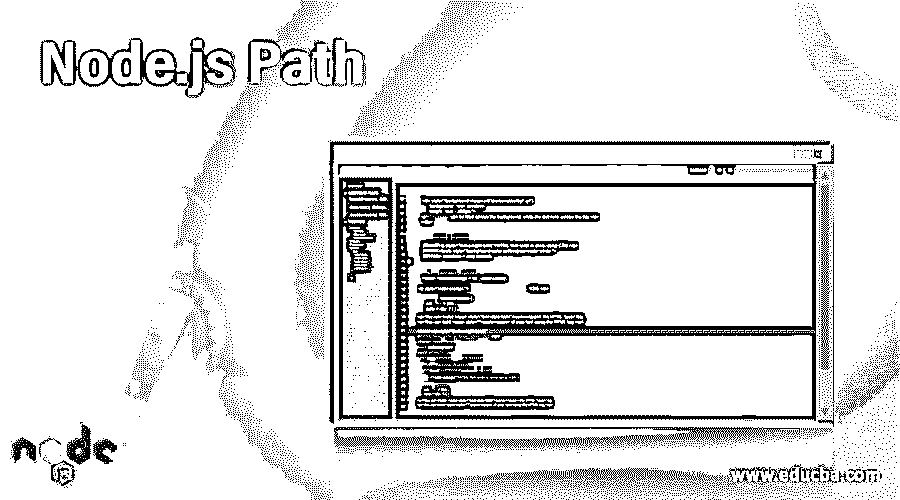
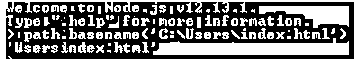
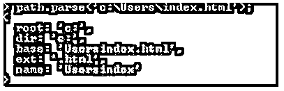

# Node.js 路径

> 原文：<https://www.educba.com/node-js-path/>

## Node.js 路径简介

下面的文章提供了 Node.js 路径的概要。Node.js 有一些内置模块。在编写代码时，这些模块已经准备好实现了。其中之一是路径模块。这个模块包含了许多有用的方法。在路径模块的帮助下，我们可以处理文件和目录路径。为了在我们的程序中使用这个模块，我们需要导入这个路径模块。

### Node.js 路径方法

路径模块包含许多方法。在探讨 path 模块中的方法之前，让我们看看如何在我们的程序中使用这个模块。

<small>网页开发、编程语言、软件测试&其他</small>

首先，我们需要在顶部导入路径模块。

使用下面的语法来导入它。

**语法:**

`const path = require(‘path’); //importing path module in node js`

这里我们声明了一个常量路径。我们是这样写的，这与其他语言中的导入语法相同。

下面是 path 模块中的一些重要方法，我们应该知道这些方法，以便开始在我们的代码中实现它们。

路径模块的行为因操作系统而异。如果我们想知道我们在 windows 上使用的路径，那么我们有一个名为 basename 的方法。它给出了路径的结束部分。

**举例:**

`path.basename('C:\Users\index.html')`

**输出:**

### 路径模块中的方法

下面给出了路径模块中的方法:

#### 1.path.extname(路径)

这是我们的另一个方法 extname。每个文件都有一些扩展名。不管你是不是程序员，每个人都知道扩展名是什么。我们使用的文件类型包括简单的文本文件。txt 在最后。用于存储我们正在使用的图像文件。png，。jpg 或 jpeg，。gif 等。所以如果我们想知道我们有什么类型的文件，我们可以用这个方法名。

**举例:**

`path.extname('c:\Users\index.html');`

**输出:**

#### 2.Path.join(['paths'])

这个方法帮助我们合并所有传入的参数，并返回完整的路径来使用。这在我们不知道确切路径的地方帮助了我们。这使我们能够动态地连接多个段，并形成要使用的路径。

**举例:**

`path.join('/abc', 'properties', 'image/flower', 'lily', '..');`

**输出:**

#### 3.path.normalize(path)

此方法用于规范化给定的路径。关于这种方法，这里要注意的主要事情是，我们知道，当我们使用多个段来连接路径时，无论 os 如何，都会有多个正斜杠或反斜杠和点。这种方法帮助我们删除不需要的字符，并为我们提供干净的路径。

**举例:**

`path.normalize('/abc', 'properties', 'image/flower', '/lily');`

**输出:**

#### 4.path.parse(路径)

这个方法返回给定路径的根、基、目录、名称和扩展名。

`root <string>
base <string>
dir <string>
ext <string>
name <string>`

**举例:**

这个方法向我们展示了这条道路的不同元素。它给出了关于路径如何形成的更多信息。

`path.parse('c:\Users\index.html');`

**输出:**

#### 5.path.sep

此方法有助于识别操作系统特定的分隔符。正如我们所知，Linux 和 Windows 有不同的规则来分隔路径。

**举例:**

`'c:\\Users\\index.html'.split(path.sep)`

**输出:**

我们可以在上面例子中的 split 函数的帮助下分离路径。

#### 6.path.win32

这种方法为我们提供了包含规范的能力。这增加了在向模块函数写入路径时要考虑的对象。

#### 7.path.toNamespacedPath(path)

此方法仅在 windows 操作系统上有帮助。如果给定了路径，它会给路径添加前缀并返回。但是，假设如果路径不是字符串，那么它就不会添加任何前缀，而是原样返回。

#### 8.path . resolve([…路径])

可能会出现需要使用多个路径段的情况。我们需要结合这些途径。在编程语言中，我们称之为解析路径。这同样适用于此功能。这是为了简化路径。

它只是在绝对路径中转换路径段。

**举例:**

`path.resolve('/Users','/index.html');`

因此，这将产生以下结果:

**输出:**

此外，在使用此函数时，您可能会注意到没有包含字符串路径，然后它会显示 typeError。

#### 9.path.relative(从，到)

这个方法给出了基于 cwdi.e 当前工作目录的路径。这个方法返回我们在其中提供的相对路径。对于这个方法，我们需要给出 from 和 to 路径。如果 from 和 to 路径相同，那么它将返回零长度字符串。有时零长度字符串被传递给 from 和 to 中的方法，然后它将返回当前工作目录。

**举例:**

`path.relative('/profile/user1/data', '/temp/abc/ab/flower');`

**输出:**

#### 

#### 10。 path.isAbsolute(路径)

这种方法是一种检查。假设你想知道给定的路径是否是绝对的，这时我们可以用这个方法。

以防万一，如果为这个函数提供的路径长度为零，那么它将返回 false。

**举例:**

`path.isAbsolute('/items/flowers/lily');`

**输出:**

上面的例子给出了正确的答案，因为路径是绝对的。现在假设我们提供相对路径。

**举例:**

`path.isAbsolute('items/flowers/lily');`

**输出:**

现在我们得到了错误的回报。它也给了我们错误，因为没有给出正确的路径。所以在这个函数中写 path 时要小心。如果给定路径不属于 string 类型，该方法也会返回类型错误。

#### 11.路径.分隔符

分隔符不过是路径中使用的分隔符。不同的操作系统有不同的路径实现方式。您可以在本地机器上的 node 命令提示符下进行尝试。这将返回系统的实际路径。

您可以登录到控制台。

`Console.log(process.env.PATH);`

**举例:**

`process.env.PATH.split(path.delimiter);`

### 结论

Node.js 路径模块帮助动态获取路径。同时我们能够跨平台交流。我们看到了路径模块中不同的有用函数的帮助，我们可以自定义路径，以不同的方式实现它。

### 推荐文章

这是 Node.js 路径的指南。这里我们讨论 Node.js 路径的介绍，以及不同的方法和相应的例子。您也可以看看以下文章，了解更多信息–

1.  [节点 js REPL](https://www.educba.com/node-js-repl/)
2.  [Node.js 流程](https://www.educba.com/node-dot-js-process/)
3.  [Nodejs 体系结构](https://www.educba.com/nodejs-architecture/)
4.  [Node.js 子进程](https://www.educba.com/node-js-child-process/)

