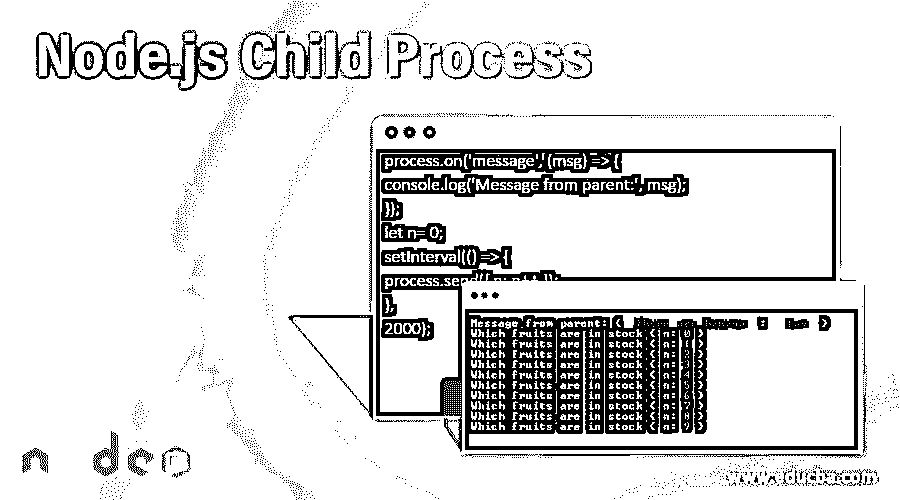
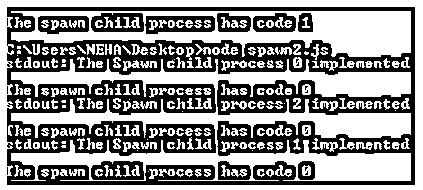

# Node.js 子流程

> 原文：<https://www.educba.com/node-js-child-process/>

## Node.js 子进程简介

node.js 的核心是客户端的 JavaScript。JavaScript 为我们提供了在服务器端运行的环境，称为 node.js。主要部分是 js，因为我们都知道 js 是单线程的。所以毫无疑问，我们可以说 node.js 也是单线程的。但是我们不能在复杂的实时应用程序上的单线程上回复，此时我们使用 Node.js 子进程。

### Node.js 子进程如何工作？

为了帮助一次执行许多任务，node.js 有一个名为 node.js 子进程的模块。在这些进程的帮助下，我们可以根据需要发布尽可能多的小进程。Node.js 子进程有一个主进程。Node.js 进程有一些参数。

<small>网页开发、编程语言、软件测试&其他</small>

在本地计算机上运行以下代码:

**代码:**

`console.log(process.argv);`

您将获得实际的文件和路径的节点正是在您的机器上。

**代码:**

`console.log(process.argv)
[ 'C:\\Program Files\\nodejs\\node.exe' ] undefined`

**输出:**

### 如何使用各种方式创建 Node.js 子进程？

这里我们有四种不同类型的子进程。

*   叉子()
*   执行()
*   execFile()
*   产卵()

下面给出了在 node.js 中创建不同流程的四种方法:

#### 1.叉子()

该功能与 spawn 相同。这个函数使用了称为 eventEmmiter 的 modulo=e。众所周知，eventEmmiter 是一个用于传播事件的 node.js 模块。假设我们有两个文件。文件 1 和文件 2。

**文件 1:**

**代码:**

`const { fork } = require('child_process');
const message= fork('file2.js');
message.on('message', (msg) => {
console.log('Which fruits are in stock', msg);
});
message.send({ 'There are bananas': ' fav' });`

**文件 2:**

**代码:**

`process.on('message', (msg) => {
console.log('Message from parent:', msg);
});
let n= 0;
setInterval(() => {
process.send({ n: n++ });
},
2000);`

**输出:**

")

#### 2\. **exec()**

现在第二个是 exec()函数。这个功能是利用外壳来执行命令。这个函数使用了 shell。该函数缓冲输出。

这个函数需要设置一些命令和参数。

**命令(字符串):**我们需要设置命令。后面是不同的选项。

有如下几种选择:

*   **cwd (String):** 显示子进程在当前工作目录中的位置。
*   **shell (String):** 这有助于在 windows 或其他操作系统上执行 shell 选项。
*   **超时(次数):**我们在这里设置超时。默认情况下，它设置为零(0)。
*   **uid (Number): T** 这是设置进程的用户身份。
*   **env (Object):** 这是为了知道环境键值对。
*   **编码(字符串)**:设置程序的编码。默认情况下，它设置为 UTF8。
*   **gid (Number):** 这是设置流程的组标识。
*   **killSignal (String):** 如果我们想要停止传播，那么我们将使用此选项。其默认值为“SIGTERM”。
*   **maxBuffer (Number):** 有了这个，我们就可以设置缓冲区计数了。默认为 200*1024。

**语法:**

`child_process.exec(command[, options], callback function)`

**例子:execffun . js**

`console.log("The Child Process is " + process.argv[2] + " getting implemented" );`

**示例:execfun1.js**

我们需要在这里包含一个文件系统模块。

**代码:**

`const fileSystem = require('fs');
const process1 = require('child_process');
for(var i=0; i<3; i++) {
var process2 = process1 .exec('node execfun.js'+i,function
(err, stdout, stderr) {
if (err) {
console.log(err.stack);
console.log('The error message: '+err.code);
console.log(' the Signal message: '+err.signal);
}
console.log('the output for stdout: ' + stdout);
console.log('the output for stderr: ' + stderr);
});
process2.on('on exit', function (code) {
console.log('The child process is getting end here. '+code);
});
}`

**输出:**

如果我们运行 execfun2.js，那么我们将得到下面的输出。

")

#### 3.execFile()

有时我们需要在不使用 shell 的情况下运行我们的文件。壳牌用起来有风险。它伴随着一些安全威胁。该函数的工作方式类似于 exec 函数。execFile 函数的使用比 exec()函数更流畅。

#### 4.产卵()

spawn 意味着从中释放一个新的子进程。同样的事情也适用于这个功能。Span 函数使用 od EventEmmiter。spawn 进程返回 stdout 和 stderr 的流。每个函数都有一些需要执行的参数。

**命令:**

*   **args (Array):** 这里有数组元素。

**选项:**

正如我们在语法中看到的，下面是我们可以利用的不同选项。

*   **cwd (String):** 显示当前进程运行的当前工作目录。
*   **stdio (Array):** 这显示了孩子的 stdio 配置。
*   **env (Object):** 这为我们提供了环境键值对。
*   **customFds (Array):** 这是不推荐使用的文件。这是供孩子使用的 stdio。
*   **uid (Number):** 用于设置流程的用户身份。
*   **gid (Number):** 这是设置流程的组标识。
*   **detached (Boolean):** 这是将成为过程组领导的孩子。

**语法:**

`const { spawn } = require('child_process');`

每次我们使用函数来使用进程时，我们需要首先从 child _ proocess 析构它，如上所示。

**示例:spwan1.js**

`console.log("The Spawn child process " + process.argv[2] + " implemented");`

**示例:spawn2.js**

**代码:**

`const fileSystem = require('fs');
const spawnProcess = require('child_process');
for(var i=0; i<3; i++) {
var process2 = spawnProcess.spawn('node', ['spawn1.js', i]);
process2.stdout.on('data', function (dataValue) {
console.log('The output for stdout: ' + dataValue);
});
process2.stderr.on('data', function (dataValue) {
console.log(' The output for stderr: ' + dataValue);
});
process2.on('close', function (spawnCode) {
console.log('The spawn child process has code ' + spawnCode);
});
}`

要查看结果，请运行以下命令。

**代码:**

`node spawn2.js`

然后回车，你会看到下面的输出:

**输出:**

### 结论

子进程有几个函数。但主要用上面提到的四种。这些子进程帮助我们实现实际的节点编程。每个过程可以作为一个单独的节点工作。

### 推荐文章

这是 Node.js 子进程的指南。这里我们讨论一下入门，Node.js 子进程是如何工作的？以及如何使用各种方式创建 Node.js 子进程？您也可以看看以下文章，了解更多信息–

1.  [如何使用 Node.js](https://www.educba.com/how-to-use-node-js/)
2.  [节点。JS DNS](https://www.educba.com/node-js-dns/)
3.  [Node.js 流程](https://www.educba.com/node-dot-js-process/)
4.  [Nodejs 体系结构](https://www.educba.com/nodejs-architecture/)

