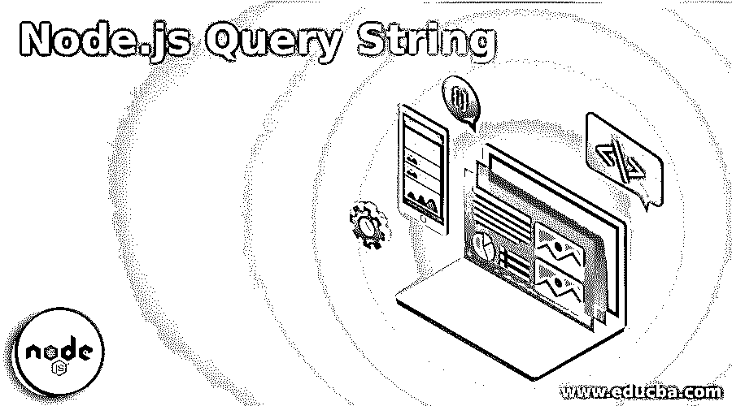
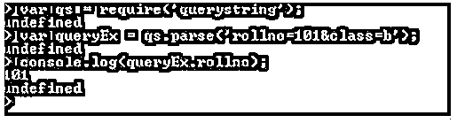
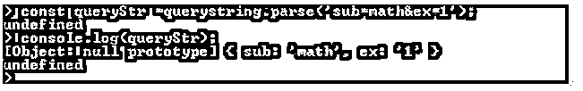

# Node.js 查询字符串

> 原文：<https://www.educba.com/node-js-query-string/>

## Node.js 查询字符串简介

以下文章提供了 Node.js 查询字符串的概要。Node.js 有一个叫做查询字符串的模块。这个模块主要用于格式化和解析 URL。在使用这个模块之前，我们必须导入它。用简单的语言来说，我们可以说我们正在以预期的格式提取 URL。这使得查询变得更加容易。我们可以说这是以键值对的形式向 url 添加额外数据的一种方式。也就是我们正在查询的 http 请求。每次我们请求 url 时，我们都在寻找特定的东西，这个特定的东西可以在 url 本身中查询。

### Node.js 查询字符串的工作

该模块主要用于 Node.js 版本 6 及更高版本。你还需要有最新版本的浏览器，如 chrome，Mozilla firefox，safari 等。在某些情况下，您需要使用旧版本的查询字符串和浏览器或 nodejs。此时确保您使用的查询字符串版本是 5。

<small>网页开发、编程语言、软件测试&其他</small>

运行以下命令获取较低版本的查询字符串。

**代码:**

`npm install query-string@5`

然后进入。此命令将安装旧版本的查询字符串。这个模块的主要目的是解析和解码 URL 中传递的查询字符串。当我们使用不同的路线时，这一点非常重要。URL 组件正在被解码 uri 组件解码。

现在让我们看看它到底是如何工作的。

我们来看一个 url。

**假设我们有以下 URL:**

**www.example.com/math/ex1?question=1**

在上面的 url 中，你可以看到/ex1，然后问号和问题= 1。在这里，我们从数学的 ex1 中查询问题 1 的 get 请求。通过这种方式，我们可以解析请求并获得我们需要的数据。如果您想要更多的数据，那么您可以添加更多的由“&”符号分隔的键值对。

**多参数示例:**

**www.example.com/student?rollno=101&班=乙**

查询字符串以问号开始，然后我们根据需要添加参数。如果有多个参数，我们用 amp(&)符号将它们连接起来。

### js 查询字符串方法

在处理查询字符串时，我们发现有许多与此相关的方法。首先，我们需要在我们的应用程序中导入这个模块。

这与我们在节点 js 中导入其他模块的语法相同。

**语法:**

`constqs = require('querystring');`

**举例:**

**代码:**

`varqs = require('querystring');
varqueryEx = qs.parse('rollno=101&class=b');
console.log(queryEx.rollno);`

**输出:**

下面给出了查询字符串中的一些方法:

*   querystring.unescape(str)
*   querystring.decode()
*   querystring.stringify(obj[、sep[、eq[、options]])
*   querystring.encode()
*   querystring.parse(str[，sep[，eq[，options]])
*   querystring.escape

#### 1\. querystring.unescape(str)

它有助于字符串类型的解析，这个方法不能直接使用。此方法由 querystring.parse()方法使用。querystring.unescape(str)方法使用 javascript 的 sdecodeURIComponent()方法。它利用这种方法来解码。

#### 2.querystring.decode()

此方法的工作方式类似于 querystring.parse()方法。

#### 3.querystring.stringify(obj[、sep[、eq[、options]])

这个方法有几个参数。

*   这是我们正在处理的一个物体。
*   **sep:** 这个是作为分隔符来分隔的，是一个&。
*   **eq:** 这又是一个分隔符，用来获取单独的值。在这种情况下是=符号。
*   **选项:**这里我们使用函数 querystring.escape()在安全模式下转换 URL。

现在让我们看看它是如何工作的。

**举例:**

**代码:**

`querystring.stringify({ ex1: 'math', science: ['one', 'two'], subject: '' });`

**输出:**

因此，这将为我们提供一个查询字符串，正如我们对 url 的期望。

#### 4.querystring.encode()

此方法与 querystring.stringify()方法的工作方式相同。

#### 5.querystring.parse(str[，sep[，eq[，options]])

此方法也具有与 querystring.stringify()方法相同的参数。此方法将 querystring 转换为键值对。它以键值对的可读格式返回集合。

**举例:**

**代码:**

`constqueryStr =querystring.parse('sub=math&ex=1');
console.log(queryStr);`

**输出:**

在上面的例子中，我们使用解析的方法来获得键值对的输出。

#### 6.querystring.escape

此方法有字符串参数。此方法用于百分比编码。这是用来实现特定 url 查询的字符串。这种方法不能直接使用。此方法应使用 querystring.stringify()方法。

有了以上所有方法，我们可以做得更多一点，以获得令人满意的结果。假设我们有一个查询字符串，但我们不希望它之间有任何空值。现在，为了获得没有空值的 url，可以使用 skip null 参数。

**举例:**

**代码:**

`varqs = require('querystring');
qs.stringify({ ex1: 'null', science: 'one', subject: 'math'}, {
skipNull: true
});`

**输出:**

同样，我们也有错误价值观的概念。在某一点上，你可能需要放一个键，但不赋予它任何值。在这一点上，你需要为它赋值，比如 null，undefined 或者空值。为了更深入地了解这一点，让我们看看下面的例子。

下面的例子是错误的值。

**代码:**

`varqs = require('query-string');
qs.stringify({ ex1: false, science: 'one', subject: 'math'});`

**输出:**

下面的例子是为了检查空值。

**代码:**

`varqs = require('query-string');
qs.stringify({ ex1: null, science: 'one', subject: 'math'});`

**输出:**

最后一个例子是关于未定义的值。

**代码:**

`varqs = require('query-string');
qs.stringify({ ex1: undefined, science: 'one', subject: 'math'});`

**输出:**

js 查询字符串具有 utf-8 编码。如果在应用程序中使用 utf-8 以外的编码，则按照相应的编码，将使用解码 uri 组件。

### 结论

当我们处理 API(应用程序编程接口)调用时，这个模块非常有用。我们可能会对解析 url 有不同的要求。这个模块给了我们一个简单的使用 url 的方法。正如你已经看到的不同方法的 nodedejsquery string。

### 推荐文章

这是 Node.js 查询字符串的指南。这里我们讨论 Node.js 查询字符串的介绍，以及工作和 js 字符串方法。您也可以看看以下文章，了解更多信息–

1.  [Node.js 路径](https://www.educba.com/node-js-path/)
2.  [Node.js 子进程](https://www.educba.com/node-js-child-process/)
3.  [节点。JS DNS](https://www.educba.com/node-js-dns/)
4.  [节点 js REPL](https://www.educba.com/node-js-repl/)

