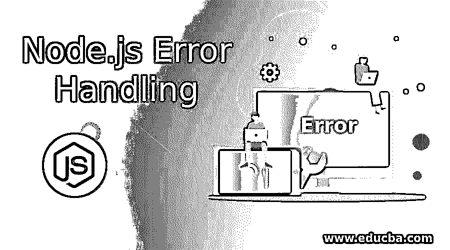
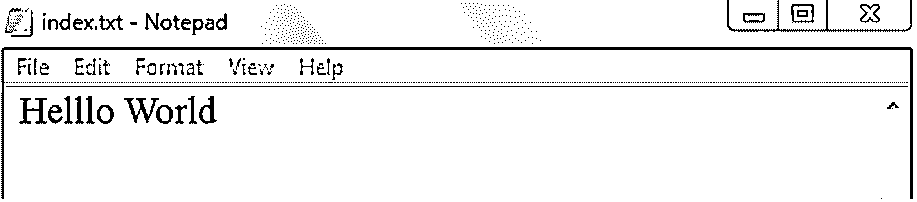

# Node.js 错误处理

> 原文：<https://www.educba.com/node-js-error-handling/>




## Node.js 错误处理简介

错误处理是有效捕捉和处理错误的过程。这些误差可能是同步的，也可能是异步的。错误处理是任何编程语言的核心部分。正如我们所知，node.js 只不过是服务器的 JavaScript 运行时。Node.js 主要致力于我们如何处理流程中出现的错误。我们熟悉其他编程语言的错误处理。我们经常看到 try 和 catch 块来处理错误。

```
function a(b) {
try {
logic ((err) => {
if (error) {
throw (error);
}
`      });
} catch (e) {
b(e);
}
}
```

以上是我们见过的那种错误处理。

<small>网页开发、编程语言、软件测试&其他</small>

### 错误处理的重要性

为了理解 node.js 中的错误处理，我们应该知道一些关键概念，如回调函数、异步函数(如 promise)和异步等待、尝试..catch 块，throw 关键字，error 对象。

如果您想知道为什么我们需要关注 node.js，那么请看一个例子。

假设您收到来自客户端的请求。你必须给客户一个适当的回应。客户不知道程序的内部细节，但是他应该以一种简单的方式理解出了问题。此时，我们应该通过处理错误来给出适当的响应。

及时投掷和捕捉错误是非常重要的。

### 节点中的错误处理是如何工作的？Js？

首先，我们将看到使用 node.js 的 try-catch。

```
function a() {
b();
}
function b() {
throw new Error('Something went wrong');
}
function errorCheck() {
try {
a();
} catch(e) {
console.log(e);
}
}
errorCheck();
```

**输出:**


在 node.js 中，我们捕捉错误并向客户端显示适当的结果。在上面的程序中，我们正在定义函数 a。在函数 a 中，我们正在调用函数 b。函数 b 有一个错误对象，它通过将参数传递给 catch 来引发错误。在 errorCheck()函数中，我们必须使用 try-catch 块来有效地处理错误。

在 node.js 中，我们专门处理 api 调用。有了 express，我们需要处理错误。我们可以同步和异步地处理 express 中的错误。

**同步捕捉错误的方式如下**

```
app.get('/', function (req, res) {
throw new Error(“Something went wrong”)
})
```

**异步方式捕捉错误**

```
app.get('/', function (req, res, next) {
fs.readFile('/fileNotFound', function (err, data) {
if (err) {
next(err)
} else {
res.send(data)
}
})
})
```

### 实现错误处理节点的示例。射流研究…

下面举几个例子

#### 示例#1

使用 Promises 时处理 Node.js 错误

```
function a() {
return Promise.resolve('Hello World');
}
function b(){
console.log("Promise is not resolved here")
}
a()
.then(b)
.catch((e) => {
})
```

**输出:**


#### 实施例 2

使用 express 处理 Node.js 错误

默认情况下，Express 具有处理错误的能力。

**举例:**

```
app.get('/', [
function (req, res, next) {
fs.writeFile('/home', 'data', next)
},
function (req, res) {
res.send('OK')
}
])
```

到目前为止，您已经看到我们只是在编写代码并抛出我们可能知道的错误。我们没有有效地处理这个问题。在 node.js 中，我们主要使用异步编程。在异步 try-catch 中，错误处理无法有效工作。

我们主要在 node.js 中处理文件。Fs 即文件处理是 node.js 中的核心模块，我们来举个例子。

**示例:**我们将把这个文件保存为 nodeFile。而在同一个位置上，你必须创建 index.txt 文件。

```
var fs = require("fs");
fs.readFile("index.txt","utf8",function(error, value)
{
if(error){
throw error;
}
console.log(value);
});
process.on("e",function(error){
console.log("There is an exception")
});
```

将上述代码保存在某个文件夹中。此外，确保您正在制作我们在程序中提到的文本文件。Index.txt 是我们要在这个程序中读取的文件。




在命令提示符下键入命令，即文件的节点名。

**示例:**节点 nodeFile

**输出:**


在上面的程序中，我们捕获了一个异常，在没有向最终用户显示确切错误的情况下，我们处理了那个错误。这是通过崩溃来拯救我们程序的一个非常有用的方法。最终用户根本不关心程序后台发生的事情。这个概念叫做在 node.js 中处理错误。

### 使用错误处理时要记住的几点

1.  在适当的地方抛出错误是程序员的责任。
2.  所有必要的参数都必须与函数匹配。如果我们之间有任何已知的差异，那么我们必须在程序级别处理它。
3.  我们需要观察是否需要发出错误或处理它。
4.  我们的错误必须提供有效的细节，这样下一个会遇到这个错误的人就能想到处理这个错误的方法。
5.  我们是处理意外错误的决策者。我们应该知道在哪里使用 try-catch 或者抛出异常。
6.  您应该知道使用 node.js 时出错的概率是多少。
7.  我们必须关注具体项目的模式和建议。
8.  需要明确功能逻辑。
9.  尝试在 node.js 中使用错误对象。
10.  你需要练习才能知道我们得到的是什么样的错误。获得错误的确切上下文有助于您有效地管理它。

此外，我们可以说有两种类型的错误。操作错误和程序员错误。

在这种情况下，文档就成了问题。如果你试图构建一些东西，要养成为代码写适当的注释的习惯。所以下一个程序员可以很容易地理解代码流，并且可以有效地管理错误。

我们所有的座右铭是在最后尽量减少错误。在编写代码时采取一些预防措施。

### 结论

为了有效地处理错误，您应该熟悉 Javascript ES5 和 ES6 语法及其用法。最终，节点只不过是服务器端的 javascript。Javascript 有一个错误处理概念。如果您熟悉这些概念，那么您可以轻松处理 node.js 中的错误。

### 推荐文章

这是 Node.js 错误处理指南。这里我们讨论实现错误处理节点的例子。Js 和它是如何工作的。您也可以看看以下文章，了解更多信息–

1.  [Nodejs 体系结构](https://www.educba.com/nodejs-architecture/)
2.  [黄瓜是什么？](https://www.educba.com/what-is-cucumber/)
3.  [节点中的事件。Js](https://www.educba.com/events-in-node-js/)
4.  [Node.js 流程](https://www.educba.com/node-dot-js-process/)


