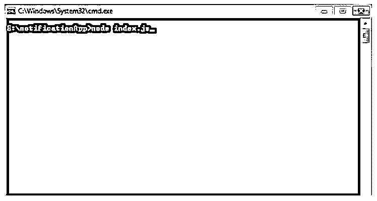
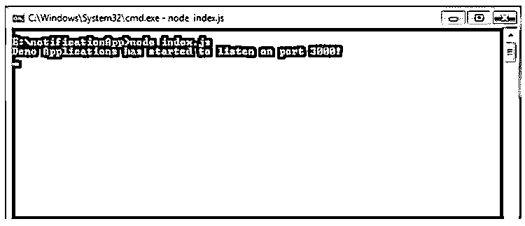
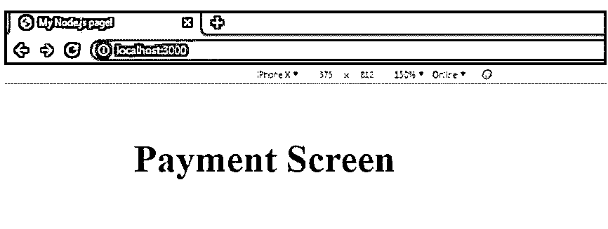

# Node.js setTimeout

> 原文：<https://www.educba.com/node-js-settimeout/>

## Node.js setTimeout 简介

以下文章提供了 Node.js setTimeout 的概要。setTimeout 是一个内置的 Node.js API 函数，它仅在所需的时间周期后执行给定的方法，该时间周期应以毫秒为单位定义，它返回一个超时对象，该对象可在流程中进一步使用。setTimeout 主要用于在延迟几毫秒后执行特定代码块的情况，该时间定义为在执行 setTimeout 方法中定义的回调函数之前等待的最短时间。

### Node.js setTimeout 的语法

下面给出了语法:

<small>网页开发、编程语言、软件测试&其他</small>

1.不带参数的 setTimeout

`setTimeout(delayedFuntion, delayTimeInMS);
functiondelayedFuntion() {
//Write code here
}
setTimeout(function () {
//Write code here
}, delayTimeInMS)`

*   **第一个参数:**应该总是需要延迟执行的函数。动态函数或单独定义的函数在这里都可以很好地工作。
*   **第二个参数:**这是所需的最小延迟时间，应该始终以毫秒为单位定义。

2.使用参数设置超时

`setTimeout(delayedFuntion, delayTimeInMS, param1, param2, .. and so on);
functiondelayedFuntion(param1, param2, .. And so on) {
//Write code here
}
setTimeout(function (param1, param2,..and so on) {
//Write code here
}, delayTimeInMS, param1, param2,..and so on)`

*   **第一个参数:**应该总是需要延迟执行的函数。它是参数化的方法，可以动态定义，也可以单独定义函数。
*   **第二个参数:**这是所需的最小延迟时间，应该始终以毫秒为单位定义。
*   **第三参数:**从第三参数定义的值，以此类推(第四，第五，..)是应该以与在延迟函数(setTimeout 的 1 st 参数)中读取的相同顺序传递的值。这里顺序是最重要的。

3.带有 setTimeout 的 clearTimeout

`vartimeoutObjectValue = setTimeout(function (param1, param2, ..and so on) {
//Write code here
}, delayTimeInMS);
clearTimeout(timeoutObjectValue);`

*   **第一个参数:** clearTimeout 方法只接受一个参数，并且应该始终是从 setTimeout 方法返回的 Timeout 对象。

### Node.js 中 setTimeout 函数是如何工作的？

*   setTimeout 函数在提到的毫秒延迟后执行回调函数，并返回一个超时对象实例，该实例可用于取消超时实例。
*   这类似于浏览器超时，其中 window.timeout 用于在浏览器上设置超时，并以所需的延迟执行方法。非常重要的是要注意，setTimeout 方法中提到的超时没有 NodeJSor JavaScript API 提供的保证，即在这个时间之后函数将被执行，这是最小的延迟时间。
*   setTimeout 方法的另一个有趣的部分是，在一个应用程序中，如果创建了许多这样的超时实例，那么在超时使用结束后取消这些超时是一个好的做法，以防止触发这些实例，并进一步重用同一个对象。

### Node.js setTimeout 示例

让我们考虑一个例子，其中用户正在向购物车添加商品，并被导航到支付屏幕，根据安全合规性策略，要求是一旦用户在支付页面上超过 10 秒，就需要采取一些行动来避免或取消支付过程，因为支付网关将关闭，这意味着我们需要用 delayTimeInMS 将超时设置为 10 秒，并且在回调函数中，可以编写代码来显示警报、刷新或返回主页。

#### 示例#1

使用命令 npm 创建一个简单的 Node.js 应用程序，它提供 index.js 作为可以编写所有 Node.js 代码的入口点。我们将使用 express 节点模块，因此请确保您安装了 express。出于演示目的，我们将在 CMD 控制台上显示输出。

**Index.js**

**代码:**

`var express = require('express');      //Using express node module to create service
var app = express();
app.get('/', function (req, res) {      //Using express app.get method to display details on UI
res.writeHead(200, {"Content-Type": "text/html"});
res.write('<!DOCTYPE html>'+
'<html>'+
' <head>'+
' <meta charset="utf-8" />'+
' <title>My Node.js page!</title>'+
' </head>'+
' <body>'+
' <h1>Payment Screen</h1>'+
' </body>'+
'</html>');
res.end();   //Writing content to html using res.write
vardelayTimeInMS = 10000;  //Defining time in ms
vardelayedFuntion = function () {
//Write Code here
console.log("Payment page exceeded the time limit, please refresh the screen");
}
setTimeout(delayedFuntion, delayTimeInMS);
});
app.listen(3000, function () {
console.log('Demo Applications has started to listen on port 3000!');
});`

#### 实施例 2

要启动应用程序，请在 CMD 中运行命令 node index.js。

#### 实施例 3

由于我们的节点应用程序正在侦听端口 3000，一旦 CMD 说应用程序已经开始侦听端口 300，就打开 chrome 窗口或任何其他浏览器，并使用端口号 3000 在 http 上启动本地应用程序。

#### 实施例 4

在浏览器窗口上，可以呈现 HTML 内容，以显示与支付相关的详细信息或询问支付信息，这些信息稍后将重定向到支付网关。出于演示的目的，我们只是显示简单的 HTML 内容如下。

#### 实施例 5

现在，setTimeout 方法开始执行并计算 delaytimenams(setTimeout 中的第二个参数)中定义的时间。请注意，这是延迟的最小时间，而不是 delayed function(setTimeout 中的 1 st 参数)执行的确切时间。

#### 实施例 6

继续监视控制台，一旦至少过了 10 秒钟，您将会看到 delayedfunction(setTimeout 中的第一个参数)被执行，并且该方法中编写的任何代码都会被执行。例如，我们只是在控制台上打印了几行，但它可以用于更广泛的方面，如刷新内容，导航到主页，提醒用户，显示超时窗口等。

### Node.js setTimeout 的优点

下面是提到的优点:

*   使用 Node.js 框架，代码异步运行，因此有时需要将异步的代码执行保持在 setTimeout 方法中提到的最短时间内。
*   这成为使用 setTimeout 方法的主要优点是 Node.js，以便代码执行、响应延迟、一段时间后处理响应、超时后重定向或重新加载内容等。都可以通过使用 setTimeout 方法来实现。

### 结论

Node.js setTimeout 方法可以在 javascript 代码中的不同位置使用，用户需要在延迟一段时间后执行一些操作。由于 javascript 是单线程的，使用 setTimeout 允许线程运行队列中等待的其他事件，从而提高执行速度。确保在循环中使用 setTimeout 时，有时会很棘手，有时又很容易使用。总的来说，setTimeout 是 Node.js 中非常有用的方法，可以跨应用程序使用，不需要大量代码。

### 推荐文章

这是 Node.js setTimeout 的指南。这里我们讨论 Node.js setTimeout 的介绍，setTimeout 函数如何与编程实例一起工作以及优点。您也可以看看以下文章，了解更多信息–

1.  [节点 js REPL](https://www.educba.com/node-js-repl/)
2.  [Node.js 流程](https://www.educba.com/node-dot-js-process/)
3.  [Nodejs 体系结构](https://www.educba.com/nodejs-architecture/)
4.  [Node.js 子进程](https://www.educba.com/node-js-child-process/)

