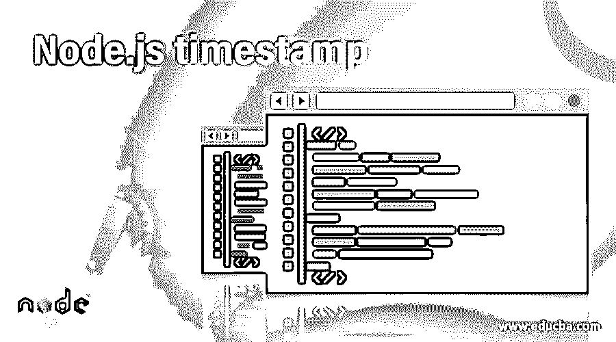
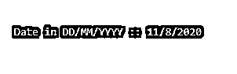
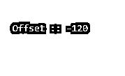

# Node.js 时间戳

> 原文：<https://www.educba.com/node-dot-js-timestamp/>

## Node.js 时间戳简介

时间戳是日期和时间值在整数中的数字转换，类似于以毫秒为单位的时间。在每项技术和每个应用程序中，使用最广泛的功能是 date 对象，它有助于在整个应用程序中检索、共享、保存和更新日期值。在 NodeJS Timestamp 中，日期和时间字段在 JavaScript 框架下，JavaScript 的日期对象在没有任何外部依赖性的情况下使用，并以毫秒为单位返回时间。在这个主题中，我们将学习 Node.js 时间戳。

**语法**

<small>网页开发、编程语言、软件测试&其他</small>

以毫秒为单位获取当前时间戳值

`var dateTimeStamp = Date.now();
console.log(" Current Timestamp :: " + dateTimeStamp);`

**输出:**

### Node.js 中 setTimeout 函数是如何工作的？

在 NodeJS 中，由日期和时间字段组成的时间戳对象由 JavaScript 框架本身提供，不需要在 NodeJS 代码中显式导入。JavaScript 一执行 Date.now()方法，就计算自 1970 年 1 月 1 日以来经过的总毫秒数，因为这是 UNIX 时间戳，并选择系统时区作为默认时区，返回以毫秒为单位的时间戳。据观察，Date.now()与 IE 8 或任何更低版本不兼容，因此您可能创建了一个新的 Date 对象并调用 getTime 方法，而不是调用 Date.now()。JavaScript 时区附带了许多内置方法，这些方法可以在使用 JavaScript 框架的应用程序中使用。处理时间和日期值，并在 UI 字段中利用这些值，存储在数据库中，或者在应用程序中比较时间或日期，是任何应用程序中最常见的用例之一。

### Node.js 时间戳示例

以下是 Node.js 时间戳的示例:

#### 示例# 1–以毫秒为单位获取当前时间戳值

**代码:**

`var dateTimeStamp = Date.now();
console.log(" Current Timestamp :: " + dateTimeStamp);`

**输出:**

#### 示例 2–从指定的时间戳获取时间(以毫秒为单位)

**代码:**

`var dateTimeStamp = Date.now();
var dateObject = new Date(dateTimeStamp);
var timeInMs = dateObject.getTime();
console.log("Date Time in milliseconds :: " + timeInMs);`

**输出:**

#### 示例 3–从指定的时间戳中获取今天的日期值

**代码:**

`var dateTimeStamp = Date.now();
var dateObject = new Date(dateTimeStamp);
var dateFromTS = dateObject.getDate();
console.log("Today's Date Value :: " + dateFromTS);`

**输出–今天的日期值::11**

**注:**日期返回 1-31 的整数**T3】**

#### 示例 4–从指定的时间戳中获取月份值

**代码:**

`var dateTimeStamp = Date.now();
var dateObject = new Date(dateTimeStamp);
var monthFromTS = dateObject.getMonth() + 1;
console.log("Month Value is :: " + monthFromTS);`

**输出-月值为::8**

**注意:** Month 返回 0-11 范围内的整数，其中 0 表示一月，11 表示十二月。确保在显示或使用月值时考虑到这一点。

#### 示例 5–从指定的时间戳中获取 4 位数格式的今天的年份

**代码:**

`var dateTimeStamp = Date.now();
var dateObject = new Date(dateTimeStamp);
var yearFromTS = dateObject.getFullYear();
console.log("Year in 4 digit Value :: " + yearFromTS);`

**输出:**

**注意:**年份值总是以 4 位整数的形式返回

#### 示例 6–以秒为单位获取时间戳

**代码:**

`var timeInMS = Date.now();
var timeInSeconds = Math.floor(timeInMS/1000)
console.log("Timestamp in MS :: " + timeInMS);
console.log("Timestamp in Seconds :: " + timeInSeconds);`

**输出:**

#### 示例# 7–从当前时间戳获取 DD-MM-YYYY 格式的日期

**代码:**

`var dateTimeStamp = Date.now();
var dateObject = new Date(dateTimeStamp);
var yearFromTS = dateObject.getFullYear();
var monthFromTS = dateObject.getMonth() + 1;
var dateFromTS = dateObject.getDate();
console.log("Date in DD/MM/YYYY :: " + dateFromTS + "/" + monthFromTS + "/" + yearFromTS);`

**输出:**

#### 示例 8–从当前时间戳获取 UTC 日期

**代码:**

`var dateTimeStamp = 1597049017329;
var dateObject = new Date(dateTimeStamp);
var utcYearFromTS = dateObject.getUTCFullYear();
var utcMonthFromTS = dateObject.getUTCMonth() + 1;
var utcDateFromTS = dateObject.getUTCDate();
var utcTimeFromTS = dateObject.getUTCHours();
var utcMinutesFromTS = dateObject.getUTCMinutes();
console.log("UTC Date in DD/MM/YYYY HH:MM  " + utcDateFromTS + "/"
+ utcMonthFromTS + "/" + utcYearFromTS + " " + utcTimeFromTS + "hrs : " + utcMinutesFromTS + "minutes");`

**输出:**

#### 示例 9–从指定的时间戳获取时区偏移量

**代码:**

`var dateTimeStamp = Date.now();
var dateObject = new Date(dateTimeStamp);
var timeZoneOffsetValue = dateObject.getTimezoneOffset();
console.log("Offset :: " + timeZoneOffsetValue);`

**输出:**

**注意:**时区中的偏移量是系统时区(本地时区)和 UTC 时区之间的差值，该值以分钟为单位返回

除此之外，JavaScriptDate API 中的日期时间戳对象还提供了更多的方法，如 getDay、getHours、getMilliseconds、getTimezoneOffset 等。

### 优势

每种技术和应用程序都有使用日期和时间值的要求，NodeJS 应用程序也是如此。在 NodeJS 中获取时间戳细节不需要任何额外的导入，或者没有外部依赖性，因为它与 JavaScript 框架包装在一起。它易于使用，因为语法就像一行代码一样简单。比较日期和时间对象就像比较两个整数一样简单。原因是 JavaScript 中的时间戳总是以毫秒格式返回整数。此外，基于 UTC 时区获取时间并获取偏移值也是另一个优点。

### 结论

在本模块的最后，我们讨论了如何从时间戳中获取 NodeJS 中的日期、时间、日、年、月以及更多与时间相关的值。还有 NodeJS 中的时间戳是如何随 JavaScript 框架一起出现并易于使用的。因此，只要继续研究日期时间对象，并成为一名完美的开发人员，围绕日期时间开发任何复杂的逻辑。

### 推荐文章

这是 Node.js 时间戳的指南。这里我们讨论 setTimeout 函数如何在 Node.js 中工作，并给出例子。您也可以看看以下文章，了解更多信息–

1.  [Node.js 缓冲区](https://www.educba.com/node-js-buffers/)
2.  [Node.js 文件系统](https://www.educba.com/node-dot-js-file-system/)
3.  [节点。JS DNS](https://www.educba.com/node-js-dns/)
4.  [如何使用 Node.js](https://www.educba.com/how-to-use-node-js/)

