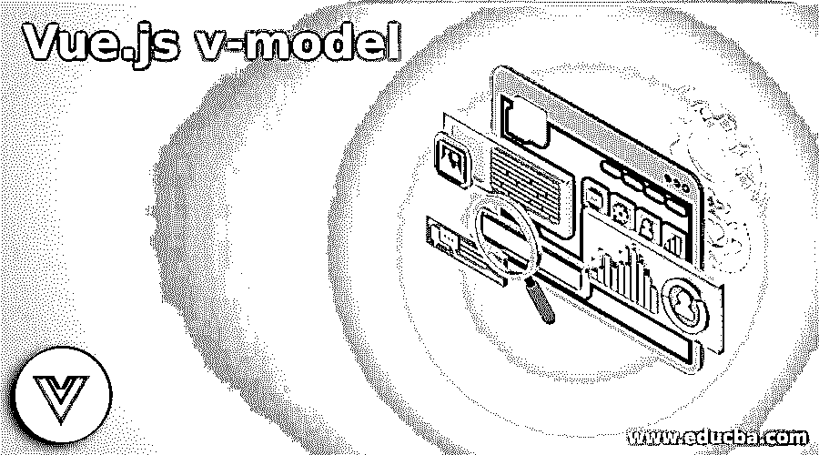
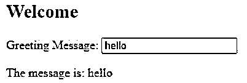
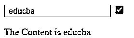
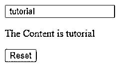
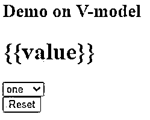
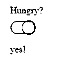

# vue . js v 模型

> 原文：<https://www.educba.com/vue-dot-js-v-model/>

## Vue.js v 模型简介

vue.js 中的 V-model 被定义为通过与 Vue.js 捆绑来进行双向绑定过程，以加快 web 应用程序的开发。该 v-model 指令有助于将值绑定到组件数据，并且每当用户按下某个键或粘贴选项时都会触发事件。通过这种方式，可以修改 DOM，而不需要使 DOM 显式地工作，也有助于将数据绑定到表单字段。在自定义组件下使用这种 v-model 有助于控制统一数据的更新。

**语法:**

<small>网页开发、编程语言、软件测试&其他</small>

v-model 可以像 HTML 元素一样给出:

`<input v-model =” yahoo”>`

要翻译它，请使用:

`<input: value="yahoo" @input=" x => yahoo = x. target. Value" />`

### v-model 在 Vue.js 中是如何工作的？

v-model 指令可以拾取更改，并将更改后的值存储在组件的数据属性中。当值被发送回父对象时，v-model 对该值具有完全控制权。它们正式地与用户输入相加，以处理用户输入。因此，组件的作业因此存储用户输入的相同值。

v-model 也带有修改选项。修剪，。数字和。懒。

#### 1..整齐

它用于删除空白。

`<template>
<input v-model.trim="place" placeholder="place"/>
</template>`

#### 2..数字

它将 number 作为输入字段中的值。

`<template>
<input v-model.number=" dob" placeholder="dob"/>
</template>`

#### 3..懒惰的

它有助于在默认情况下更新，而按键。

`<template>
<input v-model.lazy="name" placeholder="name"/>
</template>`

### v 型工作流程

第一种方法是在 Vue 创建一个本地州，就像这样。

`Data ()
{
Return  {
Yahoo: ‘ ’
}
}`

下一步是绑定输入。

`<input
type="yahoo"
:value="yahoo"
@input="action"
/>`

Vue 使上面的代码看起来很简单。

`<input  type =”yahoo” v-model =”yahoo”/ >`

### Vue.js v-model 示例

让我们看几个关于 Vue 和 v-model 指令的例子。在下面所有的例子中，我们都采用了<input>元素来显示网页上的文本条目。

#### 示例#1

**代码:**

`<html>
<head>
<title>Hello </title>

</head>
<body>

<h2>Welcome</h2>

Greeting Message:
<input type="text" v-model="message"></input>

The message is: {{ message }}

</body>
</html>`

**。js**

`import Vue from 'vue'
import App from './App.vue'
new Vue({
el: "#app",
data: {
message: "hi"
}
});`

**说明:**

*   在上面的代码中，我们使用了

    标签来获取文本消息的值。

*   我们将 v-model 指令用于<input>标签，绑定消息并将信号发送到. js 文件，以建立与属性字段 message:“hello”的双向绑定。因此，无论我们输入什么，它都会在底层数据模型中得到更新，并在视图中得到更新。

**输出:**

#### 实施例 2

**代码:**

**。html**

`
<template id="custom-select">

<select class="form-control" @change="change">
<option value="">Choose</option>
<option v-for="(option, index) in options"
:key="index" :value="option.code"
:selected="selectedOption(option)">
{{ option.name }}
</option>
</select>

</template>

America
<custom-select v-model="flight.America.country" :options="options">
</custom-select>
 
Europe
<custom-select v-model="flight.Europe.country" :options="options">
</custom-select>
 
 

<b>Select American country:</b>

{{ flight.America.country.name }}

 

<b>Select European country:</b>

{{ flight.Europe.country.name }}

`

**。js**

`Vue.component('custom-select', {
props: ['options', 'value'],
template: '#custom-select',
data() {
return {
selected: null
}
},
methods: {
selectedOption(option) {
if (this.value) {
return option.code === this.value.code;
}
return false;
},
change(e) {
const selectedCode = e.target.value;
const option = this.options.find((option) => {
return selectedCode === option.code;
});
this.$emit("input", option);
}
}
})
new Vue({
el: '#app',
data() {
return {
flight: {
America: {
date: "01/03/2019",
country: {
name: "Florida",
code: "FL"
}
},
Europe: {
date: "06/05/2020",
country: {
name: "Norway",
code: "NE"
}
}
},
options: [{
name: "Florida",
code: "FL",
},
{
name: "Washington",
code: "US"
},
{
name: "Sweden",
code: "DE"
},
{
name: "India",
code: "IN"
}
] }
}
})`

**。css** **。js**

`.title {
display: inline-block;
min-width: 90px;
padding: 4px 0;
}`

**解说:** 

*   上面的代码使用复选框选项来选择国家。

**输出:**

#### 实施例 3

用户输入和数据绑定–文本和复选框。

**代码:**

**。html**

`

<input type="text" v-model="educba" />
<input type="checkbox" v-model="isTrue" />

The Content is {{educba}}

`

**。js**

`const app= new Vue({
el: "#app",
data: {
educba : " ",
isTrue :true ,
resou: "Hello"
},
});`

**说明:**

*   HTML 标记表单中的复选框允许用户从一组给定的下拉多选项中选择选项作为输入。在这个 v-model 中，它会根据给定的输入类型自动选择更新条目的方法。

**输出:**

#### 实施例 4

用户通过按钮 onclick 输入。

**代码:**

**index.html**

`

<input type="text" v-model="tutorial" />

The Content is {{tutorial}}

<button v-on:click="value = false">
Reset
</button>

`

**。js**

`const app= new Vue({
el: "#app",
data: {
tutorial : " ",
resou: "Hello"
},
});`

**说明:**

*   在上面的代码片段中，当用户在文本区域键入输入时，vue 会反映 div 元素的变化，同时，我们可以通过提交 Reset 按钮来更新值。

**输出:**

#### 实施例 5

使用下拉菜单。

**代码:**

**。html**

`

<h2>
Demo on V-model </h2>
<h1>{{value}}</h1>

<select v-model="value">
<option value="one">one</option>
<option value="two">Two</option>
<option value="three">three</option>
</select>

<button v-on:click="value = 'Two'">
Reset
</button>

`

**。js**

`const app= new Vue({
data: () => ({ value: false })
})`

**输出:**

#### 实施例 6

**代码:**

`<template>

<input type="checkbox" class="slider-checkbox" :checked="value" @click="handleClick" />

</template>

`

**说明:**

*   上面的代码解释了 Vue 组件的样式部分。这里的 checkbox 是我们的标记，它们的值被设置为名称，同时一个侦听器处理 click 方法。
*   我们已经创建了一个 Vue 新组件，并将它们的状态设置为 Boolean。

**输出:**

### 结论

最后，我们看到了如何在 Vue.js 中使用 v-model 及其组件，并发现了如何管理数据。我们还看到了构建应用程序开发的双向绑定的基础。

### 推荐文章

这是一个关于 Vue.js v-model 的指南。这里我们讨论一下入门，v-model 在 Vue.js 中是如何工作的？v-model 工作流程及实例。您也可以看看以下文章，了解更多信息–

1.  [JavaScript z-index](https://www.educba.com/javascript-z-index/)
2.  [JavaScript onfocus](https://www.educba.com/javascript-onfocus/)
3.  [JavaScript exec()](https://www.educba.com/javascript-exec/)
4.  [JavaScript 自调用函数](https://www.educba.com/javascript-self-invoking-functions/)

