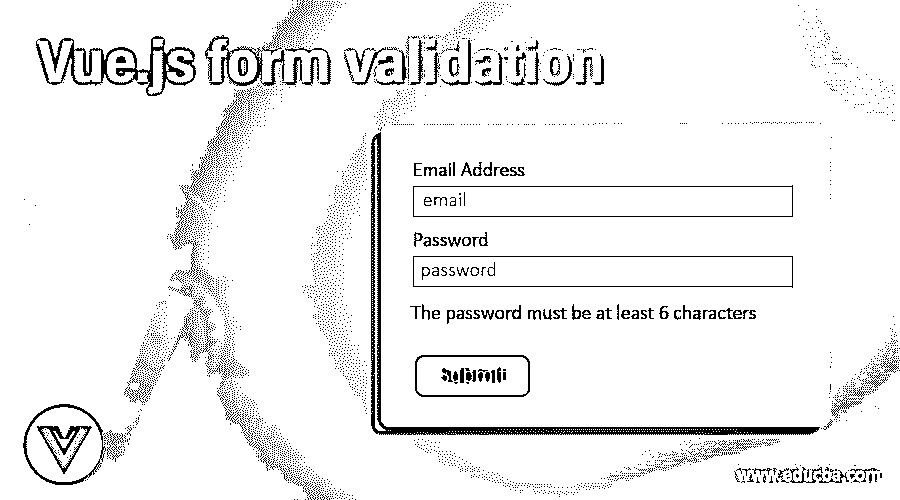
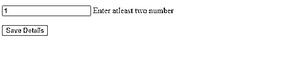
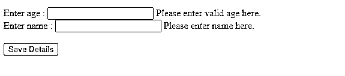

# vue . js 表单验证

> 原文：<https://www.educba.com/vue-dot-js-form-validation/>

## Vue.js 表单验证简介

表单验证用于验证任何前端框架中的 web 表单。通过使用表单验证，我们可以验证用户输入的表单字段是否正确。如果字段中的值不正确，这也允许我们显示用户低估的错误消息。此外，这种形式的验证也称为前端验证或客户端验证。我们经常在 web 表单中使用模板驱动的验证来验证数据。在本主题中，我们将了解 Vue.js 表单验证。

**语法**

<small>网页开发、编程语言、软件测试&其他</small>

为了使用表单验证，我们需要在表单标签(

<form>)中编写我们所有的输入字段；之后，只有我们可以使用它的功能来验证我们的数据。让我们看看语法和一个练习例子来更好地理解它，见下文；</form>

`<html>
<body>
<form>
<!-- all the input fields will go here-->
</form>
</body>
</html>`

此外，我们需要使用 script 标记来创建 Vue.js 实例，该实例可用于 form。下面是使用脚本标签创建 Vue.js 实例的语法。

``

### Vue.js 中的表单验证是如何工作的？

到目前为止，我们知道我们需要一个 Vue.js 实例来处理表单验证。我们可以通过使用 script 标记来实现这一点，我们需要使用' # '将表单名称作为 id。此外，我们需要根据名称映射这个脚本标记中的所有输入字段，以便对它们进行验证。我们将通过查看每种语法来详细了解如何使用它。

让我们看一步一步配置使用 Vue.js 中的表单验证见下文；

1.在我们的 HTML 文件中，我们需要在所有输入字段之前使用

<form>标签；此外，我们将为每个输入文件分配一个名称。我们可以通过使用 Vue.js 中可用的属性之一来实现这一点，即 v-model。在下面的示例中，我们在输入类型字段上使用了表单标签和 v-model，并将它们分配给名称“student name”；为了使用这个字段，我们还可以按照这个语法定义更多的字段。</form>

**举例:**

`<form>

<input type="text" id="studentName" name="studentName" v-model="studentName" />

</form>`

2.现在，我们将创建 Vue.js 实例来访问脚本标记中的字段。这个标签将出现在 html 文件的标签中。为了更好地理解，让我们看一个例子:

``

为了使用这里的文件，我们将使用下面的数据对象。

``

在上面的语法中，我们创建数据对象，在这个对象中，我们通过它们的名称访问字段。此外，我们给我们的表单命名为“demoForm”。

3.在 Vue.js 中，我们有一个规则的属性，可以将规则应用于字段。所以我们可以在田地里使用它们。为了使用它，我们使用“rules”关键字。有了属性，我们可以传递我们的模式、正则表达式等等。但是他的属性是验证提供者的一部分。我们也可以在同一文件上同时应用多个规则，方法是使用“|”管道运算符来分隔每个规则。

**举例:**

`rules ="max:10 | min:2 | required"`

4.在 Vue.js 中，我们还有两个身份验证提供者和验证观察者。首先，我们用 validation-observer 绑定整个表单，所有字段都将在验证提供程序中绑定。

`<validation-observer>
<form>
<validation-provider rules="your_rule_here">
</validation-provider>
</form>
</validation-observer>`

在 Vue 中使用表单验证时要记住的几点:

*   我们需要 Vue 实例来访问 HTML 文件的字段。
*   我们还需要提供一个应该是唯一的字段名称。这可以通过在 Vue 表单验证中使用 v-model 来完成。
*   我们还可以在单个字段中应用多个验证。最后，我们还可以显示错误消息。
*   这种表单验证用于验证用户数据，也称为客户端验证。
*   使用

### Vue.js 表单验证示例

以下是 Vue.js 表单验证的示例:

#### 示例#1

在本例中，我们创建了两个文件；一个是 HTML 文件，使用 Vue.js 属性对字段进行所有验证。第二个文件是。JS 文件，它包含 Vue 实例和处理事件，比如按钮的提交和其他继续处理的逻辑。

**HTML 文件:**

`

<pre>{{$demo | json}}</pre>
<validator name="demo">
<form v-on:submit.prevent="submitForm" novalidate>
<input type="number" v-model="value" v-validate:value="{min:2}"/>
 Enter atleast two number
   
<button type="submit">Save Details</button>
</form>
</validator>

`

**。JS 文件:**

`new Vue({
el: "#demoapp",
data: {
value: ''
},
methods: {
submitForm: function() {
this.$validate(true);
if (this.demo.valid) {
console.log("validate true ..")
}
},
}
});`

**输出:**

#### 实施例 2

在本例中，我们通过提供年龄和姓名来验证学生表单。使用不同的规则，如最小值、最大值和必需值。

**HTML 文件:**

`

<pre>{{$demo | json}}</pre>
<validator name="demo">
<form v-on:submit.prevent="submitForm" novalidate>
<label>Enter age :</label>
<input type="number" v-model="value" v-validate:value="{min:2}"/>
 Please enter valid age here.
 
<label>Enter name :</label>
<input type="text" v-model="name" v-validate:name="{min:1}"/>
 Please enter name here.
   
<button type="submit">Save Details</button>
</form>
</validator>

`

**JS 文件:**

`new Vue({
el: "#demoapp",
data: {
value: '',
name : ''
},
methods: {
submitForm: function() {
this.$validate(true);
if (this.demo.valid) {
console.log("validate true ..")
}
},
}
});`

**输出:**

### 结论

通过使用表单验证，我们可以在前端验证用户数据。Vue.js 为我们提供了许多函数和属性来验证我们的数据。我们只在表单级别使用模板驱动的验证方法。这种客户端验证使我们的数据正确，并防止我们在代码中出现许多错误。

### 推荐文章

这是一个 Vue.js 表单验证的指南。在这里，我们将讨论表单验证在 Vue.js 中是如何工作的，以及输出的例子。您也可以看看以下文章，了解更多信息–

1.  [在 PHP 中验证](https://www.educba.com/validation-in-php/)
2.  [HTML 重置按钮](https://www.educba.com/html-reset-button/)
3.  [HTML 表单验证](https://www.educba.com/html-form-validation/)
4.  [JSF 验证](https://www.educba.com/jsf-validation/)

