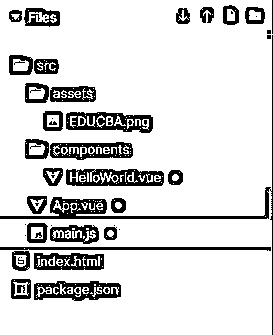
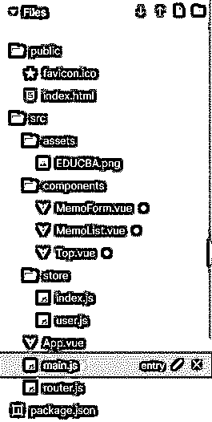
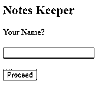
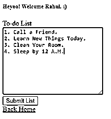
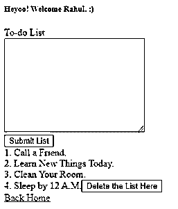

# vista . js spa

> 原文：<https://www.educba.com/vue-dot-js-spa/>

> 
> 
> 

## Vue.js 单页应用程序(SPA)简介

如今，单页应用程序变得非常普遍。前端框架有不同的工具和样板，涵盖了项目，它们大多是单页应用程序。Vue.js SPA 也是一个支持单页面应用程序的框架。每次我们添加功能和页面，SPA 都会变得更加庞大，管理起来也非常复杂。应用程序的加载时间也会增加，甚至浏览器解析 JavaScript 的时间也会增加。在 Vue.js 中，有不同的技巧可以帮助这些场景提高性能，Vue.js 是构建单页面应用程序的一个很好的框架。

**语法**

`import singleSpaVue from 'single-spa-vuejs'
const vueLifecycles = singleSpaVue({
Vue,
appOptions: {
el: `#app`,
data () {
return { content: 'heyoo single SPA' }
},
render: h => h('div', this.content)
}
})`

<small>网页开发、编程语言、软件测试&其他</small>

### Vue.js SPA 的工作

当我们使用 Vue.js 制作单页应用程序时，我们需要处理代码的性能。我们的 Vue.js 块中的复杂逻辑会导致额外组件的重新呈现，这会直接影响性能。因此，我们需要隔离应用程序中降低整个代码速度的区域。

为了提高性能，我们还应该避免使用任何不是基于位置、旋转、缩放或不透明度的动画或过渡。

### Vue.js SPA 示例

下面提到了不同的例子:

#### 示例 1–使用 Vue.js 的基本 SPA

在下面的示例中，构建了一个基本的单页应用程序，其中包含 EduCBA 网站的链接。

用于实现以下代码的文件:

**【我】EDUCBA.png**

**【ii】hello world . vista**

`<template>

<h1>{{ msg }}</h1>
<h2>Important Links</h2>
<google-ad
id="div-gpt-ad-1500260348414-0"
unit="udn.com/News/SuperBanner"
></google-ad>
<ul>
<li>
<a href="https://www.educba.com/" target="_blank"> Our Website </a>
</li>
<li><a href="https://www.educba.com/tutorials/?source=menu" target="_blank"> Free Tutorials </a></li>
<li>
<a href="https://www.educba.com/courses/?source=menu" target="_blank"> Certification Courses </a>
</li>
</ul>

</template>

`

**【iii】app . vista**

`<template>

<HelloWorld/>

</template>

`

**【iv】main . js**

`import Vue from "vue";
import App from "./App";
import DoubleClick from "vue-doubleclick";
Vue.config.productionTip = false;
let mappings = {
banner: [
{
window: [1001, 150],
sizes: [[969, 89], [1201, 111], [729, 91], [971, 251]] },
{
window: [0, 0] , sizes: [] }
] };
let sizes = {
banner: [[969, 89], [971, 251], [1201, 111], [729, 91]] };
Vue.use(DoubleClick, {
id: "129853887",
mappings,
sizes
});
new Vue({
el: "#app",
components: { App },
template: "<App/>"
});`

**输出:**

#### 示例 2–使用 Vue.js SPA 的 Notes Keeper 应用程序

在下面的例子中，我们开发了一个单页应用程序(SPA ),即使用 Vue.js 的笔记管理应用程序。如果未输入姓名，将显示“输入您的姓名以继续”文本。输入姓名后，单击继续按钮。然后，会出现一个待办事项窗口，用户可以在其中输入自己的待办事项，并在屏幕上打印待办事项列表。要删除整个列表，可以按“删除此处的列表”按钮。要返回主页，可以单击“返回主页”链接。

用于实现以下代码的文件:

**【我】EDUCBA.png**

**【ii】备忘录形式。视图**

`<template>

<h5>Heyoo! Welcome {{ name }}. :)</h5>
<form @submit.prevent="postMemo">
<label for="memo">To-do List</label>

<textarea id="memo" cols="30" rows="10" v-model="memo.text"></textarea>

Invalid Input

<button type="submit">Submit List</button>

</form>
<MemoList :items="this.memoList" @delete="deleteMemo"/>
<RouterLink to="/">Back Home</RouterLink>

</template>
`

**【iii】备忘录。视图**

`<template>

{{ item.text }}
<button @click="emitDelete(item.id)">Delete the List Here</button>

</template>

`

**【iv】top . view**

`<template>

<h2>Notes Keeper</h2>
<form @submit.prevent="login">
<label for="name">Your Name?</label>

<h1></h1>
<input type="text" id="name" v-model="nameForm.name">

Enter your name to proceed.

<h1></h1>
<button type="submit">Proceed</button>

</form>

</template>
`

**【v】index . js**

`import Vue from "vue";
import Vuex from "vuex";
import user from "./user";
Vue.use(Vuex);
const store = new Vuex.Store({
modules: {
user
}
});
export default store;`

**【VI】user . js**

`const state = {
name: null
};
const getters = {
name: state => (state.name ? state.name : "")
};
const mutations = {
setName(state, name) {
state.name = name;
}
};
const actions = {
login(context, name) {
context.commit("setName", name);
}
};
export default {
state,
getters,
mutations,
actions
};`

**【VII】app . view**

`<template>
<main>
<router-view></router-view>
</main>
</template>`

**【VIII】main . js**

`import Vue from "vue";
import router from "./router";
import store from "./store";
import App from "./App.vue";
new Vue({
el: "#app",
router,
store,
components: { App },
template: "<App/>"
});`

【t0[IX]路由器. js】的缩写

`import Vue from "vue";
import VueRouter from "vue-router";
import Top from "./components/Top";
import MemoForm from "./components/MemoForm";
import store from "./store";
Vue.use(VueRouter);
const routes = [
{
path: "/",
component: Top
},
{
path: "/memo",
component: MemoForm,
beforeEnter(to, from, next) {
if (store.getters["name"] === "") {
next("/");
} else {
next();
}
}
}
];
const router = new VueRouter({
mode: "history",
routes
});
export default router;`

**输出:**

### 结论

在上述文章的基础上，我们了解了如何在 Vue.js 中制作单页应用程序。我们了解了 Vue.js SPA 的概念，并了解了如何增强 SPA 的性能。这些例子将有助于我们根据不同的情况理解集对分析的应用。

### 推荐文章

这是 Vue.js SPA 的指南。在这里，我们讨论 Vue.js SPA 的概念和工作方式，以及输出的示例。您也可以看看以下文章，了解更多信息–

1.  [JSP 错误页面](https://www.educba.com/jsp-error-page/)
2.  [JavaScript 随机](https://www.educba.com/javascript-random/)
3.  [JavaScript test()](https://www.educba.com/javascript-test/)
4.  [Java 中的 JSP](https://www.educba.com/jsp-in-java/)

