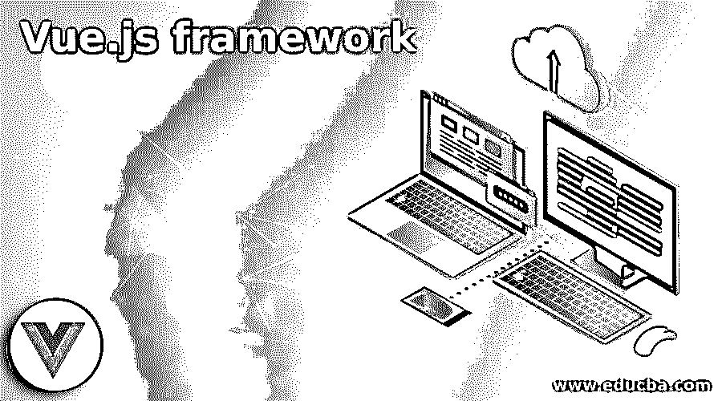

# Vue.js 框架

> 原文：<https://www.educba.com/vue-js-framework/>

## Vue.js 框架简介

Vue.js framework 是一个非常好的面向功能的框架，用于以增量方式从头开始制作用户界面。Vue.js 框架为用户提供了使用其中预定义的增强功能的能力，从而为使用需要与当前视图集成的各种形式的标准库提供了帮助。此外，vue.js 框架在开发独立的单页面应用程序时非常兼容和灵活。它提供了一个结合和选择现代工具集的推动力，这些工具集与所需的预定义标准库完美融合。

### 不同的 Vue.js 框架

基本上，Vue.js 框架可以分为以下几个类别，每个类别都有一个综合的框架列表:

<small>网页开发、编程语言、软件测试&其他</small>

#### 1.组件集合

此类别表示包括一组组件的框架，没有布局系统，由以下工具和组件组成。

*   vue-admin: 这是一个用于创建任何管理面板的框架，由 Vue 2.0 和布尔玛 3.0 组成。
*   **keen-ui:** 是一种组件集合框架，用于使用 vue 编写 ui 组件，有时会挑起素材设计。
*   vue-mdc: 这个框架主要用于获取基于 Vue.js 的 web 组件。
*   所有必要的和不可避免的标准库和组件都在带有所有 vue 风格的 UI 套件中。
*   **wffranco/vue-strap:** 该框架由 Bootstrap 3 组件和 vue 版本 2(即 Vue 2)组成。
*   Uiv: 它包括与 Vue 2 的实现相结合的 Bootstrap 3 组件。

#### 2.移动的

该类别负责使用以下现代工具和组件设计与移动设备相关的用户界面框架。

*   vue-onsenui: 该框架组件是用于移动应用开发的通用框架之一。它由软件开发小子(Software development kid)组成，包含 HTML 5 和 JavaScript，用于制作和构建带有 Angular 1，2，React 和 Vue.js 绑定的漂亮 UI。
*   **Weex:** Weex 框架可以在开发时执行或充当一个通用的 API 来显示跨平台的网站。
*   **Framework7-Vue:** 这个框架非常有助于使用 Framework7 和 Vue 为 iOS 和 Android 设备构建功能齐全的特色应用。
*   **vux:** 它是一个使用一个中文组件命名 WeUI 的框架，用来开发 Vue UI。
*   weex-eros: 这个框架包含了一个 API，用于开发基于这些 API 的解决方案，从而实现简单、轻松的 web 开发。
*   **mint-ui:** 它是框架的一部分，作为 Vue.js 的移动 ui 元素。
*   **Mand-mobile:** 是一款基于 Vue.js 2 的移动 UI 工具包，用于设计基本的金融、银行相关场景。

#### 3.管理模板

该类别代表管理模板的一组组件和框架。

*   vue-element-admin:vue-element admin 是框架的一个组件，其中 vue admin 基于与 UI 2.x 相关的元素，这意味着与版本 2 相关的任何变体。
*   **element Vue Admin:** 它也有点像 vue-element admin，不同之处在于这个模板使用了基于 UI 2.x 变体的管理门户模板。
*   **iView Vue Admin:** 是基于 iview 2.x 的模板，涉及到使用 iview admin 定制整个门户模板。
*   **rest-admin:** Rest admin 是一个管理面板，涉及 Vue 和用于在 Vue 上定制的 Bootstrap 4。
*   **Shards Dashboard Lite Vue:** 这是管理模板中引入的一个有趣特性，因为它支持许多自定义组件和模板。

#### 4.静态网站生成器

这个类别代表了用于生成单页网站的 vue 框架。

*   Gridsome: 它用于构建灵活快速的网站，带有现代风格的 Vue.js。
*   **徐伟贤:**使用框架不太方便，但仍然作为一个静态的网站模板生成器，以一种无人维护的形式提供给人们阅读。
*   VuePress: 它是一个静态站点生成器，进一步用于创建和生成面向最小 Vue 的网站。

#### 5.服务器端渲染

顾名思义，这个类别代表了一个用于维护服务器端操作的 vue 框架。

*   **Universal vue:**Vue Universal 是一个很好的服务器端渲染框架，它使用 Vue CLI 插件来轻松创建面向通用 Vue 的应用程序。
*   **Ream:** 该框架用于创建和构建服务器渲染，并以最少的方式利用 vue。
*   js: 一个灵活多样的服务器端渲染框架。

#### 6.应答的

这一类别包括一些组件和布局系统，它们必须以某种方式做出响应。

该类别包括以下一组 Vue 框架:

*   Vue-material:Vue material kit 是一个合适的框架，可以提高构建任何网站的速度，只需要对 JavaScript、Vuejs 和 Vue Router 有最基本的了解。总的来说，这个包包含了一些简单易懂的库来增强网页。
*   quasar-framework: 这个框架用于创建和构建响应式网站，包括混合移动应用程序，如 Android 和 IOS，使用与 Vue.js 2 相同的代码。
*   **vuetify:** vuetify 是响应式框架之一，用于为 Vue.js 2 创建一个物质组件框架。
*   这包括与布尔玛框架相关的框架。
*   **element-ui:** 一个 Vue.js 2.0 ui 工具包正被用于在响应式类别中创建这个基于元素的 UI。
*   **muse-ui:** 也是 Vue.js 2 的素材组件库。
*   iview-ui: 广泛支持 Vue.js 2.0 for the 的框架。

#### 7.多方面的

此类别代表组件的各种不同用途的 vue 框架，分类如下。

*   **CabloyJS:** 它是最理想、最灵活的用于开发网站的 Node JS，是最首选的框架，因为它支持 Node Js 全栈开发，进一步涉及基于 EggJs、KaoJs、VueJs 和 Framework 7 的平台。
*   **Basys:** Basys 是一个完整的框架，用于构建全栈 vue.js 应用，涉及一个工具箱。
*   **Vue-Access-Control:** 它是一个面向前端的框架，用于对组件进行访问控制。
*   app-framework: 这是一个免费的开源框架，用于构建包含 HTML 和 JavaScript 的 IOS 和 android 应用。
*   **Myfirebase:** 是一个兼容 google firebase 的框架，基本上是用来创建单页面质量的应用框架。

### 结论

Vue.js 框架是一个框架，它包含了许多支持构建和创建增强型网站的其他框架。这些工具和框架用于根据用户或网站开发者的需求构建响应性 UI，以及用于全栈开发的基本 Js。所有的节点 Js 和前端开发都勉强使用 Vue.js。

### 推荐文章

这是 Vue.js 框架的指南。这里我们将分别讨论不同 Vue.js 框架的介绍。您也可以看看以下文章，了解更多信息–

1.  [JavaScript onkeyup](https://www.educba.com/javascript-onkeyup/)
2.  [JavaScript 随机](https://www.educba.com/javascript-random/)
3.  [JavaScript 复制数组](https://www.educba.com/javascript-copy-array/)
4.  [JavaScript 鼠标按下](https://www.educba.com/javascript-mousedown/)

