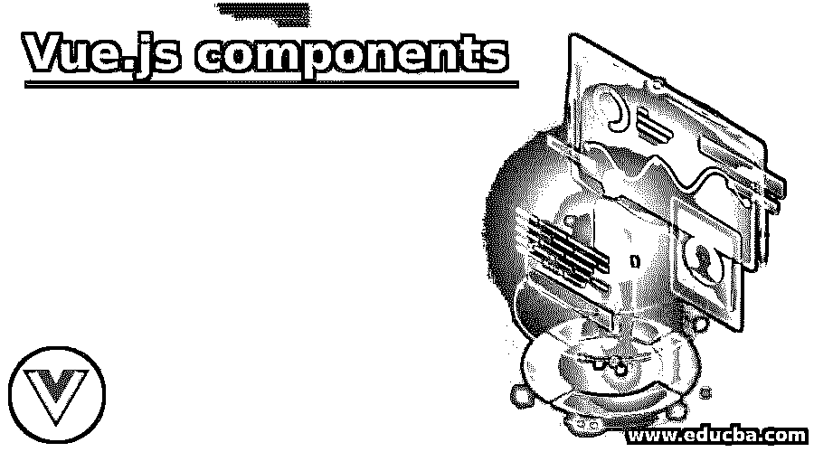
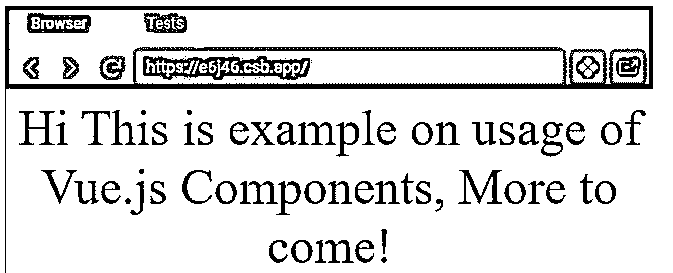
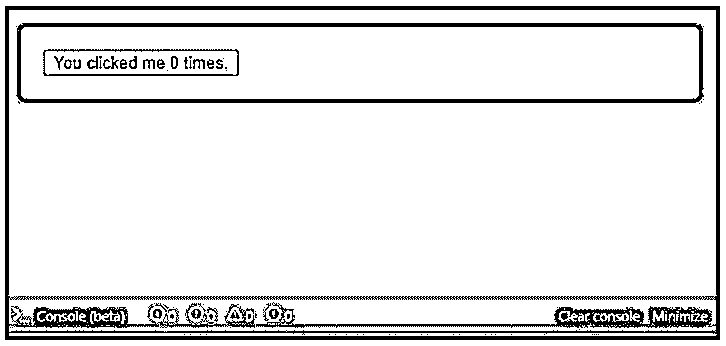
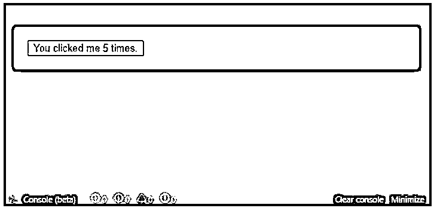
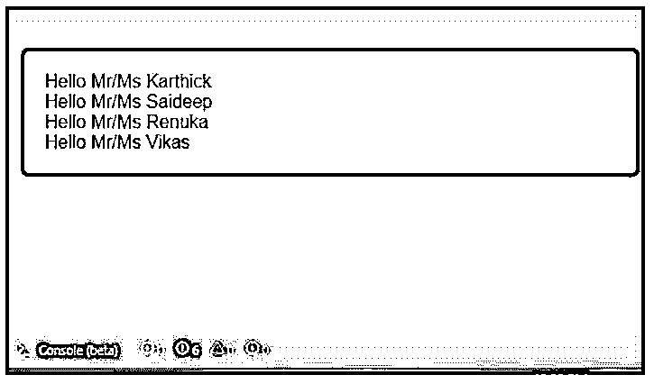
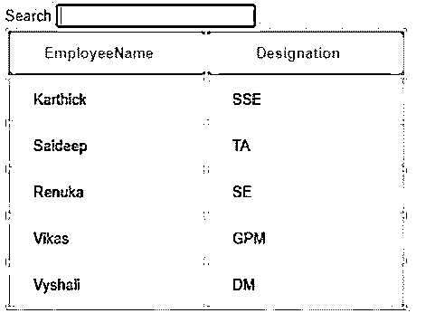
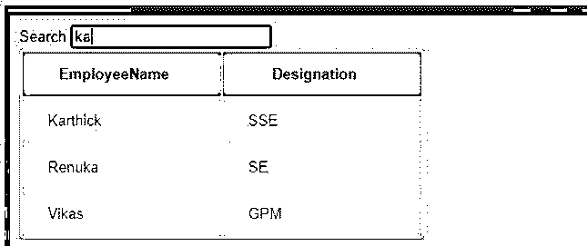

# Vue.js 组件

> 原文：<https://www.educba.com/vue-js-components/>

## Vue.js 组件简介

Vue.js 组件用于抽象，这允许构建由小的可重用组件组成的大规模应用程序。Vue.js 中的组件有助于扩展基本的 HTML 元素来封装可重用的代码。在某些情况下，组件也可能显示为用“is”属性扩展的本机 HTML 元素。覆盖所有关键词，Vue 组件是一个可重用的、自包含的 UI 逻辑块；因此 Vue.js 也被称为“组件框架”。这是一种结构化的前端开发方式，不会破坏最终用户的 UI 开发体验和观感。

**语法:**

<small>网页开发、编程语言、软件测试&其他</small>

首先，我们需要创建一个组件构造函数。

`vue.extend( );
var sample_component = Vue.extend({
//component options
} );`

为了使用上面创建的构造函数作为组件，我们需要用标签 sample_component 全局注册组件。

`vue.component(tag, constructor):`

在没有创建构造函数的情况下，上面的行将如下所示:

`vue.component(‘sample_component’, MyComponent);`

一旦构造函数注册为组件，现在就可以在父实例中作为自定义元素使用“sample_component”。这些组件应该在根 Vue 实例化之前注册。

### Vue.js 组件示例

下面提到了不同的例子:

#### 示例#1

**代码:**

`import Vue from "vue";
import App from "./Hello";
Vue.config.productionTip = false;
new Vue({
el: "#app",
template: "<App/>",
components: { App }
});`

**在。vue 文件:**

`<template>

{{ text }}, More to come!

</template>

`

**输出:**

#### 实施例 2

计数器

**代码:**

js 文件中的**:**

`Vue.component('counter', {
data: function () {
return {
count: 0
}
},
template: '<button v-on:click="count++">You clicked me {{ count }} times.</button>'
})
new Vue({ el: '#counter-demo' })`

HTML 文件中的**:**

`

<counter></counter>

`

CSS 文件中的**:**

`body {
background: #20262E;
padding: 18px;
font-family: Helvetica;
}
#counter-demo {
background: #fff;
border-radius: 5px;
padding: 18px;
transition: all 0.2s;
}`

**输出:**

**点击:**

#### 实施例 3

重用组件

**代码:**

js 文件中的**:**

`Vue.component('employee_name', {
props: ['name'],
template: '
Hello Mr/Ms {{ name }}
'
})
new Vue({
el: "#app"
})`

HTML 文件中的**:**

`

<employee_name name="Karthick"></employee_name>
<employee_name name="Saideep"></employee_name>
<employee_name name="Renuka"></employee_name>
<employee_name name="Vikas"></employee_name>

`

CSS 文件中的**:**

`body {
background: #20262E;
padding: 18px;
font-family: Helvetica;
}
#app {
background: #fff;
border-radius: 5px;
padding: 18px;
transition: all 0.2s;
}`

**输出:**

#### 实施例 4

Vue.js 中的复杂网格组件

**代码:**

`<!DOCTYPE html>
<html>
<head>
<title>Grid Component in Vue.js</title>

<link rel="stylesheet" type="text/css" href="https://cdn.educba.com/style.css" />

</head>
<body>
<!-- root element -->

<form id="search">
Search <input name="query" v-model="searchQuery" />
</form>
<demo-grid
:heroes="gridData"
:columns="gridColumns"
:filter-key="searchQuery"
>
</demo-grid>

</body>
</html>`

**在 style.css 中:**

`body {
font-family: Arial, sans-serif;
font-size: 13px;
color: rgb(44, 43, 43);
}
table {
border: 1px dotted #4beea5;
border-radius: 2px;
background-color: rgb(228, 212, 212);
}
th {
background-color: #81b855;
color: rgba(37, 25, 25, 0.66);
cursor: pointer;
-webkit-user-select: none;
-moz-user-select: none;
-ms-user-select: none;
user-select: none;
}
td {
background-color: #d8a1a1;
}
th,
td {
min-width: 130px;
padding: 12px 22px;
}
th.active {
color: rgb(243, 235, 235);
}
th.active .arrow {
opacity: 2;
}
.arrow {
display: inline-block;
vertical-align: middle;
width: 1;
height: 1;
margin-left: 4px;
opacity: 0.68;
}
.arrow.asc {
border-left: 3px solid transparent;
border-right: 3px solid transparent;
border-bottom: 3px solid rgb(221, 214, 214);
}
.arrow.dsc {
border-left: 3px solid transparent;
border-right: 3px solid transparent;
border-top: 3px solid rgb(255, 240, 240);
}`

**输出:**

**我们可以过滤员工姓名:**

有了上面所有的例子，让我们看看组件上的构建块。

*   “el”用于使用新 Vue( {})初始化的根组件，它标识 DOM 元素组件将挂载到其上。
*   “props”将列出所有可以传递给子组件的属性。
*   “模板”，用于设置组件模板，该模板定义组件生成的输出。
*   该组件还接受一些其他属性，如“数据”、组件的本地状态、“方法”、“计算”、与组件关联的属性以及“观察”。

### 结论

至此，我们将结束我们的主题“Vue.js 组件”。我们已经看到了什么是 Vue.js 组件，并举例说明了一些示例，以便让您更好地理解。这里还显示了如何创建和注册构造函数作为 Vue 组件的语法。最后，我们看到了有助于我们构建 Vue 组件的构建模块。

### 推荐文章

这是 Vue.js 组件的指南。这里我们分别讨论 Vue.js 组件的介绍和例子。您也可以看看以下文章，了解更多信息–

1.  [JavaScript onkeyup](https://www.educba.com/javascript-onkeyup/)
2.  [JavaScript onfocus](https://www.educba.com/javascript-onfocus/)
3.  [JavaScript encodeURI()](https://www.educba.com/javascript-encodeuri/)
4.  [JavaScript exec()](https://www.educba.com/javascript-exec/)

