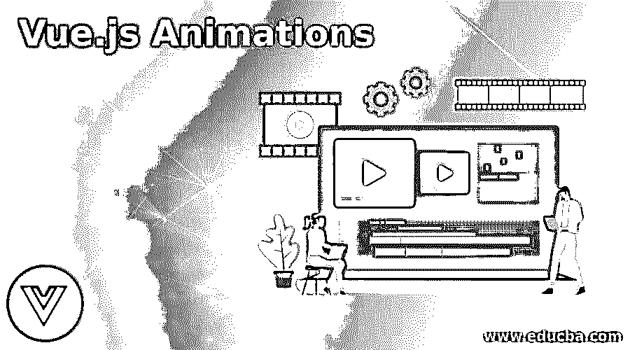
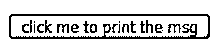
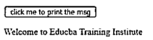

# vue . js 动画

> 原文:# t0]https://www . educba . com/view-dot-js 动画/

## Vue.js 动画简介

Vue.js 动画定义为在一个声明中出现多种状态并使任何图像元素转换为类似移动对象的元素的过程，称为动画，在 Vue.js 中使用动画通过绘制或设计布局来创建简单而有吸引力的应用程序。简而言之，我们可以说 Vue.js 是为开发和管理稳定的图像而定义的，以转换为移动图像的幻觉，也称为 Vue.js 布局或元素的动画过程。因此，在 Vue.js 各种动画中，可以使用库来创建用于设计 Vue.js 应用程序的各种布局。

### Vue.js 动画使用示例

在本文中，我们将看到 Vue.js 动画特性用于设计或绘制动画应用程序的布局。一般来说，过渡和动画一起用于设计 Vue 应用程序中的布局或元素。在 Vue.js 中，动画可以像过渡一样工作，但是过渡不能像动画那样完成这个过程，在动画中，我们可以在一个声明中完成多个步骤，而这在过渡中是做不到的。使用 Vue.js 创建应用程序中提供的几个库，有许多方法可以制作动画。这些动画的处理类似于 Vue.js 中的过渡，在这里，当我们编写 Html 文件时，我们使用<transition>标签。</transition>

<small>网页开发、编程语言、软件测试&其他</small>

现在让我们看看使用 Vue.js 提供的不同工具在 Vue.js 应用程序中创建 Vue.js 动画的各种方法。为用户创建一个应用程序，以便在整个应用程序中进行完美导航，并从一个页面过渡到另一个页面或另一个组件，这就是创建动画应用程序的过程。我们将在 Vue.js 中看到用于动画的各种类，它们也用于转场。

让我们看看几个用于动画的类:

*   **v-enter:** 这个类主要用于在创建或添加任何元素之前进入第一个状态。简而言之，我们可以说这个类是在 Vue.js 的应用程序中创建任何类型的动画的开始阶段。一旦添加了元素，那么我们将在动画结束事件时删除 v-enter。v-show 或 v-如果这个类用于显示应用程序中的内容或元素。
*   **v-enter-active:** 这是一个表示启动状态已经进入活动状态的类。除了 v-enter 和 v-enter-active 之外，还有另一个用于进入状态的类，即 v-enter-to，它也负责在插入元素时进入转换。
*   **v-leave-active:** 这是一个类，用于离开活动或进入状态的转换，或者这个类用于结束当前的转换状态。所以还有其他类也负责结束或离开转换状态，比如 v-leave-to 和 v-leave。

在 Vue.js 的动画中，当我们使用<transition>标签时，这提供了一个名为“name”的属性，它可以在类声明中代替“v-”使用，所以假设已经将“dropdown”赋给了“name”属性，那么我们可以将类用作“dropdown-enter”而不是“v-enter”因此，在 Vue.js 动画中，我们有 3 个主要类，如开始状态、活动状态和结束状态转换，用于创建从一个页面或组件切换到另一个页面或组件的导航动画。通常我们知道动画是用 CSS 写的，所以用 js 写，我们有一个选项叫做 hook classes，名字和 transition Vue.js 提供的类类似比如 before-enter，enter，after-enter，enter-canceled，before-leave，leave，after-leave，leave-canceled。</transition>

#### 例子

以下是 Vue.js 动画的示例:

**Html 文件:**

**代码:**

`<html>
<head>
<title>Educba vue.js app</title>

</head>
<body>

<button @click="show = !show">
click me to print the msg
</button>
<transition name="vue">

Welcome to Educba Training Institute

</transition>

</body>
</html>`

**JS 文件:**

**代码:**

`new Vue({
el: "#educbaapp",
data: {
show: true
}
});`

**CSS 文件:**

**代码:**

`.vue-enter-active,
.vue-leave-active {
transition: opacity 0.3s;
}
.vue-enter,
.vue-leave-to {
opacity: 0;
}`

**输出:**

**

** 

在上面的示例程序中，我们看到了动画如何在 Vue.js 应用程序中工作的演示。在上面的程序中，我们看到我们已经将 <transition>name 属性赋给了“vue”，所以我们也使用了从“vue-enter-active”、“vue-leave-active”等开始的类。首先，我们编写了一个 Html 文件，它链接到 CSS 文件中的 CSS 样式，我们还创建了一个按钮。它的名字是“点击打印消息”，然后我们使用一个 vue-if 来显示按钮被点击时的消息。我们可以在第一个屏幕截图中看到该按钮，稍后当我们单击该按钮时，消息会显示为“欢迎来到 Educba training Institute ”,这意味着该按钮是一个开关，当单击该按钮时，它会显示第二个屏幕截图中所示的消息，否则，如果我们在消息显示后再次单击该按钮，则不会显示该消息。所以，一般来说，上面的程序是用来创建一个按钮的，这个按钮将作为一个切换按钮；每当你点击按钮，它会显示一条信息，如果我们再次点击它，它什么也不显示。</transition>

### 结论

在这篇文章中，我们得出结论，Vue.js 动画是一个用于设计或绘制任何布局的功能，使 Vue 应用程序对用户来说更有吸引力，使用起来更简单。在这一点上，我们看到我们可以在动画中的一个声明中完成多个步骤，但不能在转换中完成。所以在这篇文章中，我们看到了在 Vue.js 中创建动画；我们使用类似于过渡中使用的类，例如 v-enter、v-enter-active、v-enter-to 开始过渡、v-leave、v-leave-active、v-leave-to 结束过渡或动画。在这里，我们还看到了一个使用所有这些类的简单例子。

### 推荐文章

这是一个 Vue.js 动画的指南。这里我们分别用例子来讨论 Vue.js 动画的介绍和工作。你也可以看看下面的文章来了解更多-

1.  [JavaScript Minify](https://www.educba.com/javascript-minify/)
2.  [JavaScript clearTimeout()](https://www.educba.com/javascript-cleartimeout/)
3.  [JavaScript onsubmit](https://www.educba.com/javascript-onsubmit/)
4.  [JavaScript exec()](https://www.educba.com/javascript-exec/)

