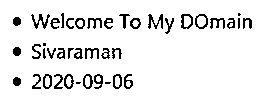
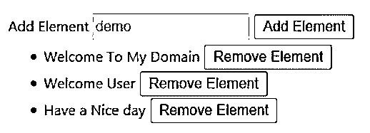
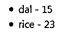

# Vue.js For 循环

> 原文：<https://www.educba.com/vue-dot-js-for-loop/>

## Vue.js For loop 简介

Vue.js For loop 是一个动态循环，它用来处理列表或重复用户输入， 它将使用元素的给定格式给出正确的输出。它的内置指令允许我们使用数据模型在对象数组中创建循环项。我们可以借助元素中的 v-for 指令在来自数组的消息中的项上创建循环，该指令应在循环的每次迭代中不断重复。它将显示给应用程序中活动的其他用户。

**语法:**

<small>网页开发、编程语言、软件测试&其他</small>

Vue.js 有不同的循环来迭代应用程序中的值，其中 for 循环是迭代用户输入的最佳方式，我们可以获得给定格式的正确输出结果。

`<html>
<body>
<template id=”first”>
----some html codes---
</templates>

</body></html>`

上面的代码是使用循环(for)迭代和遍历应用程序中的数组元素的基本语法。

### Vue.js 中 For 循环是如何工作的？

*   Vue.js for 循环使用 v-for 默认预定义指令工作，该指令允许我们构造循环，数组或对象中的项目通过该循环。v-for 指令用作密钥；我们将设置唯一的标识键；它不允许重复键；我们将确保在 vue 组件工作时使用按键的属性，以满足用户的期望。如果假设我们不使用任何键，Vue 将尝试使它作为 DOM 元素尽可能地更有效——对于元素，它可能会出现无序或其他不可预测的行为。如果我们有唯一数量的键，它们对每个元素都有自己的引用，那么对于 DOM 元素将如何被精确地操作，这可能比预测的要好。
*   在大多数情况下，v-for 指令用于构造数组或对象上的循环；它可以用合适的例子来定义，当我们需要迭代循环的次数有限时。我们还使用计算的属性选项和过滤方法，在模板中迭代元素之前过滤来自的数据。除了使用数组上的循环和访问每个元素来保持每个项目的元素索引的轨迹之外。
*   一般来说，我们使用 v-for 指令对产品和索引进行分页，显示列表的索引和产品排名等。通过使用键-值对，我们还迭代数组元素索引；我们还必须将另一个值添加到循环结构中；如果我们使用单个参数，循环迭代所有的项，假设我们使用第二个参数，它需要元素项和键，如果我们使用第三个参数，我们必须使用索引作为 v-for 循环的宝贵的东西。

### Vue.js For loop 示例

以下是 Vue.js For loop 的示例:

#### 示例#1

**代码:**

`<html>
<head>
<title>Example</title>

<link rel="stylesheet" type="text/css" href="//unpkg.com/vue-form-generator@2.0.0/dist/vfg.css">
<link rel="stylesheet" type="text/css" href="style.css">

<link rel="stylesheet" type="text/css" href="//maxcdn.bootstrapcdn.com/bootstrap/4.0.0-alpha.6/css/bootstrap.min.css">
</head>
<body>
<ul id="first" class="example">
<li v-for="output in sample">
{{ output }}
</li>
</ul>

</body>
</html>`

**输出:**

#### 实施例 2

**代码:**

`<html>
<head>
<title>Example</title>

<link rel="stylesheet" type="text/css" href="//unpkg.com/vue-form-generator@2.0.0/dist/vfg.css">
<link rel="stylesheet" type="text/css" href="style.css">

<link rel="stylesheet" type="text/css" href="//maxcdn.bootstrapcdn.com/bootstrap/4.0.0-alpha.6/css/bootstrap.min.css">
</head>
<body>
<my-component v-for="input in inputs" :key="input.id"></my-component>
<my-component
v-for="(input, index) in inputs"
v-bind:item="input"
v-bind:index="index"
v-bind:key="input.id"
></my-component>

<form v-on:submit.prevent="Add">
<label for="Newname">Add Element</label>
<input
v-model="text"
id="Newname"
placeholder="demo"
>
<button>Add Element</button>
</form>
<ul>
<li
is="example"
v-for="(input, index) in second"
v-bind:key="input.id"
v-bind:title="input.title"
v-on:remove="second.splice(index, 1)"
></li>
</ul>

</body>
</html>`

**输出:**

**

** 

#### 实施例 3

**代码:**

`<html>
<head>
<title>Example</title>

<link rel="stylesheet" type="text/css" href="//unpkg.com/vue-form-generator@2.0.0/dist/vfg.css">
<link rel="stylesheet" type="text/css" href="style.css">

<link rel="stylesheet" type="text/css" href="//maxcdn.bootstrapcdn.com/bootstrap/4.0.0-alpha.6/css/bootstrap.min.css">
</head>
<body>

<ul>
<li v-for="list in lists(grocerylists)" :key="list.name">
{{ list.name }} - {{ list.id }}
</li>
</ul>

</body>
</html>`

**输出:**

### 结论

我们可以使用许多循环来迭代数组或内存设备中的输入数据。在这些 v-for 循环中，动态循环使用每个组件的 Vue 实例来访问 html 元素和属性。

### 推荐文章

这是 Vue.js For loop 的指南。这里我们讨论一下入门，Vue.js 中 for loop 是如何工作的？和示例。你也可以看看下面的文章来了解更多-

1.  [JavaScript 鼠标按下](https://www.educba.com/javascript-mousedown/)
2.  [JavaScript exec()](https://www.educba.com/javascript-exec/)
3.  [JavaScript 名称空间](https://www.educba.com/javascript-namespace/)
4.  [JavaScript JSON](https://www.educba.com/javascript-json/)

