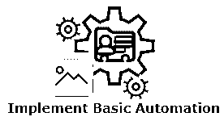

# JavaScript 能做什么？

> 原文：<https://www.educba.com/what-javascript-can-do/>

## JavaScript 简介

Javascript 是一种脚本或编程方言，它使您能够在网站页面上执行复杂的活动——每次网站页面完成时，它都会显示静态数据供您查看——展示突破性的内容更新、直观的地图、生动的 2D/3D 设计、查看视频点唱机等——您可以打赌 JavaScript 被明智地包括在内。这是标准 web 进步分层方块的第三层，其中两层( [HTML 和 CSS](https://www.educba.com/html-vs-css/) )我们已经在学习领域的各个部分加入了相当多的细节。最后，我们可以包含一些 JavaScript 来执行动态行为。

它是世界上最流行的编程方言之一，最初用于除了网页的直观性之外的计算机化活动。Web 工程师使用 JavaScript 做任何事情，从将合理的任务计算机化到构建像工作区编程应用程序一样工作的复杂网页。它比过去的网络在编程、服务器以及植入式设备控制方面的应用都要多。它通常与站点一起使用，以提供比 HTML 更好的连接，大多数互联网浏览器都充当了 javascript 的中介。出于安全原因，程序中的 javascript 是受限制的(例如，它不能直接访问文件系统)。

### JavaScript 有什么帮助？

中心 Javascript 方言由一些宽泛的编程属性组成，这些属性使您能够做如下事情:

*   储存有益品质的内在因素。例如，在上面的例子中，我们要求输入另一个名称，然后将该名称存储在一个名为 name 的变量中。
*   对部分内容(在编程中称为“字符串”)的操作。在上述情况下，我们使用字符串“Player 1:”并将其与 name 变量相关联，以生成完整的内容名称，例如“Player 1: Chris”。
*   根据站点页面上出现的一些情况运行代码。在上面的例子中，我们处理了一个 tick 事件，以识别 catch 何时被单击，然后执行刷新内容标记的代码。

从各方面来看，更重要或更令人振奋的是，通过核心 Javascript 方言创建的有用性。应用程序编程接口(API)为您提供了在 JavaScript 代码中使用的超能力。

### JavaScript 在你的页面上做什么？

我们来快速回顾一下当你在程序中堆叠一个网页时会发生什么。当您在应用程序中累积站点页面时，您正在执行执行域(program 选项卡)中的代码(HTML、CSS 以及 Javascript)。这就像一个要求原材料(代码)的加工厂，而且产出一个项目(网页)。该程序的 Javascript 引擎执行 HTML 和 CSS 之后的 Javascript，这些 HTML 和 CSS 已经被收集并设置到一个网站页面中。

这保证了页面的结构和样式，当 JavaScript 开始运行时，它们已经就位。这一点非同寻常，因为 Javascript 真正的基本用途是通过文档对象模型 API 对 HTML 和 CSS 进行强大的修改，从而为 UI 充电。万一 Javascript 在 HTML 和 CSS 影响之前堆叠并计划继续运行，后面的错误就会发生。

#### 1.浏览器安全性

每个程序选项卡都有其不同的隔间，用于运行代码(这些容器在专业术语中被称为“执行条件”)—这表明，作为一条规则，所有选项卡中的代码完全自主运行，并且一个选项卡中的代码不能快速影响另一个选项卡中的代码—或各个站点上的代码。这是一个非凡的安全标准——如果不是这种情况，私掠船可以开始编写代码，从不同的目的地和其他类似的地方获取数据。

#### 2.与云沟通

应用异步 JavaScript 除了 XML (Ajax)之外，JavaScript 还可以通过服务器进行信息交易。这使得使用服务器端资产来创建响应性 Web 应用程序成为可能。使用 Ajax，it 可以计算出在整个客户端应用程序中不合逻辑或难以执行的力量、知识和技术科学服务器资产。例如，可以利用 Ajax 生成一个形状句柄，它可以在您键入时提供建议，在不重新加载 Web 页面的情况下显示索引列表，并提供直观的地图，您可以通过滑动鼠标光标来查看。

#### 3.实施基本自动化

尽管有共同的编程方言属性，例如，内容控制和数学图形，但它可以获得大量关于程序和它在中工作的[网页的数据。它可以利用此信息根据一天中的季节来编写自定义的欢迎信息，将网页地址嵌入页脚中，另外根据您正在使用的程序来改进网页。](https://www.educba.com/web-page-design-layout/)

#### 4.动态更新网页内容

两个特别的特性使 JavaScript 能够在你使用它的时候动态调整网页。首先，JavaScript 是“场合驱动的”，表明它可以对各种场合做出反应，例如，鼠标点击、控制台输入、网页堆叠或即将到来的超时。接下来，它介绍了文档对象模型(DOM)，一个 Web 页面结构的接口。这使得 JavaScript 可以查看和更改图片、内容、形状字段、样式以及网页的独特组件和质量。

除了 DOM 接口之外的场合使 JavaScript 工程师能够实现合理的任务，例如，批准结构贡献，以及额外嵌入智力品质，例如，图片滑块和娱乐。这些对于动态 HTML (DHTML)的执行很重要。

### 摘要

以类似的方式，你去那里，你的基础维度进入 JavaScript 的宇宙。我们从一个假设开始，让你习惯于出于什么原因使用 JavaScript，以及你可以用它做什么。巧合的是，您看到了几个代码测试，并弄清楚了它如何与您的站点上的任何剩余代码相协调，在离散的事物中。

目前它可能会显得有些势不可挡；尽管如此，在本课程中，我们将带您了解预示着良好进展的合理进展。

### 推荐文章

这是 JavaScript 能做什么的指南？在这里，我们讨论了 JavaScript 能够做什么，浏览器安全性，以及与云的通信。您也可以浏览我们推荐的其他文章，了解更多信息——

1.  [什么是 jQuery？](https://www.educba.com/what-is-jquery/)
2.  [什么是 PHP？](https://www.educba.com/what-is-php/)
3.  [JavaScript 数学函数](https://www.educba.com/javascript-math-functions/)
4.  [JavaScript 工具](https://www.educba.com/javascript-tools/)

