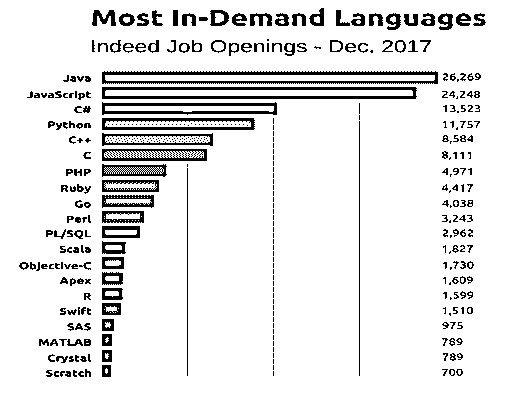

# JavaScript 的使用

> 原文：<https://www.educba.com/uses-of-javascript/>

## JavaScript 的使用

Javascript 是目前市场上使用最多的语言之一。下图显示了一家公司所有语言的图示。JavaScript 排在第二位。主要用于[建设网站](https://www.educba.com/online-website-builder/)和 web 应用。下面列出了 JavaScript 的另一个应用程序。

<small>网页开发、编程语言、软件测试&其他</small>

### JavaScript 的 10 大用途

以下是 10 大用途列表，解释如下:

#### 1.Web 开发

JavaScript 是一种[客户端脚本语言](https://www.educba.com/programming-languages-vs-scripting-languages/)，用于[创建网页](https://www.educba.com/web-page-design-layout/)。它是 Netscape 开发的一种独立语言。当一个网页是动态的，并在页面上添加特殊效果，如翻转、展开和许多类型的图形时，会用到它。它主要被所有网站用于验证目的。除了验证之外，它还支持外部应用程序，如 PDF 文档、运行小部件、支持 flash 应用程序等。它还可以在用户需要时将内容加载到文档中，甚至无需重新加载整个页面。

#### 2.网络应用

随着技术的发展，浏览器和个人电脑已经发展到需要一种语言来创建健壮的网络应用程序的程度。当用户在谷歌地图中浏览[地图时，用户只需点击并拖动鼠标。所有详细的看法是可见的，只需点击一下。由于 JavaScript，这是可能的。它与浏览器交互，而无需向服务器来回发送消息。JavaScript 使用应用程序编程接口(API)为代码提供额外的功能。](https://www.educba.com/career-in-google-maps/)

#### 3.报告

JavaScript 还提供了创建网站演示的功能。JavaScript 提供了 RevealJS 和 BespokeJS 库来构建基于 web 的幻灯片。Reveal.js 使用 HTML 创建了一些最漂亮、最具互动性的套牌。用户可以容易地插入嵌套幻灯片。即使用户不知道编程语言，他们也可以很容易地在网上建立一个有这么多帮助的网站。这些演示文稿经过触摸优化，非常适合移动设备、手机和平板电脑。除此之外，JavaScript 还提供了不同的过渡风格、主题和幻灯片背景。[支持所有 CSS 颜色格式](https://www.educba.com/cheat-sheet-css/)。JavaScript 还为 Bespoke.js 插件提供了各种各样的特性。其中包括响应性缩放、动画项目符号列表和代码示例的语法突出显示。它提供了精心设计的主题，但又不太浮华。启动 Bespoke.js 最快的方法是使用生成器。它允许用户为你的演示设置标题，并通过一系列问题来获得所需的插件。

#### 4.服务器应用程序

Node JS 建立在 Chrome 的 Javascript 运行时之上，用于构建快速且可扩展的网络应用。它使用事件驱动、轻量级和高效的应用程序，这些应用程序将在服务器的帮助下分布在系统中。Javascript 用于处理 HTTP 请求和生成内容。当用户在客户端用 JavaScript 编写复杂的应用程序时，用户甚至可以在服务器端用 JavaScript 编写逻辑，这样就可以实现从一种语言到另一种语言的认知飞跃。

#### 5.Web 服务器

使用[节点 JS](https://www.educba.com/how-to-use-node-js/) 可以创建一个 web 服务器。节点 JS 的[优势在于它是事件驱动的，不会等待前一个调用的响应。它转移到下一个调用，并利用事件在收到前一个调用的响应时获得通知。构建在节点 JS](https://www.educba.com/features-of-node-js/) 上的[服务器速度非常快，不使用缓冲和传输大块数据。除此之外，它是单线程的，带有以非阻塞方式使用的事件循环。HTTP 模块可以通过使用 createServer()方法来帮助创建服务器。每当有人试图访问端口 8080 时，就会执行此方法。作为对此的响应，HTTP 服务器应该显示 HTML，并且应该包含在 HTTP 头中。它可以通过键入“npm install -g http-server”轻松安装，也可以通过键入 http-server 命令启动。](https://www.educba.com/node-js-interview-questions-and-answers/)

#### 6.比赛

不仅是网站，JavaScript 的使用也有助于创建休闲游戏。JavaScript 和 HTML5 的结合使得 JavaScript 在游戏开发中也很流行。它提供了 Ease JS 库，为处理丰富的图形提供了简单的解决方案。它还有一个所有 flash 开发人员都熟悉的 API，带有一个分层显示列表。用户可以创建一个 Stage，它会将显示列表呈现到目标画布上。Ease JS 也有被称为精灵的 2D 位图，这些位图被直接绘制以呈现变换的目标。

#### 7.艺术

在 JavaScript 中使用 HTML5 在[网页上绘制图形变得更加容易](https://www.educba.com/web-page-design-layout/)。所有二维和三维形状都可以很容易地在画布上绘制，这为所有不同的数字艺术项目打开了浏览器的新媒介。画布没有边界和内容，因此用户可以创建自己的艺术作品。

#### 8.智能手表应用

Javascript 是使用最多的语言，因为它正在所有可能的设备和应用程序中使用。使用 JavaScript 提供了一个用于智能手表应用程序的 Pebble JS 库。该框架适用于需要互联网才能运行的应用程序。使用 Pebbles，开发者可以使用 JavaScript 为许多手表创建应用程序。

#### 9.移动应用

JavaScript 的[用法可以做的最重要的事情是构建没有 web 上下文的应用程序。手机主要在苹果和安卓系统中使用，这两种不同的语言被用来构建手机。应该可以编写一次并在这些设备的两个平台上使用。PhoneGap 是实现这一点的框架。最近我们也有](https://www.educba.com/javascript-math-functions/)[反应本地](https://www.educba.com/react-native-interview-questions/)服务于这个目的。它是跨平台变更和部署的主要参与者。因此，Javascript 可用于跨环境部署和下载相应的应用程序。

#### 10.飞行机器人

是的，甚至这也是 JavaScript 没有触及的领域。使用节点 Js，用户可以编程一个飞行机器人。

### 结论

作为 JavaScript 所有上述应用的结果，很明显 JavaScript 是一种将会存在的语言。有了前端和后端开发中的所有特性， [JavaScript 有助于支持这两者并创建一些可以在世界范围内使用的最好的应用程序。](https://www.educba.com/how-javascript-works/)

### 推荐文章

这是在现实世界中使用 JavaScript 的指南。这里我们讨论了 JavaScript 的基本概念和各种应用，如游戏、网络服务器、网络开发等。您也可以阅读以下文章，了解更多信息——

1.  [Javascript 面试问题](https://www.educba.com/javascript-interview-questions/)
2.  [JavaScript 职业](https://www.educba.com/careers-in-javascript/)
3.  [反应原生 vs 迅捷](https://www.educba.com/react-native-vs-swift/)
4.  [React Native vs Native script](https://www.educba.com/react-native-vs-nativescript/)

