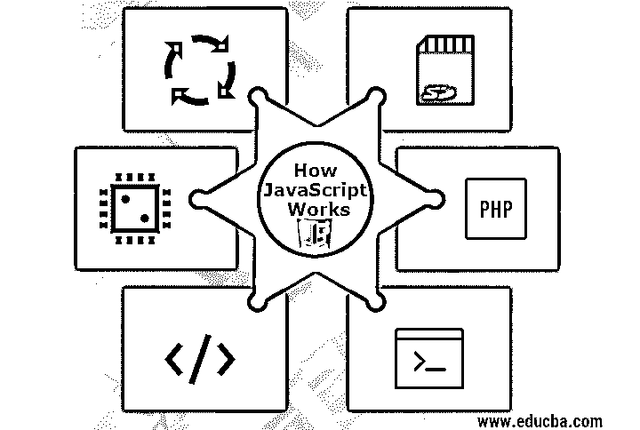

# JavaScript 是如何工作的？

> 原文：<https://www.educba.com/how-javascript-works/>

## JavaScript 如何工作的介绍？

JavaScript 是一种脚本语言，在浏览器中用于界面交互。Brendan Eich 是为 Netspace 的 Netspace Navigator web 浏览器创建 JavaScript 引擎的第一人。它是用 C 实现的，它的代号是 SpiderMonkey。Mocha 最初是这个项目的名字，后来改名为 LiveScript，最后当 Netspace 和 Sun 达成许可协议后，它再次改名为 JavaScript。在这个主题中，我们将学习 javascript 是如何工作的。我们一定听说过像 V8，蜘蛛猴和其他许多流行的引擎。不同的引擎有不同的“代号”，例如:

*   V8 发动机用于 Opera 和 Chrome。
*   蜘蛛猴 Firefox 中使用的引擎。
*   三叉戟，查克拉-引擎用于 IE 和硝基。
*   ChakraCore–微软 Edge 中使用的引擎。
*   squirrel fish–Safari 中使用的引擎。

用于 javascript 的引擎由两个主要组件组成:

<small>网页开发、编程语言、软件测试&其他</small>

*   堆内存—这是内存分配发生的地方。
*   调用堆栈—这是调用堆栈和执行代码的地方。

**注:**

JavaScript，单线程编程语言，这意味着它只有一个调用栈，因此它有能力一次做一件事。调用栈基本上是一个数据结构，它记录了程序中实际执行的点。这个调用栈类似于其他具有基本功能的栈，比如，如果我们进入一个函数，我们就把它放在栈顶。如果我们想从一个函数返回，我们必须弹出栈顶。这是每个堆栈的基本功能。正如我们所讨论的，驱动 [JavaScript 函数](https://www.educba.com/javascript-function-declaration/)的引擎确实很复杂，但是每个引擎在更广泛的意义上执行的基本事情如下:

*   如果浏览器读取脚本，那么引擎就嵌入在浏览器本身中。
*   在读取脚本后，它将脚本转换(“编译”)为机器语言。
*   然后机器代码运行，非常快。

### 浏览器内 JavaScript 作品可以做什么？

*   它改变现有的内容，通过向页面添加新的 HTML 来修改样式。
*   提供鼠标点击、鼠标悬停等功能。其对使用者的动作做出反应。
*   通过网络向远程服务器发送和接收请求，无需在用户输入时加载整个页面。其中一个非常著名的技术是 AJAX。
*   通过它可以设置和获取 cookies 的值，为用户提供信息、警报和其他用途的消息。
*   也可以在客户端存储临时数据。

### 浏览器内 JavaScript 作品不能做什么？

为了用户的安全，JavaScript 在浏览器中的能力是有限的。目的是防止一些第三方网页访问私人信息或损害用户的数据。这种受限访问的一些情况是:

*   默认情况下，网页上的 JavaScript 仅限于读写硬盘上的任意文件、复制它们或执行程序。它甚至不能直接访问操作系统的功能。很少有现代浏览器还允许它处理文件，但同样，这种访问是有限的，只有当用户做某些动作时才提供，如将文件“放”进浏览器窗口。一些方法也可用于与摄像头/麦克风和其他设备进行交互，但这也需要用户的明确许可。因此，启用 JavaScript 的页面可能不会秘密启用网络摄像头，也可能会将信息发送到远程服务器或任何第三方。

*   不同的选项卡或窗口通常不知道彼此的实例。但从技术上讲，这是非常可能的。同样的叫做“同源政策”。为了同样的工作，两个实例都必须包含一些特殊的 JavaScript 代码，可以处理彼此之间的数据交换。但是对于用户的安全来说，限制还是存在的。例如，用户已经打开的来自 URL abc.com 的网页必须不能访问具有 URL xyz.com 的另一个浏览器标签并秘密窃取信息。

*   通过使用它，人们可以很容易地通过网络与当前页面来自的任何远程服务器或第三方进行通信。但出于安全原因，它从其他站点或域接收或发送数据的能力被禁用。但是这仍然是可能的，为此一些 JavaScript 作品需要远程方的明确同意。如果 JavaScript 将在浏览器外部而不是内部使用，即从服务器使用，则不可能提供这样的限制。您可能还会注意到，一些现代浏览器允许安装插件或扩展，通过这些插件或扩展，JavaScript 可以在浏览器内部获得扩展权限。

### JavaScript 的独特之处是什么？

*   众所周知，它是一种基于对象的脚本语言。
*   它是用 c 写的，是一种解释型语言。
*   纯 JavaScript 访问 DOM 更快。
*   通过使用 JavaScript 工作，用户获得了对浏览器的更多控制。
*   它还可以处理日期和时间戳。
*   它还可以检测用户的浏览器甚至 OS。
*   它很轻。
*   如前所述，它是一种脚本语言。
*   它是一种基于解释器的脚本语言。
*   它区分大小写，即语法区分大小写。
*   它是一种基于对象的语言，因为它像 java 一样提供预定义的对象，但它不是 Java。
*   JavaScript 中的每一条语句都必须以分号(；).
*   JavaScript 提供的最重要的东西是在脚本中创建新函数的能力。可以使用函数在 JavaScript 中声明一个函数
*   完全支持 [HTML 和 CSS](https://www.educba.com/html-vs-css/) 。
*   它非常容易使用。
*   支持所有浏览器。

### 限制

在众多优势中，JavaScript 也有一些限制，如下所示:

*   JavaScript 位于客户端，它不提供读写磁盘上文件的功能。
*   JavaScript 不能用于网络应用程序，因为它不提供任何此类支持。
*   它不提供任何类似多线程或多处理器的功能。

### 结论

至此，我们都知道了一些关于 JavaScript 作品发展的基本信息，一些在 web 浏览器上运行 JavaScript 的著名引擎，将 JavaScript 放在浏览器内的优势是什么，以及如果 JavaScript 可以放在浏览器外运行会发生什么。我们也遇到了 JavaScript 工作的一些[特性，这些特性使它变得有用和独特，同时也有一些限制/缺点。就这样，我结束了关于 javascript 如何工作的话题，你可以从网上探索更多的东西。](https://www.educba.com/features-of-javascript/)

### 推荐文章

这是 JavaScript 工作的指南。在这里，我们讨论了基本概念、限制以及 javascript 与众不同的地方。您也可以阅读以下文章，了解更多信息——

1.  [备忘单 JavaScript](https://www.educba.com/cheat-sheet-javascript/)
2.  [JavaScript 的使用](https://www.educba.com/uses-of-javascript/)
3.  [JavaScript vs JScript](https://www.educba.com/javascript-vs-jscript/)
4.  [C# vs JavaScript](https://www.educba.com/c-sharp-vs-javascript/)

